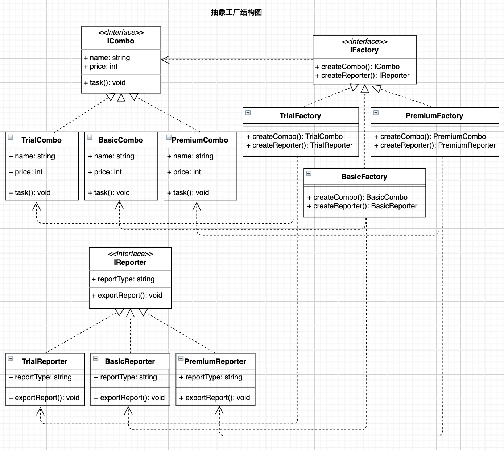

# 前言

本文介绍最后一种工厂模式——抽象工厂。与工厂方法一样，抽象工厂也属于创建型设计模式。在[《设计模式之工厂方法模式》](https://juejin.cn/post/7037916018924060702)一文中我们了解了工厂方法的定义、构成及示例，并由此知道工厂方法适用于创建一系列具有共同属性和方法的对象。注意这里的"具有共同属性和方法"，意味着工厂方法的一个工厂类只能创建一种对象。当需要创建的对象具有不同的属性或方法时，工厂方法就不再适用了。此时，多种对象的创建需要通过抽象工厂来实现。本文以[前文](https://juejin.cn/post/7037916018924060702)同样的需求假设为基础进行扩展，介绍抽象工厂模式，并给出代码示例。

> 设计模式重在学思想，个人水平有限，不要深究例子是否合适，理解设计思想为首要目的。

# 需求假设

假如公司的产品为客户提供了三种套餐(`Combo`): 分别为体验版(`TrialCombo`)、基础版(`BasicCombo`)和高级版(`PremiumCombo`)。不同的套餐具有不同的名称(`name	`)、价格(`price`)以及对应的服务(`task`)。面向对象分析**套餐类**：

* 具有属性：名称(`name	`)、价格(`price`)；
* 具有行为：任务服务(`task`)；

现在，由于存在不同的套餐类型，需求规定相应也要提供不同的结果呈现报告：体验版需要提供简要excel报告(`TrialReporter`)、基础版需要提供详细excel报告(`BasicReporter`)、高级版需要提供精美pdf报告(`PremiumReporter`)。也就是说，现在需要创建**报告类**：

* 具有属性：报告类型；（或报告名称等其他各种属性，此处省略）。
* 具有行为：导出报告；

# 模式定义

抽象工厂**提供一个创建一系列相关或相互依赖对象的接口，而无需指定它们具体的类。**
结合本文的需求假定来理解上述定义：

* "一系列相关或相互依赖对象"：体验版(`Trial`)、基础版(`Basic)和高级版(`Premium`)分别为三个不同的系列，套餐和报告就是各系列中相关或相互依赖的对象；

* "无需指定它们具体的类"：我们只需要提供系列工厂(`TrialFactory, BasicFactory, PremiumFactory`)，而不用指定具体类的工厂，例如不必像工厂方法中一样去指定细化的工厂类(`TrialComboFactory, BasicComboFactory, PremiumComboFactory`)。抽象工厂是在系列工厂中，提供多个不同的工厂方法(`createCombo(),createReporter()`)来生产多种不同类型的对象。



# 模式构成

根据`UML`结构图，抽象工厂模式包含：

* **多个**抽象类或接口：用于约定**不同类别**的具体类应具有的属性和方法；如`ICombo,IReporter`;
* 多个具体类：用于实现抽象类或接口；如`TrialCombo,TrialReporter`等。
* 一个抽象工厂类或接口：用于约定具体工厂应具有的属性和**一组**方法；如`IFactory`。
* 多个具体(系列)工厂类：用于实现抽象工厂类或接口；如`TrialFactory`等。

# 代码示例

## C++

```c++
/*
 * File: include/combo.hpp
 * Created Date: 2021-12-01 02:46:27
 * Author: ysj
 * Description:  套餐类头文件(含实现)
 */

#pragma once

#include <iostream>
#include <string>
using namespace std;

// 抽象类
class Combo
{
public:
    string name;
    int price;

public:
    virtual void task() = 0;
};

// 具体实现类
class TrialCombo : public Combo
{
public:
    TrialCombo()
    {
        name = "体验版";
        price = 299;
    };
    void task()
    {
        cout << name << "-> 执行价值" << price << "元的服务" << endl;
    };
};

// 具体实现类
class BasicCombo : public Combo
{
public:
    BasicCombo()
    {
        name = "基础版";
        price = 599;
    };
    void task()
    {
        cout << name << "-> 执行价值" << price << "元的服务" << endl;
    };
};

// 具体实现类
class PremiumCombo : public Combo
{
public:
    PremiumCombo()
    {
        name = "高级版";
        price = 1999;
    };
    void task()
    {
        cout << name << "-> 执行价值" << price << "元的服务" << endl;
    };
};
```

```c++
/*
 * File: include/reporter.hpp
 * Created Date: 2021-12-01 05:22:23
 * Author: ysj
 * Description:  报告类头文件(含实现)
 */

#pragma once

#include <iostream>
#include <string>
using namespace std;

// 抽象类
class Reporter
{
public:
    string reportType;

public:
    virtual void exportReport() = 0;
};

// 具体实现类
class TrialReporter : public Reporter
{
public:
    TrialReporter()
    {
        reportType = "简要excel报告";
    };

public:
    void exportReport()
    {
        cout << "导出" << this->reportType << endl;
    };
};

// 具体实现类
class BasicReporter : public Reporter
{
public:
    BasicReporter()
    {
        reportType = "详细excel报告";
    };

public:
    void exportReport()
    {
        cout << "导出" << this->reportType << endl;
    };
};

// 具体实现类
class PremiumReporter : public Reporter
{
public:
    PremiumReporter()
    {
        reportType = "精美pdf报告";
    };

public:
    void exportReport()
    {
        cout << "导出" << this->reportType << endl;
    };
};
```

```c++
/*
 * File: include/factory.hpp
 * Created Date: 2021-12-01 06:16:13
 * Author: ysj
 * Description:  工厂类头文件(含实现)
 */

#pragma once
#include "combo.hpp"
#include "reporter.hpp"

// 抽象类
class Factory
{
public:
    virtual Combo *createCombo() = 0;
    virtual Reporter *createReporter() = 0;
};

// 具体实现类
class TrialFactory : public Factory
{
public:
    Combo *createCombo()
    {
        return new TrialCombo();
    };
    Reporter *createReporter()
    {
        return new TrialReporter();
    };
};

// 具体实现类
class BasicFactory : public Factory
{
public:
    Combo *createCombo()
    {
        return new BasicCombo();
    };
    Reporter *createReporter()
    {
        return new BasicReporter();
    };
};

// 具体实现类
class PremiumFactory : public Factory
{
public:
    Combo *createCombo()
    {
        return new PremiumCombo();
    };
    Reporter *createReporter()
    {
        return new PremiumReporter();
    };
};
```

```c++
/*
 * File: main.cpp
 * Created Date: 2021-11-29 06:29:10
 * Author: ysj
 * Description:  cpp 抽象工厂
 */
#include <iostream>
#include "factory.hpp"
using namespace std;

// 客户端调用
int main()
{
    Factory *trialFactory = new TrialFactory();
    Combo *trialCombo = trialFactory->createCombo();
    trialCombo->task();
    Reporter *trialReporter = trialFactory->createReporter();
    trialReporter->exportReport();

    Factory *basicFactory = new BasicFactory();
    Combo *basicCombo = basicFactory->createCombo();
    basicCombo->task();
    Reporter *basicReporter = basicFactory->createReporter();
    basicReporter->exportReport();

    Factory *premiumFactory = new PremiumFactory();
    Combo *premiumCombo = premiumFactory->createCombo();
    premiumCombo->task();
    Reporter *premiumReporter = premiumFactory->createReporter();
    premiumReporter->exportReport();

    return 0;
};
```

```shell
$ g++ main.cpp -I include -o main && ./main
体验版-> 执行价值299元的服务
导出简要excel报告
基础版-> 执行价值599元的服务
导出详细excel报告
高级版-> 执行价值1999元的服务
导出精美pdf报告
```

## Golang

```go
/*
 * File: combo.go
 * Created Date: 2021-11-29 06:24:53
 * Author: ysj
 * Description:  套餐
 */

package main

import "fmt"

// 接口
type ICombo interface {
	task()
}

type Combo struct {
	Name  string
	Price int
}

func (t *Combo) task() {
	fmt.Printf("%s-> 执行价值%d元的服务\n", t.Name, t.Price)
}

// 具体实现
func NewTrialCombo() ICombo {
	return &Combo{
		Name:  "体验版",
		Price: 299,
	}
}

// 具体实现
func NewBasicCombo() ICombo {
	return &Combo{
		Name:  "基础版",
		Price: 599,
	}
}

// 具体实现
func NewPremiumCombo() ICombo {
	return &Combo{
		Name:  "高级版",
		Price: 1999,
	}
}
```

```go
/*
 * File: reporter.go
 * Created Date: 2021-11-29 06:25:02
 * Author: ysj
 * Description:  报告
 */

package main

import "fmt"

// 接口
type IReporter interface {
	exportReport()
}

type Reporter struct {
	ReportType string
}

func (r *Reporter) exportReport() {
	fmt.Printf("导出%s\n", r.ReportType)
}

// 具体实现
func NewTrialReporter() IReporter {
	return &Reporter{
		ReportType: "简要excel报告",
	}
}

// 具体实现
func NewBasicReporter() IReporter {
	return &Reporter{
		ReportType: "详细excel报告",
	}
}

// 具体实现
func NewPremiumReporter() IReporter {
	return &Reporter{
		ReportType: "精美pdf报告",
	}
}
```

```go
/*
 * File: factory.go
 * Created Date: 2021-11-29 06:25:22
 * Author: ysj
 * Description:  工厂
 */
package main

// 接口
type IFactory interface {
	createCombo() ICombo
	createReporter() IReporter
}

// "体验版"工厂

type TrialFactory struct{}

func (t *TrialFactory) createCombo() ICombo {
	return NewTrialCombo()
}
func (t *TrialFactory) createReporter() IReporter {
	return NewTrialReporter()
}

// "基础版"工厂
type BasicFactory struct{}

func (t *BasicFactory) createCombo() ICombo {
	return NewBasicCombo()
}
func (t *BasicFactory) createReporter() IReporter {
	return NewBasicReporter()
}

// "高级版"工厂
type PremiumFactory struct{}

func (t *PremiumFactory) createCombo() ICombo {
	return NewPremiumCombo()
}
func (t *PremiumFactory) createReporter() IReporter {
	return NewPremiumReporter()
}
```

```go
/*
 * File: main.go
 * Created Date: 2021-11-29 02:03:08
 * Author: ysj
 * Description:  golang 抽象工厂
 */

package main

func main() {
	trialFactory := &TrialFactory{}
	trialCombo := trialFactory.createCombo()
	trialCombo.task()
	trialReporter := trialFactory.createReporter()
	trialReporter.exportReport()

	basicFactory := &BasicFactory{}
	basicCombo := basicFactory.createCombo()
	basicCombo.task()
	basicReporter := basicFactory.createReporter()
	basicReporter.exportReport()

	premiumFactory := &PremiumFactory{}
	premiumCombo := premiumFactory.createCombo()
	premiumCombo.task()
	premiumReporter := premiumFactory.createReporter()
	premiumReporter.exportReport()
}
```

```shell
$ go run .
体验版-> 执行价值299元的服务
导出简要excel报告
基础版-> 执行价值599元的服务
导出详细excel报告
高级版-> 执行价值1999元的服务
导出精美pdf报告
```

## Python

```python
#!/usr/bin/env python3
# -*- coding:utf-8 -*-
###
# File: combo.py
# Created Date: 2021-11-29 06:18:05
# Author: ysj
# Description:  套餐类
###

from abc import ABCMeta, abstractmethod


class Combo(metaclass=ABCMeta):
    """抽象基类"""

    name = "套餐名"
    price = 0

    @abstractmethod
    def task(self):
        pass

    @property
    @abstractmethod
    def name(self):
        return self.name

    @property
    @abstractmethod
    def price(self):
        return self.price


class TrialCombo(Combo):
    """具体实现类"""

    name = "体验版"
    price = 299

    def task(self):
        print(f"{self.name}-> 执行价值{self.price}元的服务")
        return


class BasicCombo(Combo):
    """具体实现类"""

    name = "基础版"
    price = 599

    def task(self):
        print(f"{self.name}-> 执行价值{self.price}元的服务")
        return


class PremiumCombo(Combo):
    """具体实现类"""

    name = "高级版"
    price = 1999

    def task(self):
        print(f"{self.name}-> 执行价值{self.price}元的服务")
        return
```

```python
#!/usr/bin/env python3
# -*- coding:utf-8 -*-
###
# File: reporter.py
# Created Date: 2021-11-29 06:18:27
# Author: ysj
# Description:  报告类
###
from abc import ABCMeta, abstractmethod


class Reporter(metaclass=ABCMeta):
    """抽象基类"""
    report_type = "报告类型"

    @abstractmethod
    def export_report(self):
        return

    @property
    @abstractmethod
    def report_type(self):
        return self.report_type


class TrialReporter(Reporter):
    """具体实现类"""
    report_type = "简要excel报告"

    def export_report(self):
        print(f"导出{self.report_type}")
        return


class BasicReporter(Reporter):
    """具体实现类"""
    report_type = "详细excel报告"

    def export_report(self):
        print(f"导出{self.report_type}")
        return


class PremiumReporter(Reporter):
    """具体实现类"""
    report_type = "精美pdf报告"

    def export_report(self):
        print(f"导出{self.report_type}")
        return
```

```python
#!/usr/bin/env python3
# -*- coding:utf-8 -*-
###
# File: factory.py
# Created Date: 2021-11-29 06:19:19
# Author: ysj
# Description:  工厂类
###
from abc import ABCMeta, abstractmethod

from combo import TrialCombo, BasicCombo, PremiumCombo
from reporter import TrialReporter, BasicReporter, PremiumReporter


class Factory(metaclass=ABCMeta):
    """抽象基类"""
    @abstractmethod
    def create_combo(self):
        pass

    @abstractmethod
    def create_reporter(self):
        pass


class TrialFactory(Factory):
    """具体实现类"""

    def create_combo(self):
        return TrialCombo()

    def create_reporter(self):
        return TrialReporter()


class BasicFactory(Factory):
    """具体实现类"""

    def create_combo(self):
        return BasicCombo()

    def create_reporter(self):
        return BasicReporter()


class PremiumFactory(Factory):
    """具体实现类"""

    def create_combo(self):
        return PremiumCombo()

    def create_reporter(self):
        return PremiumReporter()
```

```python
#!/usr/bin/env python3
# -*- coding:utf-8 -*-
###
# File: main.py
# Created Date: 2021-11-28 07:20:56
# Author: ysj
# Description:  python 抽象工厂
###

from factory import TrialFactory, BasicFactory, PremiumFactory

trial_factory = TrialFactory()
trial_combo = trial_factory.create_combo()
trial_combo.task()
trial_reporter = trial_factory.create_reporter()
trial_reporter.export_report()

basic_factory = BasicFactory()
basic_combo = basic_factory.create_combo()
basic_combo.task()
basic_reporter = basic_factory.create_reporter()
basic_reporter.export_report()

premium_factory = PremiumFactory()
premium_combo = premium_factory.create_combo()
premium_combo.task()
premium_reporter = premium_factory.create_reporter()
premium_reporter.export_report()
```

```shell
$ python3 main.py
体验版-> 执行价值299元的服务
导出简要excel报告
基础版-> 执行价值599元的服务
导出详细excel报告
高级版-> 执行价值1999元的服务
导出精美pdf报告
```

## Typescript

```typescript
/**
 * -------------------------------------------------------
 * File: combo.ts
 * Created Date: 2021-11-29 04:18:18
 * Author: ysj
 * Description: 套餐类
 * -------------------------------------------------------
 */

/**一个接口 */
export interface ICombo {
  name: string;
  price: number;
  task(): void;
}

/**具体实现类*/
export class TrialCombo implements ICombo {
  name = '体验版';
  price = 299;
  task() {
    console.log(`${this.name}-> 执行价值${this.price}元的服务`);
  }
}

/**具体实现类*/
export class BasicCombo implements ICombo {
  name = '基础版';
  price = 599;
  task() {
    console.log(`${this.name}-> 执行价值${this.price}元的服务`);
  }
}
/**具体实现类*/
export class PremiumCombo implements ICombo {
  name = '高级版';
  price = 1999;
  task() {
    console.log(`${this.name}-> 执行价值${this.price}元的服务`);
  }
}
```

```typescript
/**
 * -------------------------------------------------------
 * File: reporter.ts
 * Created Date: 2021-11-29 04:19:29
 * Author: ysj
 * Description: 报告类
 * -------------------------------------------------------
 */

/**一个接口 */
export interface IReporter {
  reportType: string;
  exportReport(): void;
}

/**具体实现类 */
export class TrialReporter implements IReporter {
  reportType = '简要excel报告';
  exportReport() {
    console.log(`导出${this.reportType}`);
  }
}

/**具体实现类 */
export class BasicReporter implements IReporter {
  reportType = '详细excel报告';
  exportReport() {
    console.log(`导出${this.reportType}`);
  }
}

/**具体实现类 */
export class PremiumReporter implements IReporter {
  reportType = '精美pdf报告';
  exportReport() {
    console.log(`导出${this.reportType}`);
  }
}
```

```typescript
/**
 * -------------------------------------------------------
 * File: factory.ts
 * Created Date: 2021-11-29 04:20:16
 * Author: ysj
 * Description: 工厂类
 * -------------------------------------------------------
 */

import { ICombo, TrialCombo, BasicCombo, PremiumCombo } from './combo';
import {
  IReporter,
  TrialReporter,
  BasicReporter,
  PremiumReporter,
} from './reporter';

/**工厂接口*/
export interface IFactory {
  createCombo(): ICombo;
  createReporter(): IReporter;
}

/**具体工厂类 */
export class TrialFactory implements IFactory {
  createCombo() {
    return new TrialCombo();
  }
  createReporter() {
    return new TrialReporter();
  }
}

/**具体工厂类 */
export class BasicFactory implements IFactory {
  createCombo() {
    return new BasicCombo();
  }
  createReporter() {
    return new BasicReporter();
  }
}

/**具体工厂类 */
export class PremiumFactory implements IFactory {
  createCombo() {
    return new PremiumCombo();
  }
  createReporter() {
    return new PremiumReporter();
  }
}
```

```typescript
/**
 * -------------------------------------------------------
 * File: index.ts
 * Created Date: 2021-11-29 04:20:50
 * Author: ysj
 * Description: ts 抽象工厂
 * -------------------------------------------------------
 */

import { TrialFactory, BasicFactory, PremiumFactory } from './factory';

const trialFactory = new TrialFactory();
const trialCombo = trialFactory.createCombo();
trialCombo.task();
const trialReporter = trialFactory.createReporter();
trialReporter.exportReport();

const basicFactory = new BasicFactory();
const basicCombo = basicFactory.createCombo();
basicCombo.task();
const basicReporter = basicFactory.createReporter();
basicReporter.exportReport();

const premiumFactory = new PremiumFactory();
const premiumCombo = premiumFactory.createCombo();
premiumCombo.task();
const premiumReporter = premiumFactory.createReporter();
premiumReporter.exportReport();
```

```shell
$ tsc -p ./tsconfig.json && node build/index.js
体验版-> 执行价值299元的服务
导出简要excel报告
基础版-> 执行价值599元的服务
导出详细excel报告
高级版-> 执行价值1999元的服务
导出精美pdf报告
✨  Done in 2.21s.
```

# 优点缺点

抽象工厂最大的好处就是易于交换产品系列，只需要改变具体工厂即可使用不同的产品配置。例如本文的示例中，想要使用体验版套餐和报告就调用`TrialFactory`， 想要使用基础版套餐和报告就调用`BasicFactory`。
抽象工厂的第二个好处是让具体创建实例的过程与客户端分离，客户端是通过抽象接口来操纵实例，产品的具体类名被具体工厂的实现分离，不会出现在客户端代码中。

抽象工厂缺点在于增加功能时，需要增加多个类。修改时，也可能涉及大批量的改动。

# 适用场景

* 当存在多个产品系列，且每个系列需要创建一组(或多种)对象时；（只创建一个对象的是工厂方法）。
* 系统结构稳定，不会频繁的新增或修改对象。因为增加功能时，需要增加多个类。修改时，可能涉及大批量的改动。（也就是由抽象工厂的缺点决定的）。

# 参考资料

* 程杰.大话设计模式[M].北京：清华大学出版社，2007.12
