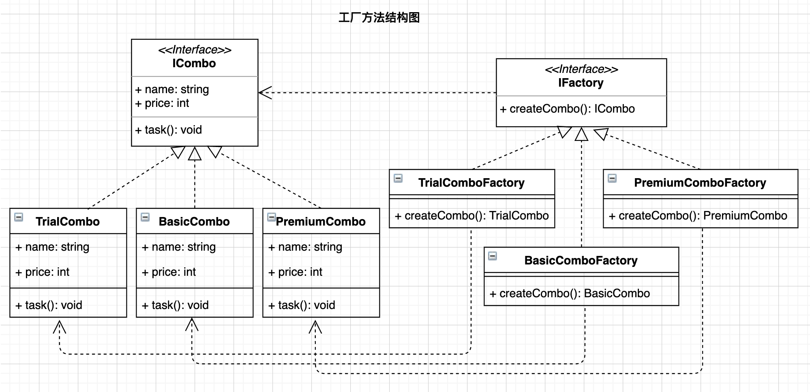

# 前言

在23种设计模式中工厂模式包含工厂方法和抽象工厂两种模式，属于创建型设计模式。在[《设计模式之简单工厂模式》](https://juejin.cn/post/7037913594469564452/)一文中我们了解了简单工厂的定义、构成及示例，并由此知道了简单工厂不符合开闭原则。针对这一缺点，有了工厂方法模式。本文以[前文](https://juejin.cn/post/7037913594469564452/)同样的需求假设为前提介绍下工厂方法模式，并给出代码示例。

> 设计模式重在学思想，个人水平有限，不要深究例子是否合适，理解设计思想为首要目的。

# 需求假设

假如公司的产品为客户提供了三种套餐(`Combo`): 分别为体验版(`TrialCombo`)、基础版(`BasicCombo`)和高级版(`PremiumCombo`)。不同的套餐具有不同的名称(`name	`)、价格(`price`)以及对应的服务(`task`)。现在需要采用面向对象的方法进行编写。总结一句就是**套餐类**：

* 具有属性：名称(`name	`)、价格(`price`)；
* 具有行为：任务服务(`task`)；

以`Python`为例，在简单工厂中需要一个工厂类, 核心是根据传入的参数不同创建不同的套餐类：

```python
class SimpleFactory(object):
    """简单工厂类"""

    def create_combo(self, combo_type=None):
        if combo_type == "trial":
            return TrialCombo()
        elif combo_type == "basic":
            return BasicCombo()
        elif combo_type == "premium":
            return PremiumCombo()
        else:
            return TrialCombo()
```

由于新增或者减少套餐时，我们需要去修改`create_combo()`的代码逻辑，从而违背了开闭原则。因此，我们希望在新增或者减少套餐类时，能不影响其他套餐类创建的代码逻辑。这就是工厂方法模式需要做的。

# 模式定义

结合需求假设，工厂方法模式就是**定义一个用于创建对象的接口(IFactory)，让子类(TrialComboFactory、BasicComboFactory、PremiumComboFactory)决定实例化哪一个类(TrialCombo、BasicCombo、PremiumCombo)。工厂方法使一个类(套餐类)的实例化延迟到子类(工厂子类)。**



由定义可知，工厂方法把简单工厂的内部逻辑判断移到了客户端代码来进行(意思就是在调用的时候，由我们自己来决定使用哪个工厂子类)。想要增加功能，简单工厂需要修改工厂类，而工厂方法需要修改客户端代码。

# 模式构成

根据`UML`结构图，工厂方法模式包含：

* 一个抽象类或接口：用于约定具体类应具有的属性和方法；如`ICombo`;
* 多个具体类：用于实现抽象类或接口；如`TrialCombo`等。
* 一个抽象工厂类或接口：用于约定具体工厂应具有的属性和方法；如`IFactory`。
* 多个具体工厂类：用于实现抽象工厂类或接口；如`TrialComboFactory`等。

# 代码示例

## C++

```c++
/*
 * File: main.cpp
 * Created Date: 2021-11-26 12:38:36
 * Author: ysj
 * Description:  cpp 工厂方法
 */

#include <iostream>
#include <string>
using namespace std;

// 抽象类
class Combo
{
public:
    string name;
    int price;

public:
    virtual void task() = 0;
};

// 具体实现类
class TrialCombo : public Combo
{
public:
    TrialCombo()
    {
        name = "体验版";
        price = 299;
    };
    void task()
    {
        cout << name << "-> 执行价值" << price << "元的服务" << endl;
    };
};

// 具体实现类
class BasicCombo : public Combo
{
public:
    BasicCombo()
    {
        name = "基础版";
        price = 599;
    };
    void task()
    {
        cout << name << "-> 执行价值" << price << "元的服务" << endl;
    };
};

// 具体实现类
class PremiumCombo : public Combo
{
public:
    PremiumCombo()
    {
        name = "高级版";
        price = 1999;
    };
    void task()
    {
        cout << name << "-> 执行价值" << price << "元的服务" << endl;
    };
};

enum ComboType
{
    trial,
    basic,
    premium
};

// 抽象工厂类
class Factory
{
public:
    virtual Combo *createCombo() = 0;
};

// 具体工厂类
class TrialComboFactory : public Factory
{
public:
    Combo *createCombo()
    {
        return new TrialCombo();
    };
};

// 具体工厂类
class BasicComboFactory : public Factory
{
public:
    Combo *createCombo()
    {
        return new BasicCombo();
    };
};

// 具体工厂类
class PremiumComboFactory : public Factory
{
public:
    Combo *createCombo()
    {
        return new PremiumCombo();
    };
};

// 客户端调用
int main()
{
    Factory *trialComboFactory = new TrialComboFactory();
    Combo *trialCombo = trialComboFactory->createCombo();
    trialCombo->task();

    Factory *basicComboFactory = new BasicComboFactory();
    Combo *basicCombo = basicComboFactory->createCombo();
    basicCombo->task();

    Factory *premiumComboFactory = new PremiumComboFactory();
    Combo *premiumCombo = premiumComboFactory->createCombo();
    premiumCombo->task();

    return 0;
}
```

```shell
$ g++ -o main main.cpp && ./main
体验版-> 执行价值299元的服务
基础版-> 执行价值599元的服务
高级版-> 执行价值1999元的服务
```

## Golang

```go
/*
 * File: main.go
 * Created Date: 2021-11-26 12:31:54
 * Author: ysj
 * Description:  golang 工厂方法
 */

package main

import "fmt"

// 接口
type ICombo interface {
	task()
}

type Combo struct {
	Name  string
	Price int
}

// 具体实现
func NewTrialCombo() ICombo {
	return &Combo{
		Name:  "体验版",
		Price: 299,
	}
}

// 具体实现
func NewBasicCombo() ICombo {
	return &Combo{
		Name:  "基础版",
		Price: 599,
	}
}

// 具体实现
func NewPremiumCombo() ICombo {
	return &Combo{
		Name:  "高级版",
		Price: 1999,
	}
}

func (t *Combo) task() {
	fmt.Printf("%s-> 执行价值%d元的服务\n", t.Name, t.Price)
}

// 工厂接口
type IFactory interface {
	createCombo() ICombo
}

// 具体工厂
type TrialComboFactory struct{}

func (t *TrialComboFactory) createCombo() ICombo {
	return NewTrialCombo()
}

// 具体工厂
type BasicComboFactory struct{}

func (t *BasicComboFactory) createCombo() ICombo {
	return NewBasicCombo()
}

// 具体工厂
type PremiumComboFactory struct{}

func (t *PremiumComboFactory) createCombo() ICombo {
	return NewPremiumCombo()
}

// 客户端调用
func main() {
	trialComboFactory := &TrialComboFactory{}
	trialCombo := trialComboFactory.createCombo()
	trialCombo.task()

	basicComboFactory := &BasicComboFactory{}
	basicCombo := basicComboFactory.createCombo()
	basicCombo.task()

	premiumComboFactory := &PremiumComboFactory{}
	premiumCombo := premiumComboFactory.createCombo()
	premiumCombo.task()
}
```

```shell
$ go run .
体验版-> 执行价值299元的服务
基础版-> 执行价值599元的服务
高级版-> 执行价值1999元的服务
```

## Python

```python
#!/usr/bin/env python3
# -*- coding:utf-8 -*-
###
# File: main.py
# Created Date: 2021-11-26 12:13:10
# Author: ysj
# Description:  python 工厂方法
###

from abc import ABCMeta, abstractmethod


class Combo(metaclass=ABCMeta):
    """抽象基类"""

    name = "套餐名"
    price = 0

    @abstractmethod
    def task(self):
        pass

    @property
    @abstractmethod
    def name(self):
        return self.name

    @property
    @abstractmethod
    def price(self):
        return self.price


class TrialCombo(Combo):
    """具体实现类"""

    name = "体验版"
    price = 299

    def task(self):
        print(f"{self.name}-> 执行价值{self.price}元的服务")
        return


class BasicCombo(Combo):
    """具体实现类"""

    name = "基础版"
    price = 599

    def task(self):
        print(f"{self.name}-> 执行价值{self.price}元的服务")
        return


class PremiumCombo(Combo):
    """具体实现类"""

    name = "高级版"
    price = 1999

    def task(self):
        print(f"{self.name}-> 执行价值{self.price}元的服务")
        return


class Factory(metaclass=ABCMeta):
    """抽象工厂基类"""
    @abstractmethod
    def create_combo(self):
        pass


class TrialComboFactory(Factory):
    """具体工厂类"""

    def create_combo(self):
        return TrialCombo()


class BasicComboFactory(Factory):
    """具体工厂类"""

    def create_combo(self):
        return BasicCombo()


class PremiumComboFactory(Factory):
    """具体工厂类"""

    def create_combo(self):
        return PremiumCombo()


if __name__ == "__main__":
    trial_combo_factory = TrialComboFactory()
    trial_combo = trial_combo_factory.create_combo()
    trial_combo.task()

    basic_combo_factory = BasicComboFactory()
    basic_combo = basic_combo_factory.create_combo()
    basic_combo.task()

    premium_combo_factory = PremiumComboFactory()
    premium_combo = premium_combo_factory.create_combo()
    premium_combo.task()
```

```shell
$ python3 main.py
体验版-> 执行价值299元的服务
基础版-> 执行价值599元的服务
高级版-> 执行价值1999元的服务
```

## Typescript

```typescript
/**
 * -------------------------------------------------------
 * File: index.ts
 * Created Date: 2021-11-24 01:42:10
 * Author: ysj
 * Description: ts 工厂方法
 * -------------------------------------------------------
 */

/**接口 */
interface ICombo {
  name: string;
  price: number;
  task(): void;
}

/**具体实现类*/
class TrialCombo implements ICombo {
  name = '体验版';
  price = 299;
  task() {
    console.log(`${this.name}-> 执行价值${this.price}元的服务`);
  }
}

/**具体实现类*/
class BasicCombo implements ICombo {
  name = '基础版';
  price = 599;
  task() {
    console.log(`${this.name}-> 执行价值${this.price}元的服务`);
  }
}
/**具体实现类*/
class PremiumCombo implements ICombo {
  name = '高级版';
  price = 1999;
  task() {
    console.log(`${this.name}-> 执行价值${this.price}元的服务`);
  }
}
/**工厂接口*/
interface IFactory {
  createCombo(): ICombo;
}

/**具体工厂类 */
class TrialComboFactory implements IFactory {
  createCombo() {
    return new TrialCombo();
  }
}

/**具体工厂类 */
class BasicComboFactory implements IFactory {
  createCombo() {
    return new BasicCombo();
  }
}

/**具体工厂类 */
class PremiumComboFactory implements IFactory {
  createCombo() {
    return new PremiumCombo();
  }
}

/**客户端调用 */
const trialComboFactory = new TrialComboFactory();
const trialCombo = trialComboFactory.createCombo();
trialCombo.task();

const basicComboFactory = new BasicComboFactory();
const basicCombo = basicComboFactory.createCombo();
basicCombo.task();

const premiumComboFactory = new PremiumComboFactory();
const premiumCombo = premiumComboFactory.createCombo();
premiumCombo.task();
```

```shell
$ tsc index.ts --outFile build/main.js && node build/main.js
体验版-> 执行价值299元的服务
基础版-> 执行价值599元的服务
高级版-> 执行价值1999元的服务
✨  Done in 2.09s.
```

# 优点缺点

工厂方法最大的优点在于符合开闭原则。当新增或删除功能类时，不会影响到其他类的既有实现。避免了需求迭代的过程中，相互关联产生影响。

工厂方法的缺点在于，有多少个具体产品，就要写多少个具体工厂。当产品种类越来越多，工厂的代码量也会水涨船高。

# 适用场景

* 当某个系列类有很多对象需要创建，且这些对象具有共同的属性和行为时；例如本例中的套餐类都具有名称`name`和行为`task`。
* 当希望对象的创建在逻辑上解耦，各自保持独立时；例如本例中通过`TrialComboFactory`工厂创建`TrialCombo`类实例、通过`BasicComboFactory`创建`BasicCombo`类实例，彼此之间的创建过程相互独立，互不影响，客户端只需要知道具体的工厂名称，不需要去关心具体的类以及该类创建的细节。

# 参考资料

* 程杰.大话设计模式[M].北京：清华大学出版社，2007.12