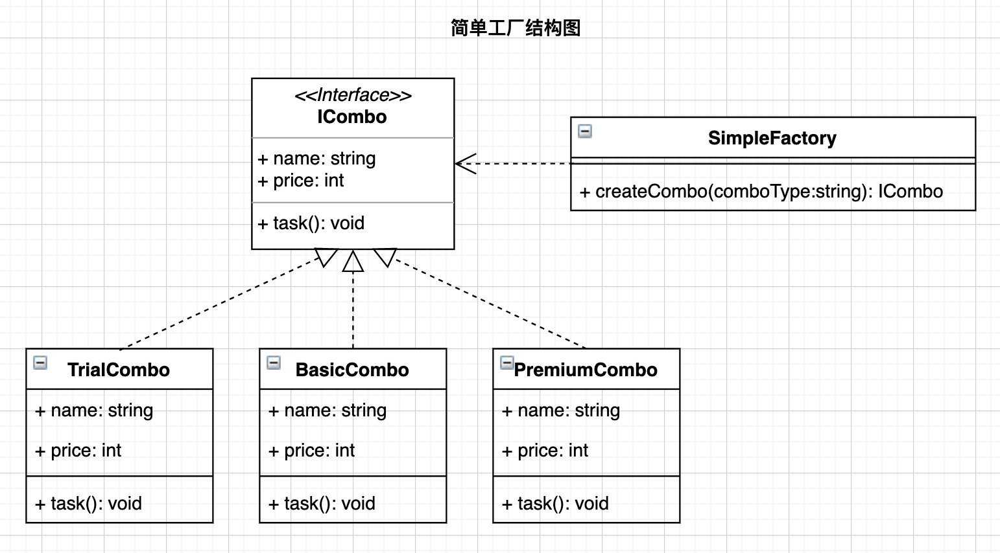

# 前言

在23种设计模式中工厂模式占两种，属于创建型设计模式。在单独说工厂模式时，往往包含简单工厂、工厂方法和抽象工厂三种。尽管简单工厂并不包含在设计模式中，但仍是一种常用的编程方式。本文简要介绍下简单工厂模式，并给出4种语言代码的简单示例。

> 设计模式重在学思想，个人水平有限，不要深究例子是否合适，理解设计思想为首要目的。

# 需求假设

假如公司的产品为客户提供了三种套餐(`Combo`): 分别为体验版(`TrialCombo`)、基础版(`BasicCombo`)和高级版(`PremiumCombo`)。不同的套餐具有不同的名称(`name	`)、价格(`price`)以及对应的服务(`task`)。现在需要采用面向对象的方法进行编写。总结一句就是**套餐类**：

* 具有属性：名称(`name	`)、价格(`price`)；
* 具有行为：任务服务(`task`)；

以`Python`为例， 很容易很自然地可以如下进行编写：

```python
from abc import ABCMeta, abstractmethod

class Combo(metaclass=ABCMeta):
    """套餐抽象基类"""
    name = "套餐名"
    price = 0
    @abstractmethod
    def task(self):
        pass
      
    @property
    @abstractmethod
    def name(self):
        return self.name
      
    @property
    @abstractmethod
    def price(self):
        return self.price
   
  
class TrialCombo(Combo):
    """体验版套餐"""
    name = "体验版"
    price = 299
    
    def task(self):
        print(f"{self.name}-> 执行价值{self.price}元的服务")
        return

      
class BasicCombo(Combo):
    """基础版套餐"""
    name = "基础版"
    price = 599
    
    def task(self):
        print(f"{self.name}-> 执行价值{self.price}元的服务")
        return

      
class PremiumCombo(Combo):
    """高级版套餐"""
    name = "高级版"
    price = 1999
    
    def task(self):
        print(f"{self.name}-> 执行价值{self.price}元的服务")
        return
```

然后客户端根据业务条件进行如下的实例化和调用：

```python
trial_combo = TrialCombo()
trial_combo.task()

basic_combo = BasicCombo()
basic_combo.task()

premium_combo = PremiumCombo()
premium_combo.task()
```

这样编写有问题吗？没有问题。但此处的没有问题仅仅是因为这些类并没有涉及复杂的创建过程，试想当类的创建比较复杂时，例如需要传入多个初始化参数时，像这样：

```python
combo = Combo(arg1, arg2,arg3)
```

那么每次实例化过程将变得繁琐，随着项目体积增长，假如程序中多处进行了实例化调用，或者想要变更参数，或者想要变更类实例，总之想要修改就得异常小心！

# 模式定义

为了让类的实例化达到"一处修改处处修改"，可以将类的创建统一交给"工厂"处理，以后在维护的过程中只需要改变"工厂"，就能改变所有的"产出"。为此，需要引入一个工厂类，根据各种不同的条件创建相应的类实例。

结合本例，**简单工厂模式就是定义一个工厂类(SimpleFactory)，根据传入的参数不同(comboType)返回不同的实例(TrialCombo、BasicCombo、PremiumCombo)，被创建的实例具有共同的父类或接口(ICombo)。**



# 模式构成

根据`UML`结构图，简单工厂模式包含：

* 一个抽象类或接口：用于约定具体类应具有的属性和方法；如`ICombo`。
* 多个具体类：用于实现抽象类或接口；如`TrialCombo`等。
* 一个工厂类：用于根据条件创建不同的具体类实例；如`SimpleFactory`。

# 代码示例

## C++

```c++
/* 
 * File: main.cpp
 * Created Date: 2021-11-25 10:10:45
 * Author: ysj
 * Description:  cpp 简单工厂
 */

#include <iostream>
#include <string>
using namespace std;

// 抽象类
class Combo
{
public:
    string name;
    int price;

public:
    virtual void task() = 0;
};

// 具体实现类
class TrialCombo : public Combo
{
public:
    TrialCombo()
    {
        name = "体验版";
        price = 299;
    };
    void task()
    {
        cout << name << "-> 执行价值" << price << "元的服务" << endl;
    };
};

//具体实现类
class BasicCombo : public Combo
{
public:
    BasicCombo()
    {
        name = "基础版";
        price = 599;
    };
    void task()
    {
        cout << name << "-> 执行价值" << price << "元的服务" << endl;
    };
};

//具体实现类
class PremiumCombo : public Combo
{
public:
    PremiumCombo()
    {
        name = "高级版";
        price = 1999;
    };
    void task()
    {
        cout << name << "-> 执行价值" << price << "元的服务" << endl;
    };
};

enum ComboType
{
    trial,
    basic,
    premium
};

// 简单工厂类
class SimpleFactory
{
public:
    static Combo *createCombo(ComboType comboType)
    {
        switch (comboType)
        {
        case trial:
            return new TrialCombo();
        case basic:
            return new BasicCombo();
        case premium:
            return new PremiumCombo();
        default:
            return new TrialCombo();
        }
    };
};

// 客户端调用
int main()
{
    SimpleFactory factory = SimpleFactory();
    Combo *trialCombo = factory.createCombo(trial);
    trialCombo->task();

    Combo *basicCombo = factory.createCombo(basic);
    basicCombo->task();

    Combo *premiumCombo = factory.createCombo(premium);
    premiumCombo->task();

    return 0;
}
```

```shell
$ g++ -o main main.cpp && ./main
体验版-> 执行价值299元的服务
基础版-> 执行价值599元的服务
高级版-> 执行价值1999元的服务
```

## Golang

```go
/* 
 * File: main.go
 * Created Date: 2021-11-24 12:34:23
 * Author: ysj
 * Description: golang 简单工厂
 */
package main

import (
	"fmt"
)

// 接口
type ICombo interface {
	task()
}

type Combo struct {
	Name  string
	Price int
}

// 具体实现
func NewTrialCombo() ICombo {
	return &Combo{
		Name:  "体验版",
		Price: 299,
	}
}

// 具体实现
func NewBasicCombo() ICombo {
	return &Combo{
		Name:  "基础版",
		Price: 599,
	}
}

// 具体实现
func NewPremuimCombo() ICombo {
	return &Combo{
		Name:  "高级版",
		Price: 1999,
	}
}

func (t *Combo) task() {
	fmt.Printf("%s-> 执行价值%d元的服务\n", t.Name, t.Price)
}

// 简单工厂
type SimpleFactory struct{}

func (s *SimpleFactory) createCombo(comboType string) ICombo {
	switch comboType {
	case "trial":
		return NewTrialCombo()
	case "basic":
		return NewBasicCombo()
	case "premium":
		return NewPremuimCombo()
	default:
		return NewTrialCombo()
	}
}

// 客户端调用
func main() {
	factory := &SimpleFactory{}

	trialCombo := factory.createCombo("trial")
	trialCombo.task()

	basicCombo := factory.createCombo("basic")
	basicCombo.task()

	premiumCombo := factory.createCombo("premium")
	premiumCombo.task()
}
```

```shell
$ go run .
体验版-> 执行价值299元的服务
基础版-> 执行价值599元的服务
体验版-> 执行价值1999元的服务
```

## Python

```python
#!/usr/bin/env python3
# -*- coding:utf-8 -*-
###
# File: main.py
# Created Date: 2021-11-24 12:11:07
# Author: ysj
# Description: python 简单工厂
###

from abc import ABCMeta, abstractmethod


class Combo(metaclass=ABCMeta):
    """抽象基类"""

    name = "套餐名"
    price = 0

    @abstractmethod
    def task(self):
        pass

    @property
    @abstractmethod
    def name(self):
        return self.name

    @property
    @abstractmethod
    def price(self):
        return self.price


class TrialCombo(Combo):
    """具体实现类"""

    name = "体验版"
    price = 299

    def task(self):
        print(f"{self.name}-> 执行价值{self.price}元的服务")
        return


class BasicCombo(Combo):
    """具体实现类"""

    name = "基础版"
    price = 599

    def task(self):
        print(f"{self.name}-> 执行价值{self.price}元的服务")
        return


class PremiumCombo(Combo):
    """具体实现类"""

    name = "高级版"
    price = 1999

    def task(self):
        print(f"{self.name}-> 执行价值{self.price}元的服务")
        return


class SimpleFactory(object):
    """简单工厂类"""

    def create_combo(self, combo_type=None):
        if combo_type == "trial":
            return TrialCombo()
        elif combo_type == "basic":
            return BasicCombo()
        elif combo_type == "premium":
            return PremiumCombo()
        else:
            return TrialCombo()


if __name__ == "__main__":
    factory = SimpleFactory()

    trial_combo = factory.create_combo('trial')
    trial_combo.task()

    basic_combo = factory.create_combo('basic')
    basic_combo.task()

    premium_combo = factory.create_combo('premium')
    premium_combo.task()
```

```shell
$ python3 main.py
体验版-> 执行价值299元的服务
基础版-> 执行价值599元的服务
高级版-> 执行价值1999元的服务
```

## Typescript

```typescript
/**
 * -------------------------------------------------------
 * File: index.ts
 * Created Date: 2021-11-24 01:42:10
 * Author: ysj
 * Description: ts 简单工厂
 * -------------------------------------------------------
 */

/**一个接口 */
interface ICombo {
  name: string;
  price: number;
  task(): void;
}

/**具体实现类*/
class TrialCombo implements ICombo {
  name = '体验版';
  price = 299;
  task() {
    console.log(`${this.name}-> 执行价值${this.price}元的服务`);
  }
}

/**具体实现类*/
class BasicCombo implements ICombo {
  name = '基础版';
  price = 599;
  task() {
    console.log(`${this.name}-> 执行价值${this.price}元的服务`);
  }
}
/**具体实现类*/
class PremiumCombo implements ICombo {
  name = '高级版';
  price = 1999;
  task() {
    console.log(`${this.name}-> 执行价值${this.price}元的服务`);
  }
}
/**简单工厂类*/
class SimpleFactory {
  createCombo(comboType: string) {
    switch (comboType) {
      case 'trial':
        return new TrialCombo();
      case 'basic':
        return new BasicCombo();
      case 'premium':
        return new PremiumCombo();
      default:
        return new TrialCombo();
    }
  }
}

/**客户端调用 */
const factory: SimpleFactory = new SimpleFactory();

const trialCombo = factory.createCombo('trial');
trialCombo.task();
const basicCombo = factory.createCombo('basic');
basicCombo.task();
const premiumCombo = factory.createCombo('premium');
premiumCombo.task();
```

```shell
$ tsc index.ts --outFile build/main.js && node build/main.js
体验版-> 执行价值299元的服务
基础版-> 执行价值599元的服务
高级版-> 执行价值1999元的服务
✨  Done in 2.21s.
```

# 优点缺点

简单工厂最大的优点在于，工厂类中包含了必要的判断逻辑，可以根据客户端指定的条件动态实例化相关的类， 这对于客户端来说，去除了与具体产品的依赖。简单地说，就是把类实例的"使用与创建"进行了分离，当需求变更时，我们不需要在每个使用类的地方去进行修改，而直接去修改工厂方法的逻辑即可。

简单工厂的缺点是不符合开闭原则。当我们需要增加新的具体类时，或者当我们需要改变类创建的条件时，都需要去修改工厂方法，既没有对扩展开放，也没有对修改关闭。

> 个人认为，某些情况下多写几个if-else、switch-case又有何不可呢, 简单最重要，毕竟有时候易于理解比一味遵循开闭有实际意义得多！

# 适用场景

* 需要创建的对象较少。由于只有一个工厂类，工厂类中创建的对象不宜过多，以免工厂类的业务逻辑过于复杂。
* 客户端不需要知道对象的创建过程。由于工厂类封装了对象的创建过程，将对象的"使用与创建"进行了分离，所以客户端只管如何使用对象，而不用关心具体如何创建对象。

# 参考资料

* 程杰.大话设计模式[M].北京：清华大学出版社，2007.12