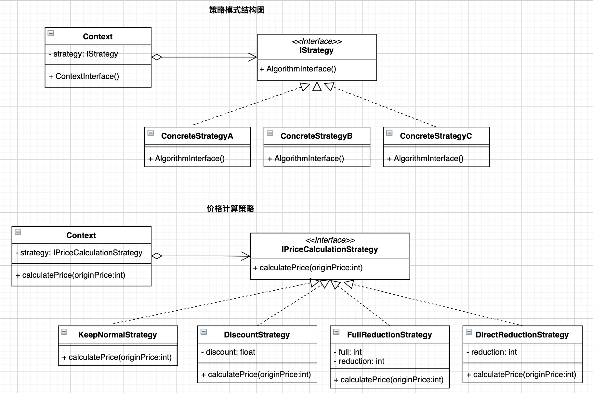

# 前言

在23种设计模式中有11种行为型模式。行为型模式对类和对象如何交互和怎样分配职责进行描述。其中，策略模式描述的是，将算法封装在对象中，进而可以方便的指定和改变一个对象所使用的算法。本文以假定的需求为基础，介绍下策略模式的应用，并给出代码示例。

# 需求假设

在之前的文章中，我们假定了公司的产品为客户提供了体验版、基础版和高级版三种套餐，套餐的创建使用了工厂模式。现在我们将需求聚焦在客户购买套餐后，支付价格的计算上。由于不同的套餐具有不同的价格，同时为了促进产品售卖，公司还提供了不同的优惠手段，如打折、满减、无门槛优惠卷等。因此，客户最终的支付价格面临着不同计算规则。

不同的优惠手段就对应着不同的价格**计算规则**(或称**计算策略**、**计算算法**)，我们需要利用策略模式来完成价格计算的设计。

# 模式定义

策略模式就是定义**一系列算法**，**分别封装**起来，让他们之间可以**互相替换**，此模式让算法的变化不会影响到使用算法的客户。

* "一系列算法": 从概念上看所有这些算法完成的都是相同的工作，只是实现不同。例如，打折和满减是不同的算法，但各自的目的是一致的，就是计算出最终的价格。
* "分别封装"、"互相替换"：有多少种具体策略，就要封装多少个策略类，这些策略类之间可以相互替换，从而改变算法。例如，针对打折、满减、无门槛卷三种优惠方式，我们就需要分别封装为三个不同的策略类。
* "不会影响到使用算法的客户": 通过实现一个策略上下文类(`Context`)来封装当前使用的具体策略和策略方法的调用，同时 `Strategy` 类为 `Context` 定义了一系列可供重用的算法或行为。客户端仅通过`Context`类来使用策略，保证了以相同的方式调用所有的算法。如此以来，当各策略算法发生变化时也就不会影响到算法的使用。



# 模式构成

根据`UML`结构图，策略模式包含：

* 一个抽象策略类或策略接口：用于约定各具体策略应实现的具体算法。也就是规定这些算法应完成的共同工作是啥。例如**价格计算策略(`IPriceCalculationStrategy`)**规定了各种促销手段都需要完成**计算价格`calculatePrice()`**这一行为。
* 多个具体策略类：分别实现策略接口约定的方法。具体策略如，保持**原价策略(`KeepNormalStrategy`)、打折策略(`DiscountStrategy`)、满减策略(`FullReductionStrategy`)、无门槛策略(`DirectReductionStrategy`)**。
* 一个上下文类(`Context`): 用以配置一个具体策略，维护一个对策略对象的引用。通过`Context`类来持有当前所使用的具体策略对象。

# 代码示例

## C++

```c++
/*
 * File: strategy.hpp
 * Created Date: 2021-12-12 05:08:43
 * Author: ysj
 * Description:  策略类
 */
#pragma once
#include <iostream>
using namespace std;

// 价格计算抽象策略类
class PriceCalculationStrategy
{
public:
    virtual float calculatePrice(float originPrice) = 0;
};

// 原价策略
class KeepNormalStrategy : public PriceCalculationStrategy
{
public:
    virtual float calculatePrice(float originPrice)
    {
        return originPrice;
    }
};

// 打折策略
class DiscountStrategy : public PriceCalculationStrategy
{
private:
    float discount;

public:
    DiscountStrategy(float discount)
    {
        this->discount = discount;
    }
    virtual float calculatePrice(float originPrice)
    {
        return originPrice * discount;
    }
};

// 满减策略
class FullReductionStrategy : public PriceCalculationStrategy
{
private:
    float full;
    float reduction;

public:
    FullReductionStrategy(float full, float reduction)
    {
        this->full = full;
        this->reduction = reduction;
    }
    virtual float calculatePrice(float originPrice)
    {
        float totalPrice = originPrice;
        if (originPrice >= full)
        {
            totalPrice = originPrice - reduction;
        }
        return totalPrice;
    }
};

// 无门槛策略
class DirectReductionStrategy : public PriceCalculationStrategy
{
private:
    float reduction;

public:
    DirectReductionStrategy(float reduction)
    {
        this->reduction = reduction;
    }
    virtual float calculatePrice(float originPrice)
    {
        float totalPrice = originPrice - reduction;
        if (totalPrice < 0)
        {
            return 0;
        }
        return totalPrice;
    }
};
```

```c++
/*
 * File: context.hpp
 * Created Date: 2021-12-12 05:08:58
 * Author: ysj
 * Description:  策略上下文类
 */
#pragma once
#include <iostream>
#include "strategy.hpp"
using namespace std;

class PriceCalculationContext
{
private:
    PriceCalculationStrategy *strategy;

public:
    PriceCalculationContext(PriceCalculationStrategy *strategy)
    {
        this->strategy = strategy;
    }
    float calculatePrice(float originPrice)
    {
        float totalPrice = strategy->calculatePrice(originPrice);
        return totalPrice;
    }
};
```

```c++
/*
 * File: main.cpp
 * Created Date: 2021-12-12 05:06:54
 * Author: ysj
 * Description:  cpp策略模式
 */
#include <iostream>
#include "strategy.hpp"
#include "context.hpp"
using namespace std;

int main()
{
    // 购买价格、数量
    float price = 599;
    float quantity = 1;
    float originPrice = price * quantity;
    cout << "单价:" << price << " 数量:" << quantity << " 原价:" << originPrice << endl;

    // 正常计算策略
    PriceCalculationStrategy *keepNormal = new KeepNormalStrategy();
    PriceCalculationContext *ctx = new PriceCalculationContext(keepNormal);
    float totalPrice = ctx->calculatePrice(originPrice);
    cout << "正常价格:" << totalPrice << endl;

    // 打折计算策略
    PriceCalculationStrategy *discount = new DiscountStrategy(0.8);
    ctx = new PriceCalculationContext(discount);
    totalPrice = ctx->calculatePrice(originPrice);
    cout << "八折价格:" << totalPrice << endl;

    // 满减策略
    PriceCalculationStrategy *fullReduction = new FullReductionStrategy(500, 200);
    ctx = new PriceCalculationContext(fullReduction);
    totalPrice = ctx->calculatePrice(originPrice);
    cout << "满500减200价格:" << totalPrice << endl;

    // 无门槛策略
    PriceCalculationStrategy *directReduction = new DirectReductionStrategy(100);
    ctx = new PriceCalculationContext(directReduction);
    totalPrice = ctx->calculatePrice(originPrice);
    cout << "直减100价格:" << totalPrice << endl;
    
    return 0;
}
```

```shell
$ g++ main.cpp -I include -o main && ./main
单价:599 数量:1 原价:599
正常价格:599
八折价格:479.2
满500减200价格:399
直减100价格:499
```

## Golang

```go
/*
 * File: strategy.go
 * Created Date: 2021-12-12 04:25:14
 * Author: ysj
 * Description:  策略
 */
package main

// 策略接口
type IPriceCalculationStrategy interface {
	calculatePrice(originPrice float64) float64
}

// 原价策略
type KeepNormalStrategy struct{}

func NewKeepNormalStrategy() IPriceCalculationStrategy {
	return &KeepNormalStrategy{}
}

func (k *KeepNormalStrategy) calculatePrice(originPrice float64) float64 {
	return originPrice
}

// 打折策略
type DiscountStrategy struct {
	discount float64
}

func NewDiscountStrategy(discount float64) IPriceCalculationStrategy {
	return &DiscountStrategy{
		discount: discount,
	}
}
func (d *DiscountStrategy) calculatePrice(originPrice float64) float64 {
	return originPrice * d.discount
}

// 满减策略
type FullReductionStrategy struct {
	full      float64
	reduction float64
}

func NewFullReductionStrategy(full, reduction float64) IPriceCalculationStrategy {
	return &FullReductionStrategy{
		full:      full,
		reduction: reduction,
	}
}
func (f *FullReductionStrategy) calculatePrice(originPrice float64) float64 {
	totalPrice := originPrice
	if originPrice >= f.full {
		totalPrice = originPrice - f.reduction
	}
	return totalPrice
}

// 无门槛策略
type DirectReductionStrategy struct {
	reduction float64
}

func NewDirectReductionStrategy(reduction float64) IPriceCalculationStrategy {
	return &DirectReductionStrategy{
		reduction: reduction,
	}
}
func (d *DirectReductionStrategy) calculatePrice(originPrice float64) float64 {
	totalPrice := originPrice - d.reduction
	if totalPrice < 0 {
		return 0
	}
	return totalPrice
}
```

```go
/*
 * File: context.go
 * Created Date: 2021-12-12 04:25:39
 * Author: ysj
 * Description:  策略上下文
 */

package main

type PriceCalculationContext struct {
	strategy IPriceCalculationStrategy
}

func NewPriceCalculationContext(strategy IPriceCalculationStrategy) *PriceCalculationContext {
	return &PriceCalculationContext{
		strategy: strategy,
	}
}

func (p *PriceCalculationContext) calculatePrice(originPrice float64) float64 {
	return p.strategy.calculatePrice(originPrice)
}
```

```go
/*
 * File: main.go
 * Created Date: 2021-12-12 04:26:03
 * Author: ysj
 * Description:  golang策略模式
 */

package main

import "fmt"

func main() {
	// 购买价格、数量
	price := 599.0
	quantity := 1.0
	originPrice := price * quantity
	fmt.Printf("单价:%.2f 数量:%.2f 原价:%.2f\n", price, quantity, originPrice)

	// 正常计算策略
	keepNormal := NewKeepNormalStrategy()
	ctx := NewPriceCalculationContext(keepNormal)
	totalPrice := ctx.calculatePrice(originPrice)
	fmt.Printf("正常价格:%.2f\n", totalPrice)

	// 打折计算策略
	discount := NewDiscountStrategy(0.8)
	ctx = NewPriceCalculationContext(discount)
	totalPrice = ctx.calculatePrice(originPrice)
	fmt.Printf("八折价格:%.2f\n", totalPrice)

	// 满减策略
	fullReduction := NewFullReductionStrategy(500, 200)
	ctx = NewPriceCalculationContext(fullReduction)
	totalPrice = ctx.calculatePrice(originPrice)
	fmt.Printf("满500减200价格:%.2f\n", totalPrice)

	// 无门槛策略
	directReduction := NewDirectReductionStrategy(100)
	ctx = NewPriceCalculationContext(directReduction)
	totalPrice = ctx.calculatePrice(originPrice)
	fmt.Printf("直减100价格:%.2f\n", totalPrice)
}
```

```shell
$ go run .
单价:599.00 数量:1.00 原价:599.00
正常价格:599.00
八折价格:479.20
满500减200价格:399.00
直减100价格:499.00
```

## Python

```python
#!/usr/bin/env python3
# -*- coding:utf-8 -*-
###
# File: strategy.py
# Created Date: 2021-12-07 02:21:10
# Author: ysj
# Description: 策略类
###

from abc import ABCMeta, abstractmethod


class PriceCalculationStrategy(metaclass=ABCMeta):
    """抽象基类"""
    @abstractmethod
    def calculate_price(self, origin_price):
        pass


class KeepNormalStrategy(PriceCalculationStrategy):
    """原价策略"""

    def __init__(self):
        super().__init__()

    def calculate_price(self, origin_price):
        total_price = round(origin_price, 2)
        return total_price


class DiscountStrategy(PriceCalculationStrategy):
    """打折策略"""

    def __init__(self, discount):
        self.__discount = discount

    def calculate_price(self, origin_price):
        total_price = origin_price * self.__discount
        total_price = round(total_price, 2)
        return total_price


class FullReductionStrategy(PriceCalculationStrategy):
    """满减策略"""

    def __init__(self, full, reduction):
        self.__full = full
        self.__reduction = reduction

    def calculate_price(self, origin_price):
        if origin_price >= self.__full:
            origin_price -= self.__reduction
        total_price = round(origin_price, 2)
        return total_price


class DirectReductionStrategy(PriceCalculationStrategy):
    """无门槛策略"""

    def __init__(self, reduction):
        self.__reduction = reduction

    def calculate_price(self, origin_price):
        total_price = max(0, origin_price-self.__reduction)
        total_price = round(total_price, 2)
        return total_price
```

```python
#!/usr/bin/env python3
# -*- coding:utf-8 -*-
###
# File: context.py
# Created Date: 2021-12-07 03:03:37
# Author: ysj
# Description:  策略上下文
###

from strategy import PriceCalculationStrategy


class PriceCalculationContext(object):
    """策略上下文-由客户端判断选择策略"""

    def __init__(self, strategy: PriceCalculationStrategy):
        self.__strategy = strategy

    def calculate_price(self, origin_price):
        total_price = self.__strategy.calculate_price(origin_price)
        return total_price
```

```python
#!/usr/bin/env python3
# -*- coding:utf-8 -*-
###
# File: main.py
# Created Date: 2021-12-07 03:14:12
# Author: ysj
# Description:  python 策略模式
###

from strategy import (
    KeepNormalStrategy, DiscountStrategy,
    FullReductionStrategy, DirectReductionStrategy,
)

from context1 import PriceCalculationContext


# 购买价格、数量
price = 599
quantity = 1
origin_price = price * quantity
print(f"单价:{price} 数量:{quantity} 原价:{origin_price}")

# 正常计算策略
keep_normal = KeepNormalStrategy()
ctx = PriceCalculationContext(keep_normal)
total_price = ctx.calculate_price(origin_price)
print(f"正常价格:{total_price}")

# 打折计算策略
discount = DiscountStrategy(discount=0.8)
ctx = PriceCalculationContext(discount)
total_price = ctx.calculate_price(origin_price)
print(f"八折价格:{total_price}")

# 满减策略
full_reduction = FullReductionStrategy(full=500, reduction=200)
ctx = PriceCalculationContext(full_reduction)
total_price = ctx.calculate_price(origin_price)
print(f"满500减200价格:{total_price}")

# 无门槛策略
direct_reduction = DirectReductionStrategy(reduction=100)
ctx = PriceCalculationContext(direct_reduction)
total_price = ctx.calculate_price(origin_price)
print(f"直减100价格:{total_price}")
```

```shell
$ python3 main.py
单价:599 数量:1 原价:599
正常价格:599
八折价格:479.2
满500减200价格:399
直减100价格:499
```

## TypeScript

```typescript
/**
 * -------------------------------------------------------
 * File: strategy.ts
 * Created Date: 2021-12-12 01:46:00
 * Author: ysj
 * Description: 策略类
 * -------------------------------------------------------
 */

/**策略接口 */
export interface IPriceCalculationStrategy {
  calculatePrice(originPrice: number): number;
}

/**原价策略 */
export class KeepNormalStrategy implements IPriceCalculationStrategy {
  calculatePrice(originPrice: number) {
    const totalPrice = Number(originPrice.toFixed(2));
    return totalPrice;
  }
}

/**打折策略 */
export class DiscountStrategy implements IPriceCalculationStrategy {
  private discount: number;
  constructor(discount: number) {
    this.discount = discount;
  }
  calculatePrice(originPrice: number) {
    let totalPrice = originPrice * this.discount;
    totalPrice = Number(totalPrice.toFixed(2));
    return totalPrice;
  }
}

/**满减策略 */
export class FullReductionStrategy implements IPriceCalculationStrategy {
  private full: number;
  private reduction: number;
  constructor(full: number, reduction: number) {
    this.full = full;
    this.reduction = reduction;
  }
  calculatePrice(originPrice: number) {
    let totalPrice =
      originPrice >= this.full ? originPrice - this.reduction : originPrice;
    totalPrice = Number(totalPrice.toFixed(2));
    return totalPrice;
  }
}

/**无门槛策略 */
export class DirectReductionStrategy implements IPriceCalculationStrategy {
  private reduction: number;
  constructor(reduction: number) {
    this.reduction = reduction;
  }
  calculatePrice(originPrice: number) {
    let totalPrice = Math.max(0, originPrice - this.reduction);
    totalPrice = Number(totalPrice.toFixed(2));
    return totalPrice;
  }
}
```

```typescript
/**
 * -------------------------------------------------------
 * File: context.ts
 * Created Date: 2021-12-12 01:46:28
 * Author: ysj
 * Description: 策略上下文
 * -------------------------------------------------------
 */

import { IPriceCalculationStrategy } from './strategy';

export default class PriceCalculationContext {
  private strategy: IPriceCalculationStrategy;
  constructor(strategy: IPriceCalculationStrategy) {
    this.strategy = strategy;
  }
  calculatePrice(originPrice: number): number {
    const totalPrice = this.strategy.calculatePrice(originPrice);
    return totalPrice;
  }
}
```

```typescript
/**
 * -------------------------------------------------------
 * File: index.ts
 * Created Date: 2021-12-12 01:45:20
 * Author: ysj
 * Description: ts 策略模式
 * -------------------------------------------------------
 */

import PriceCalculationContext from './context';
import {
  KeepNormalStrategy,
  DiscountStrategy,
  FullReductionStrategy,
  DirectReductionStrategy,
} from './strategy';

// 购买价格、数量
const price = 599;
const quantity = 1;
const originPrice = price * quantity;
console.log(`单价:${price} 数量:${quantity} 原价:${originPrice}`);

// 正常计算策略
const keepNormal = new KeepNormalStrategy();
let ctx = new PriceCalculationContext(keepNormal);
let totalPrice = ctx.calculatePrice(originPrice);
console.log(`正常价格:${totalPrice}`);

// 打折计算策略
const discount = new DiscountStrategy(0.8);
ctx = new PriceCalculationContext(discount);
totalPrice = ctx.calculatePrice(originPrice);
console.log(`八折价格:${totalPrice}`);

// 满减策略
const fullReduction = new FullReductionStrategy(500, 200);
ctx = new PriceCalculationContext(fullReduction);
totalPrice = ctx.calculatePrice(originPrice);
console.log(`满500减200价格:${totalPrice}`);

// 无门槛策略
const directReduction = new DirectReductionStrategy(100);
ctx = new PriceCalculationContext(directReduction);
totalPrice = ctx.calculatePrice(originPrice);
console.log(`直减100价格:${totalPrice}`);
```

```shell
$ tsc -p ./tsconfig.json && node build/index.js
单价:599 数量:1 原价:599
正常价格:599
八折价格:479.2
满500减200价格:399
直减100价格:499
✨  Done in 2.35s.
```

# 模式扩展

上述代码是基本策略模式的实现。在基本策略模式中，我们需要在客户端决定使用哪一个具体策略，实例化一个策略对象，让后将其传递给策略模式的 `Context` 对象，然后调用`Context`对象的接口方法。这样的话，选择所用具体实现的职责就由客户端对象来承担，这会让客户端面临选择判断的压力。

因此，在基本策略模式的基础上，出现了一些改进，扩展了策略模式的设计。这些扩展主要的目的是将"选择具体实现的职责"或者叫做"选择判断的压力"转移到`Context`来承担，从而减轻客户端的职责。主要有两种实现方式：

一是策略模式与简单工厂模式的结合。例如如下Python实现：

```python
#!/usr/bin/env python3
# -*- coding:utf-8 -*-
###
# File: context.py
# Created Date: 2021-12-07 03:43:19
# Author: ysj
# Description:  策略上下文 + 简单工厂
###
from strategy import (
    KeepNormalStrategy, DiscountStrategy,
    FullReductionStrategy, DirectReductionStrategy,
)

class PriceCalculationContext(object):
    """策略上下文-由简单工厂判断创建策略"""

    def __init__(self, strategy_type):
        if strategy_type == "keep_normal":
            self.__strategy = KeepNormalStrategy()
        elif strategy_type == "discount":
            self.__strategy = DiscountStrategy(discount=0.8)
        elif strategy_type == "full_reduction":
            self.__strategy = FullReductionStrategy(full=500, reduction=200)
        elif strategy_type == "direct_reduction":
            self.__strategy = DirectReductionStrategy(reduction=100)
        else:
            self.__strategy = KeepNormalStrategy()

    def calculate_price(self, origin_price):
        total_price = self.__strategy.calculate_price(origin_price)
        return total_price
```

这样客户端在决定使用哪种算法时，只需要通过`strategy_type`的值来控制，策略类实例化的过程封装在了`Context`类中。但是，这样有一个缺点，不同策略类的初始参数需要提前确定，除非各策略类不需要初始参数。或者，不同的初始参数通过`Context`实例化时进行传递，但这无疑让`Context`的初始化变得复杂。

二是策略模式与`HashMap`的结合。这种方式抛弃了策略类的定义和实现。直接使用`HashMap`来存储策略算法名及其对应的算法。参考如下Python示例：

```python
#!/usr/bin/env python3
# -*- coding:utf-8 -*-
###
# File: context2.py
# Created Date: 2021-12-13 03:55:57
# Author: ysj
# Description:  策略上下文 + HashMap
###

class PriceCalculationContext(object):
    """策略上下文-由HashMap存储策略算法"""

    def __init__(self):
        self.__strategyMap = {
            "keep_normal": self.keep_normal,
            "discount": self.discount,
            "full_reduction": self.full_reduction,
            "direct_reduction": self.direct_reduction,
        }

    @staticmethod
    def keep_normal(origin_price):
        return round(origin_price, 2)

    @staticmethod
    def discount(origin_price, discount):
        return round(origin_price * discount, 2)

    @staticmethod
    def full_reduction(origin_price, full, reduction):
        if origin_price < full:
            return round(origin_price, 2)
        return round(origin_price-reduction, 2)

    @staticmethod
    def direct_reduction(origin_price, reduction):
        return round(max(0, origin_price-reduction), 2)

    def calculate_price(self, strategy_type, origin_price, *args, **kwargs):
        calculate_func = self.__strategyMap[strategy_type]
        total_price = calculate_func(origin_price, *args, **kwargs)
        return total_price
```

这种方式，虽然代码量降低了不少，看起来是变简单了，但完全不符合开闭原则和单一职责原则。不推荐！

# 适用场景

策略模式就是用来封装算法的，在实践中可以用来封装几乎任何类型的规则。关于该模式的适用场景，某些教程的说法条条框框，显得有些不知所谓。根据定义，总结一句话，**只要出于同一目的需要应用不同的业务规则，就可以考虑使用策略模式**来处理这种规则变化。

# 参考资料

* 程杰.大话设计模式[M].北京：清华大学出版社，2007.12

