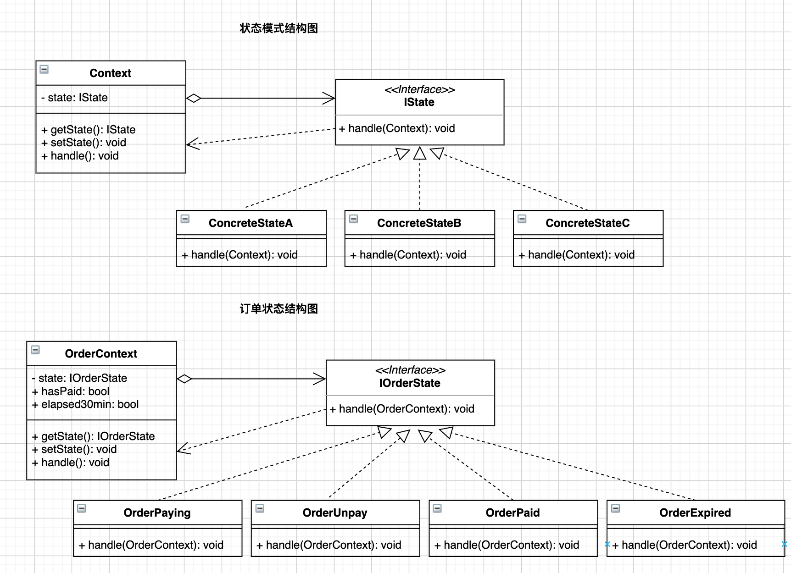

# 前言

状态模式与策略模式同属于行为型设计模式，二者极其相似。在[《设计模式之策略模式》](https://juejin.cn/post/7041009955586965535)一文中我们知道，策略模式描述的是，"将算法封装在对象中，进而可以方便的指定和改变一个对象所使用的算法"。我们甚至可以套用这句话来描述状态模式，即"将状态封装在对象中，进而可以方便的指定和改变一个对象所处的状态"。本文将介绍下状态模式的应用和示例，在文章最后适用场景部分简要讨论下状态模式和策略模式的不同。

# 需求假设

在[之前的文章](https://juejin.cn/post/7041009955586965535)示例中，客户购买不同的套餐时，支付价格的计算采用了策略模式。在价格计算好后，需要生成客户订单。客户订单具有不同的支付状态，不同的订单状态具有不同的逻辑处理。假如客户订单具有四种状态:

* 支付中：客户点击购买后，由策略模式计算出支付价格，并等待客户支付，此时生成订单，状态为支付中。
* 未支付：如果客户退出了支付窗口，并且距离订单创建时间不超过30分钟，此时状态为未支付。
* 已支付：如果客户在点击购买后立即进行了支付，或者重新回到支付窗口后进行了支付，此时状态为已支付。
* 已过期：如果客户在点击购买后，或者退出支付窗口后，超过30分钟仍未支付，此时状态为已过期。

总结订单状态变化只存在两个链条：

* 支付中 -> 未支付/已支付/已过期
* 未支付 -> 已支付/已过期

上述需求可使用状态模式进行设计。

# 模式定义

状态模式就是当一个**对象的内在状态改变**时**允许改变其行为**，这个对象看起来**像是改变了其类**。

* "对象的内在状态改变，像是改变了其类"：首先不同的状态对应着不同的具体状态类(`ConcreteState`)。然后通过实现一个状态上下文类(`Context`)来保持当前的状态(`state`)和状态对应的处理方法(`handle()`)。当`Context`对象状态属性发生变化时, 对应的处理方法也随之发生变化。状态属性的变化看起来就像是改变了状态类。
* "允许改变其行为": 当状态变化时允许改变其行为，那也意味着可以不改变行为。不同的状态具有不同的行为，只是通常意义上而言的。不同的状态下，也可以具有相同的行为。准确的说法，应该叫不同的状态具有各自对应的行为。所以，不同的状态具有相同的行为也是可以考虑应用状态模式的。



# 模式构成

根据`UML`结构图，状态模式包含：

* 一个抽象状态类或状态接口：用于约定各具体状态应实现的具体处理逻辑(`handle()`)。例如**订单状态(`IOrderState`)**规定了各具体状态都需要完成**逻辑处理`handle()`**这一行为。
* 多个具体状态类：分别实现状态接口约定的方法。具体状态如，订单**支付中(`OrderPaying`)、未支付(`OrderUnpay`)、已支付(`OrderPaid`)、已过期(`OrderExpired`)**。
* 一个上下文类(`Context`): 用以**保持一个具体状态**，维护一个对状态对象的引用。通过`Context`类来执行当前状态所对应的行为，并**根据条件使得状态发生流转**。

# 代码示例

## Golang

```go
/*
 * File: context.go
 * Created Date: 2021-12-19 11:00:25
 * Author: ysj
 * Description:  状态上下文类
 */

package main

type OrderContext struct {
	state        IOrderState
	HasPaid      bool
	Elapsed30min bool
}

// 初始化
func NewOrderContext(state IOrderState) *OrderContext {
	return &OrderContext{
		state:        state,
		HasPaid:      false,
		Elapsed30min: false,
	}
}

// 获取当前状态
func (o *OrderContext) GetState() IOrderState {
	return o.state
}

// 设置当前状态
func (o *OrderContext) SetState(state IOrderState) {
	o.state = state
}

// 当前状态下的行为
func (o *OrderContext) Handle() {
	o.state.Handle(o)
}
```

```go
/*
 * File: state.go
 * Created Date: 2021-12-19 11:00:08
 * Author: ysj
 * Description:  状态类
 */

package main

import "fmt"

type IOrderState interface {
	Handle(ctx *OrderContext)
}

/* 订单支付中 */
type OrderPaying struct{}

// 初始化
func NewOrderPaying() IOrderState {
	return OrderPaying{}
}

// 行为
func (o OrderPaying) Handle(ctx *OrderContext) {
	fmt.Println("订单支付中...")
	if ctx.HasPaid {
		ctx.SetState(NewOrderPaid())
		ctx.Handle()
	} else if ctx.Elapsed30min {
		ctx.SetState(NewOrderExpired())
		ctx.Handle()
	} else {
		ctx.SetState(NewOrderUnpay())
		ctx.Handle()
	}
}

/* 订单未支付 */
type OrderUnpay struct{}

// 初始化
func NewOrderUnpay() IOrderState {
	return OrderUnpay{}
}

// 行为
func (o OrderUnpay) Handle(ctx *OrderContext) {
	if ctx.HasPaid {
		ctx.SetState(NewOrderPaid())
		ctx.Handle()
	} else if ctx.Elapsed30min {
		ctx.SetState(NewOrderExpired())
		ctx.Handle()
	} else {
		fmt.Println("订单未支付...")
	}

}

/* 订单已支付 */
type OrderPaid struct{}

// 初始化
func NewOrderPaid() IOrderState {
	return OrderPaid{}
}

// 行为
func (o OrderPaid) Handle(ctx *OrderContext) {
	fmt.Println("订单已支付。")
}

/* 订单已过期 */
type OrderExpired struct{}

// 初始化
func NewOrderExpired() IOrderState {
	return OrderExpired{}
}

// 行为
func (o OrderExpired) Handle(ctx *OrderContext) {
	fmt.Println("订单已过期。")
}
```

```go
/*
 * File: main.go
 * Created Date: 2021-12-19 10:59:45
 * Author: ysj
 * Description:  golang 状态模式
 */

package main

func main() {
	initState := NewOrderPaying()
	// 支付中->未支付
	ctx := NewOrderContext(initState)
	ctx.Handle()

	// 未支付->已过期
	ctx.Elapsed30min = true
	ctx.Handle()

	// 已过期->X 已支付
	ctx.HasPaid = true
	ctx.Handle()

	// 支付中-> 已支付
	ctx.SetState(initState)
	ctx.HasPaid = true
	ctx.Handle()
}
```

```shell
$ go run .
订单支付中...
订单未支付...
订单已过期。
订单已过期。
订单支付中...
订单已支付。
```

## Python

```python
#!/usr/bin/env python3
# -*- coding:utf-8 -*-
###
# File: context.py
# Created Date: 2021-12-19 06:12:20
# Author: ysj
# Description:  状态上下文类
###


class OrderContext(object):
    """订单状态上下文"""

    def __init__(self, state):
        """初始化"""
        super().__init__()
        self.__state = state
        self.has_paid = False
        self.elapsed_30min = False

    def set_state(self, state):
        """设置当前状态"""
        self.__state = state

    def get_state(self):
        """获取当前状态"""
        return self.__state

    def handle(self):
        """当前状态下的行为"""
        self.__state.handle(self)
```

```python
#!/usr/bin/env python3
# -*- coding:utf-8 -*-
###
# File: state.py
# Created Date: 2021-12-19 06:12:44
# Author: ysj
# Description:  状态类
###

from abc import ABCMeta, abstractmethod
from context import OrderContext


class OrderState(metaclass=ABCMeta):
    """抽象基类"""
    @abstractmethod
    def handle(self, ctx: OrderContext):
        pass


class OrderPaying(OrderState):
    """订单支付中"""

    def handle(self, ctx: OrderContext):
        print("订单支付中...")
        if ctx.has_paid:
            ctx.set_state(OrderPaid())
            ctx.handle()
        elif ctx.elapsed_30min:
            ctx.set_state(OrderExpired())
            ctx.handle()
        else:
            ctx.set_state(OrderUnpay())
            ctx.handle()


class OrderUnpay(OrderState):
    """订单未支付"""

    def handle(self, ctx: OrderContext):
        if ctx.has_paid:
            ctx.set_state(OrderPaid())
            ctx.handle()
        elif ctx.elapsed_30min:
            ctx.set_state(OrderExpired())
            ctx.handle()
        else:
            print("订单未支付...")


class OrderPaid(OrderState):
    """订单已支付"""

    def handle(self, ctx: OrderContext):
        print("订单已支付。")


class OrderExpired(OrderState):
    """订单已过期"""

    def handle(self, ctx: OrderContext):
        print("订单已过期。")
```

```python
#!/usr/bin/env python3
# -*- coding:utf-8 -*-
###
# File: main.py
# Created Date: 2021-12-19 06:11:39
# Author: ysj
# Description:  python 状态模式
###

from context import OrderContext
from state import OrderPaying

init_state = OrderPaying()
# 支付中->未支付
ctx = OrderContext(init_state)
ctx.handle()

# 未支付->已过期
ctx.elapsed_30min = True
ctx.handle()

# 已过期->X 已支付
ctx.has_paid = True
ctx.handle()

# 支付中-> 已支付
ctx.set_state(init_state)
ctx.has_paid = True
ctx.handle()
```

```shell
$ python3 main.py
订单支付中...
订单未支付...
订单已过期。
订单已过期。
订单支付中...
订单已支付。
```

## TypeScript

```typescript
/**
 * -------------------------------------------------------
 * File: context.ts
 * Created Date: 2021-12-19 07:55:04
 * Author: ysj
 * Description: 状态上下文类
 * -------------------------------------------------------
 */

import { IOrderState } from './state';

export default class OrderContext {
  private _state: IOrderState;

  public hasPaid: boolean;
  public elapsed30min: boolean;
  // 初始化
  constructor(state: IOrderState) {
    this._state = state;
    this.hasPaid = false;
    this.elapsed30min = false;
  }

  // 获取当前状态
  getState(): IOrderState {
    return this._state;
  }
  // 设置当前状态
  setState(state: IOrderState) {
    this._state = state;
  }
  // 当前状态下的行为
  handle() {
    this._state.handle(this);
  }
}
```

```typescript
/**
 * -------------------------------------------------------
 * File: state.ts
 * Created Date: 2021-12-19 07:55:20
 * Author: ysj
 * Description: 状态类
 * -------------------------------------------------------
 */

import OrderContext from './context';

// 订单状态接口
export interface IOrderState {
  handle(ctx: OrderContext): void;
}

// 订单支付中
export class OrderPaying implements IOrderState {
  handle(ctx: OrderContext): void {
    console.log('订单支付中...');
    if (ctx.hasPaid) {
      ctx.setState(new OrderPaid());
      ctx.handle();
    } else if (ctx.elapsed30min) {
      ctx.setState(new OrderExpired());
      ctx.handle();
    } else {
      ctx.setState(new OrderUnpay());
      ctx.handle();
    }
  }
}

// 订单未支付
export class OrderUnpay implements IOrderState {
  handle(ctx: OrderContext): void {
    if (ctx.hasPaid) {
      ctx.setState(new OrderPaid());
      ctx.handle();
    } else if (ctx.elapsed30min) {
      ctx.setState(new OrderExpired());
      ctx.handle();
    } else {
      console.log('订单未支付...');
    }
  }
}

// 订单已支付
export class OrderPaid implements IOrderState {
  handle(ctx: OrderContext): void {
    console.log('订单已支付。');
  }
}

// 订单已过期
export class OrderExpired implements IOrderState {
  handle(ctx: OrderContext): void {
    console.log('订单已过期。');
  }
}
```

```typescript
/**
 * -------------------------------------------------------
 * File: index.ts
 * Created Date: 2021-12-19 07:55:33
 * Author: ysj
 * Description: ts 状态模式
 * -------------------------------------------------------
 */
import { OrderPaying } from './state';
import OrderContext from './context';

const initState = new OrderPaying();
// 支付中->未支付
const ctx = new OrderContext(initState);
ctx.handle();

// 未支付->已过期
ctx.elapsed30min = true;
ctx.handle();

// 已过期->X 已支付
ctx.hasPaid = true;
ctx.handle();

// 支付中-> 已支付
ctx.setState(initState);
ctx.hasPaid = true;
ctx.handle();
```

```shell
$ tsc -p ./tsconfig.json && node build/index.js
订单支付中...
订单未支付...
订单已过期。
订单已过期。
订单支付中...
订单已支付。
✨  Done in 1.80s.
```

# 适用场景

当**状态决定行为**时就**可以考虑**状态设计模式。这里需要注意的是：

* 状态决定行为，即当一个对象具有不同的状态，而不同的状态具有各自对应的行为时；
* 可以考虑，但不是必要。状态模式主要解决的是一个对象**状态转换的条件表达式过于复杂**时的情况，把状态的判断逻辑转移到一系列状态类中，可以简化复杂的判断逻辑，从而消除庞大的条件分支语句。当条件表达式本身就不多时，`if else`简单明了，又有何不可。

由于所有与状态相关的代码都存在于某个具体状态中，通过定义新的子类可以很容易地增加新的状态和转换。因此状态模式最大的好处便是，将各种状态及对应的行为解耦，方便扩展。

状态模式相对于策略模式，尽管在模式构成上比较相似。但在适用的场景上存在区别：

* 状态模式体现的是状态之间的流转，行为相应发生变化。状态之间是不可相互替换的，各自的行为可以是不同的。例如，已支付和已过期状态，订单状态只能是其中之一，已支付不能替换为已过期，逻辑上说不通。在已支付时，行为可以是扣除客户余额、给客户发送支付通知；在已过期时，行为同样可以是给客户发送通知，但是就不能去扣除客户余额。
* 策略模式体现的是策略之间的选择，行为目的是一致的。策略是可以互相替换的，可组合的，不同的策略或策略组合其行为的最终目的是一致的，只是中间逻辑可以不同。例如，计算价格时，可以选择不同的计算策略，可以选择A策略，也可以选择B策略，也可以应用A策略后再应用B策略。不同策略，其行为对应的逻辑规则不同，但目的都是计算支付价格。

不严谨的总结：

* 状态模式：不同的状态，不同的行为；
* 策略模式：不同的策略，相同的行为；

# 参考资料

* 程杰.大话设计模式[M].北京：清华大学出版社，2007.12
