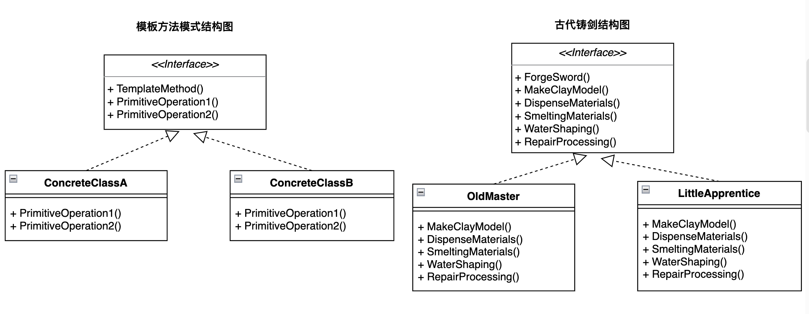

# 前言

对于模板方法模式，其实仔细想想，在现实生活中就有很多场景满足这一模式。"模板方法"中"模板"一词，顾名思义就是有一个固定的过程(或者称结构，流程，步骤等等)。联想下老板让你汇报工作、公司让你做季度总结时的ppt，这时就会在网上或者在同事那儿找一份ppt模版，然后在模板的基础上编辑属于自己的内容。再如，老板PUA员工时，说得天花乱坠，从否定员工到公司的大恩大德，再到感恩戴德，为理想奋斗等，面对不同的员工可能在细节上有所差别，但往往都是一套固定的话术模式。这就是模板方式模式，被无良老板们玩得那叫一个6。这些场景可以总结为：**当我们要完成一个一致的过程或一系列步骤，但只在个别步骤更详细的层次上实现可能不同时，就应该使用模板方法模式来处理。**

# 需求假设

可以假定这样一个场景来具体说明模板方法模式的应用——即古代铸剑。古时候铸剑整体上都有一套固定的铸造流程，但不同的人例如师傅和徒弟，可能打造出不同品质的剑。这是因为在细节步骤上，有经验的老师傅和初出茅庐的徒弟各自的掌控和处理有所差异。古时候铸剑一般分为五个工序:

* 制做泥范

  用泥塑造剑范，然后放入窑中经火烘干。

* 调剂材料

  根据合理的配比规律，对铜、锡、铅等原料进行调配。

* 熔炼原料

  将铜、锡、铅等原料进行熔炼，进一步去除原料中含有的杂质。

* 浇灌成形

  将熔炼成熟的青铜液体浇灌入剑范成形。

* 修治加工

  浇铸出来的铜剑表面精糙，需卸去铸范后，进行修治加工。

经过这五道工序，老师傅手艺高超可能打造出"绝世好剑"，而小徒弟羽翼未丰只能打造出"村好剑"。

# 模式定义

模板方法模式：定义一个操作中**算法**的骨架，而**将一些步骤延迟到子类**。

模板方法模式可以使得子类不改变一个算法的结构，即可重定义该算法的某些特定步骤。

* 这里的"**算法"**，理解为一系列固定的步骤、一个统一的过程；

* **"将一些步骤延迟到子类"，就是要在某些特定的细节层次上实现不同，而整体的过程步骤保持不变**。



# 模式构成

模板方法模式由一个统一的模板方法`TemplateMethod()`  和各个步骤的细节操作`PrimitiveOperation()`构成:

- `TemplateMethod()`内依次执行各个步骤的操作`PrimitiveOperation1()、PrimitiveOperation2()；`

  > 例如铸剑的模板方法`ForgeSword()`,需要依次执行制做泥范`MakeClayModel()`、调剂材料`DispenseMaterials()`、熔炼原料`SmeltingMaterials()`、浇灌成形`WaterShaping()`、修治加工`RepairProcessing()`五个一致的步骤。

- `PrimitiveOperation()`具体操作可以延迟到子类中去，由子类根据需要去继承实现特定于子类的不同操作细节。

# 代码示例

## golang

```go
/*
 * File: template.go
 * Created Date: 2023-03-13 02:44:39
 * Author: ysj
 * Description:  golang 模板方法
 */
package main

import "fmt"

type ForgeSwordTemplate interface {
    ForgeSword()        // 铸剑模板方法
    makeClayModel()     // 制做泥范, 每道工序20分
    dispenseMaterials() // 调剂材料, 每道工序20分
    smeltingMaterials() // 熔炼原料, 每道工序20分
    waterShaping()      // 浇灌成形, 每道工序20分
    repairProcessing()  // 修治加工, 每道工序20分
}

type ForgeSwordBase struct {
    Score int
}

func (f *ForgeSwordBase) ForgeSword() {
    f.makeClayModel()
    f.dispenseMaterials()
    f.smeltingMaterials()
    f.waterShaping()
    f.repairProcessing()
    f.result()
}

func (f *ForgeSwordBase) makeClayModel() {
    fmt.Println("制做泥范完美 +20分")
    f.Score += 20
}

func (f *ForgeSwordBase) dispenseMaterials() {
    fmt.Println("调剂材料完美 +20分")
    f.Score += 20
}

func (f *ForgeSwordBase) smeltingMaterials() {
    fmt.Println("熔炼原料完美 +20分")
    f.Score += 20
}

func (f *ForgeSwordBase) waterShaping() {
    fmt.Println("浇灌成形完美 +20分")
    f.Score += 20
}

func (f *ForgeSwordBase) repairProcessing() {
    fmt.Println("修治加工完美 +20分")
    f.Score += 20
}

func (f *ForgeSwordBase) result() {
    fmt.Println("总分:", f.Score)
    if f.Score == 100 {
        fmt.Println("获得绝世好剑!!!")
    } else if f.Score > 80 {
        fmt.Println("获得一把好剑!!")
    } else {
        fmt.Println("获得一把村好剑!")
    }
}
```

```go
/*
 * File: oldMaster.go
 * Created Date: 2023-03-13 02:57:46
 * Author: ysj
 * Description:  模板方式模式——老师傅铸剑
 */

package main

type OldMasterForgeSword struct {
    ForgeSwordBase
}

func NewOldMasterForgeSword() ForgeSwordTemplate {
    return &OldMasterForgeSword{}
}
```

```go
/*
 * File: littleApprentice.go
 * Created Date: 2023-03-13 03:00:07
 * Author: ysj
 * Description:  模板方式模式——小徒弟铸剑
 */

package main

import "fmt"

type LittleApprentice struct {
    ForgeSwordBase
}

// 初始化
func NewLittleApprentice() ForgeSwordTemplate {
    return &LittleApprentice{}
}

func (la *LittleApprentice) ForgeSword() {
    la.makeClayModel()
    la.dispenseMaterials()
    la.smeltingMaterials()
    la.waterShaping()
    la.repairProcessing()

    la.result()
}

func (la *LittleApprentice) dispenseMaterials() {
    fmt.Println("调剂材料比例不均 +10分")
    la.Score += 10
}

func (la *LittleApprentice) smeltingMaterials() {
    fmt.Println("熔炼原料火候不够 +10分")
    la.Score += 10
}
```

```go
/*
 * File: main.go
 * Created Date: 2023-03-07 06:59:11
 * Author: ysj
 * Description: 模板方式模式——客户端调用
 */

package main

import "fmt"

func main() {
    fmt.Println("=============老师傅铸剑============")
    oldMaster := NewOldMasterForgeSword()
    oldMaster.ForgeSword()

    fmt.Println("=============小徒弟铸剑============")
    littleApprentice := NewLittleApprentice()
    littleApprentice.ForgeSword()
}
```

```shell
$ go run .

=============老师傅铸剑============
制做泥范完美 +20分
调剂材料完美 +20分
熔炼原料完美 +20分
浇灌成形完美 +20分
修治加工完美 +20分
总分: 100
获得绝世好剑!!!
=============小徒弟铸剑============
制做泥范完美 +20分
调剂材料比例不均 +10分
熔炼原料火候不够 +10分
浇灌成形完美 +20分
修治加工完美 +20分
总分: 80
获得一把村好剑!
```

## python

```python
#!/usr/bin/env python3
# -*- coding:utf-8 -*-
###
# File: template.py
# Created Date: 2023-03-13 03:21:58
# Author: ysj
# Description:  python 模板方法
###

from abc import ABCMeta, abstractmethod


class ForgeSwordTemplate(metaclass=ABCMeta):
    score = 0

    def forge_sword(self):
        '''铸剑模板方法'''
        self.make_clay_model()
        self.dispense_materials()
        self.smelting_materials()
        self.water_shaping()
        self.repair_processing()

        self.result()

    @abstractmethod
    def make_clay_model(self):
        '''制做泥范, 每道工序20分'''
        print("制做泥范完美 +20分")
        self.score += 20

    @abstractmethod
    def dispense_materials(self):
        '''调剂材料, 每道工序20分'''
        print("调剂材料完美 +20分")
        self.score += 20

    @abstractmethod
    def smelting_materials(self):
        '''熔炼原料, 每道工序20分'''
        print("熔炼原料完美 +20分")
        self.score += 20

    @abstractmethod
    def water_shaping(self):
        '''浇灌成形, 每道工序20分'''
        print("浇灌成形完美 +20分")
        self.score += 20

    @abstractmethod
    def repair_processing(self):
        '''修治加工, 每道工序20分'''
        print("修治加工完美 +20分")
        self.score += 20

    def result(self):
        print("总分:", self.score)
        if self.score == 100:
            print("获得绝世好剑!!!")
        elif self.score > 80:
            print("获得一把好剑!!")
        else:
            print("获得一把村好剑!")
```

```python
#!/usr/bin/env python3
# -*- coding:utf-8 -*-
###
# File: old_master.py
# Created Date: 2023-03-13 03:22:45
# Author: ysj
# Description:  模板方式模式——老师傅铸剑
###

from template import ForgeSwordTemplate


class OldMasterForgeSword(ForgeSwordTemplate):
    def make_clay_model(self):
        '''制做泥范, 每道工序20分'''
        super().make_clay_model()

    def dispense_materials(self):
        '''调剂材料, 每道工序20分'''
        super().dispense_materials()

    def smelting_materials(self):
        '''熔炼原料, 每道工序20分'''
        super().smelting_materials()

    def water_shaping(self):
        '''浇灌成形, 每道工序20分'''
        super().water_shaping()

    def repair_processing(self):
        '''修治加工, 每道工序20分'''
        super().repair_processing()
```

```python
#!/usr/bin/env python3
# -*- coding:utf-8 -*-
###
# File: little_apprentice.py
# Created Date: 2023-03-13 03:23:08
# Author: ysj
# Description:  模板方式模式——小徒弟铸剑
###

from template import ForgeSwordTemplate


class LittleApprenticeForgeSword(ForgeSwordTemplate):
    def make_clay_model(self):
        '''制做泥范, 每道工序20分'''
        super().make_clay_model()

    def dispense_materials(self):
        print("调剂材料比例不均 +10分")
        self.score += 10

    def smelting_materials(self):
        print("熔炼原料火候不够 +10分")
        self.score += 10

    def water_shaping(self):
        '''浇灌成形, 每道工序20分'''
        super().water_shaping()

    def repair_processing(self):
        '''修治加工, 每道工序20分'''
        super().repair_processing()
```

```python
#!/usr/bin/env python3
# -*- coding:utf-8 -*-
###
# File: main.py
# Created Date: 2023-03-13 03:22:16
# Author: ysj
# Description:  模板方式模式——客户端调用
###

from old_master import OldMasterForgeSword
from little_apprentice import LittleApprenticeForgeSword

print("=============老师傅铸剑============")
old_master = OldMasterForgeSword()
old_master.forge_sword()

print("=============小徒弟铸剑============")
little_apprentice = LittleApprenticeForgeSword()
little_apprentice.forge_sword()
```

```shell
$ python main.py

=============老师傅铸剑============
制做泥范完美 +20分
调剂材料完美 +20分
熔炼原料完美 +20分
浇灌成形完美 +20分
修治加工完美 +20分
总分: 100
获得绝世好剑!!!
=============小徒弟铸剑============
制做泥范完美 +20分
调剂材料比例不均 +10分
熔炼原料火候不够 +10分
浇灌成形完美 +20分
修治加工完美 +20分
总分: 80
获得一把村好剑!
```

# 适用场景

当遇到由一系列的步骤构成的过程需要执行时，这个过程从高层次上看是相同的，但有些步骤的具体实现可能不同，这时候就应该考虑使用模板方法模式。

模板方法模式起到的作用是，当不变的和可变的行为在方法的子类实现中混合在一起时，不变的行为就会在子类中重复出现，模板方法模式通过把不变的行为搬移到超类，从而去除了子类中的重复代码。

# 参考资料

程杰.大话设计模式\[M\].北京：清华大学出版社，2007.12