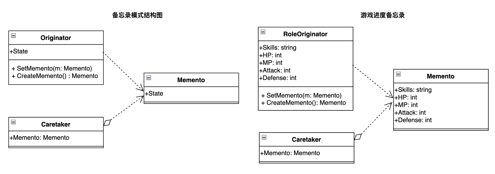

\---

theme: awesome-green

highlight: monokai-sublime

\---

# 前言

某一天，老板突然说要给后台业务系统的任务调度添加"暂停/恢复"功能，这可把工程师们的头给挠秃了，简单的业务逻辑还好，对于某些复杂的业务逻辑，任务一旦开始，就"根本停不下来"！假如你在工作中遇到需要实现类似"暂停"、"保存进度"、"保存状态"以便"恢复"等功能时，请首先考虑**备忘录模式**能否解决你的问题。

# 需求假设

各位游戏宅们肯定十分熟悉所谓的"SL大法"，即通过不断的"保存加载"`(Save/Load)` 来攻略各种boss和难关。这里我们的需求是实现游戏进度的保存和重新加载，假设这个游戏是一个非常简单的角色扮演类游戏，在保存进度时，我们的角色只需要保存如下属性：

- 角色技能SKILLS

- 角色血量HP

- 角色蓝量MP

- 角色攻击力ATTACK

- 角色防御力DEFENSE

要求最多保存最近三次的游戏进度。

# 模式定义

**备忘录模式(Memento):** 在不破环封装性的前提下，捕获一个对象的内部状态，并在该对象之外保存这个状态。以后就可将该对象恢复到原先保存的状态。



# 模式构成

`Originator(发起人):`根据需要决定备忘录`Memento`存储哪些内部状态。

* `CreateMemento: `负责创建一个备忘录`Memento`, 用以记录当前时刻它的内部状态。

* `SetMemento: `根据备忘录`Memento`恢复内部状态。

`Memento(备忘录): `用以保存某一时刻的状态信息`State`。状态的具体属性视不同的需求而定，如游戏角色的HP、MP等状态。

`Caretaker(托管人):`负责保管备忘录`Memento`，不能对备忘录的各种状态进行操作编辑，否则无法还原到之前的状态。备忘录视具体需求可以有一个或多个，如果为多个，那么`Caretaker`的`Memento`属性就是一个数组结构`Memento[]`或其他可用类型，具体视需求而定。

# 代码示例

## golang

```go
/*
 * File: memento.go
 * Created Date: 2023-03-19 02:32:35
 * Author: ysj
 * Description:  备忘录模式-备忘录(状态保存者)
 */
package main

type Memento struct {
    Skills  string // 技能
    HP      int    // 血量
    MP      int    // 蓝量
    Attack  int    // 攻击力
    Defense int    // 防御力
}
```

```go
/*
 * File: caretaker.go
 * Created Date: 2023-03-19 02:34:02
 * Author: ysj
 * Description:  备忘录模式-备忘录托管人
 */
package main

type CareTaker struct {
    Mementos [3]Memento // 备忘录，最多保存最近三次进度
}

// 放入1个Memento
func (c *CareTaker) Put(m Memento) {
    c.Mementos = [3]Memento{
        m,
        c.Mementos[0],
        c.Mementos[1],
    }
}

// 取出第i个Memento
func (c *CareTaker) Take(i int) Memento {
    if i < 0 || i > 2 {
        i = 0
    }
    return c.Mementos[i]
}
```

```go
/*
 * File: originator.go
 * Created Date: 2023-03-19 02:31:55
 * Author: ysj
 * Description:  备忘录模式-状态保存发起人
 */

package main

import "fmt"

type RoleOriginator struct {
    Skills  string // 技能
    HP      int    // 血量
    MP      int    // 蓝量
    Attack  int    // 攻击力
    Defense int    // 防御力
}

// 保存状态
func (ro *RoleOriginator) CreateMemento() Memento {
    return Memento{
        Skills:  ro.Skills,
        HP:      ro.HP,
        MP:      ro.MP,
        Attack:  ro.Attack,
        Defense: ro.Defense,
    }
}

// 恢复状态
func (ro *RoleOriginator) SetMemento(m Memento) {
    ro.Skills = m.Skills
    ro.HP = m.HP
    ro.MP = m.MP
    ro.Attack = m.Attack
    ro.Defense = m.Defense
}

// 显示当前状态
func (ro *RoleOriginator) ShowState(msg string) {
    fmt.Printf(`
=======================
%s
========角色属性========
技能：%s
血量：%d
蓝量：%d
攻击力：%d
防御力：%d
`, msg, ro.Skills, ro.HP, ro.MP, ro.Attack, ro.Defense)
}
```

```go
/*
 * File: main.go
 * Created Date: 2023-03-19 02:31:23
 * Author: ysj
 * Description:  备忘录模式客户端调用
 */

package main

func main() {
    // 主角
    role := &RoleOriginator{
        Skills:  "大威天龙",
        HP:      100,
        MP:      100,
        Attack:  100,
        Defense: 100,
    }
    // 游戏状态托管人
    caretaker := &CareTaker{}

    // 保存进度
    role.ShowState("初始状态")
    memento0 := role.CreateMemento()
    caretaker.Put(memento0)

    // 攻打boss失败
    role.HP = 0
    role.MP = 10
    role.Attack = 1
    role.Defense = 20
    role.ShowState("攻打boss失败")

    // 恢复之前的状态
    memento0 = caretaker.Take(0)
    role.SetMemento(memento0)
    role.ShowState("恢复初始状态")

    // 打怪升级
    role.Skills = "超·大威天龙"
    role.HP = 1000
    role.MP = 1000
    role.Attack = 1000
    role.Defense = 1000

    // 保存进度
    role.ShowState("打怪升级")
    memento1 := role.CreateMemento()
    caretaker.Put(memento1)

    // 挑战boss成功
    role.HP = 2000
    role.MP = 2000
    role.Attack = 2000
    role.Defense = 2000
    role.ShowState("挑战boss成功,属性翻倍")

    // 保存进度
    memento2 := role.CreateMemento()
    caretaker.Put(memento2)

    // 想重新挑战boss
    memento1 = caretaker.Take(1)
    role.SetMemento(memento1)
    role.ShowState("重新挑战boss, 恢复之前状态")
}
```

```shell
$ go run .
=======================
初始状态
========角色属性========
技能：大威天龙
血量：100
蓝量：100
攻击力：100
防御力：100

=======================
攻打boss失败
========角色属性========
技能：大威天龙
血量：0
蓝量：10
攻击力：1
防御力：20

=======================
恢复初始状态
========角色属性========
技能：大威天龙
血量：100
蓝量：100
攻击力：100
防御力：100

=======================
打怪升级
========角色属性========
技能：超·大威天龙
血量：1000
蓝量：1000
攻击力：1000
防御力：1000

=======================
挑战boss成功,属性翻倍
========角色属性========
技能：超·大威天龙
血量：2000
蓝量：2000
攻击力：2000
防御力：2000

=======================
重新挑战boss, 恢复之前状态
========角色属性========
技能：超·大威天龙
血量：1000
蓝量：1000
攻击力：1000
防御力：1000
```

## python

```python
#!/usr/bin/env python3
# -*- coding:utf-8 -*-
###
# File: memento.py
# Created Date: 2023-03-19 03:30:40
# Author: ysj
# Description:  备忘录模式-备忘录(状态保存者)
###

class Memento(object):
    def __init__(
        self,
        skills="大威天龙",
        hp=100,
        mp=100,
        attack=100,
        defense=100,
    ):
        self.skills = skills
        self.hp = hp
        self.mp = mp
        self.attack = attack
        self.defense = defense
```

```python
#!/usr/bin/env python3
# -*- coding:utf-8 -*-
###
# File: caretaker.py
# Created Date: 2023-03-19 03:30:18
# Author: ysj
# Description:  备忘录模式-备忘录托管人
###

from memento import Memento


class CareTaker(object):
    mementos = []

    def put(self, m: Memento):
        self.mementos = [
            m,
            *self.mementos[:2]
        ]

    def take(self, i: int) -> Memento:
        if i < 0 or i > 2:
            i = 0
        return self.mementos[i]
```

```python
#!/usr/bin/env python3
# -*- coding:utf-8 -*-
###
# File: originator.py
# Created Date: 2023-03-19 03:30:53
# Author: ysj
# Description:  备忘录模式-状态保存发起人
###
from memento import Memento


class RoleOriginator(object):
    def __init__(
        self,
        skills="大威天龙",
        hp=100,
        mp=100,
        attack=100,
        defense=100,
    ):
        self.skills = skills
        self.hp = hp
        self.mp = mp
        self.attack = attack
        self.defense = defense

    # 保存状态
    def create_memento(self) -> Memento:
        mem = Memento(skills=self.skills,
                      hp=self.hp,
                      mp=self.mp,
                      attack=self.attack,
                      defense=self.defense,
                      )
        return mem

    # 恢复状态
    def set_memento(self, m: Memento):
        self.skills = m.skills
        self.hp = m.hp
        self.mp = m.mp
        self.attack = m.attack
        self.defense = m.defense

    # 显示状态
    def show_state(self, msg):
        print('''
=======================
%s
========角色属性========
技能：%s
血量：%d
蓝量：%d
攻击力：%d
防御力：%d
''' % (msg, self.skills, self.hp, self.mp, self.attack, self.defense))
```

```python
#!/usr/bin/env python3
# -*- coding:utf-8 -*-
###
# File: main.py
# Created Date: 2023-03-19 03:30:05
# Author: ysj
# Description:  备忘录模式客户端调用
###
from originator import RoleOriginator
from caretaker import CareTaker

# 主角
role = RoleOriginator(
    skills="大威天龙",
    hp=100,
    mp=100,
    attack=100,
    defense=100,
)

# 游戏状态托管人
caretaker = CareTaker()

# 保存进度
role.show_state("初始状态")
memento0 = role.create_memento()
caretaker.put(memento0)

# 攻打boss失败
role.hp = 0
role.mp = 10
role.attack = 1
role.defense = 20
role.show_state("攻打boss失败")

# 恢复之前的状态
memento0 = caretaker.take(0)
role.set_memento(memento0)
role.show_state("恢复初始状态")

# 打怪升级
role.skills = "超·大威天龙"
role.hp = 1000
role.mp = 1000
role.attack = 1000
role.defense = 1000

# 保存进度
role.show_state("打怪升级")
memento1 = role.create_memento()
caretaker.put(memento1)

# 挑战boss成功
role.hp = 2000
role.mp = 2000
role.attack = 2000
role.defense = 2000
role.show_state("挑战boss成功,属性翻倍")

# 保存进度
memento2 = role.create_memento()
caretaker.put(memento2)

# 想重新挑战boss
memento1 = caretaker.take(1)
role.set_memento(memento1)
role.show_state("重新挑战boss, 恢复之前状态")
```

```shell
$ python3 main.py
=======================
初始状态
========角色属性========
技能：大威天龙
血量：100
蓝量：100
攻击力：100
防御力：100

=======================
攻打boss失败
========角色属性========
技能：大威天龙
血量：0
蓝量：10
攻击力：1
防御力：20

=======================
恢复初始状态
========角色属性========
技能：大威天龙
血量：100
蓝量：100
攻击力：100
防御力：100

=======================
打怪升级
========角色属性========
技能：超·大威天龙
血量：1000
蓝量：1000
攻击力：1000
防御力：1000

=======================
挑战boss成功,属性翻倍
========角色属性========
技能：超·大威天龙
血量：2000
蓝量：2000
攻击力：2000
防御力：2000

=======================
重新挑战boss, 恢复之前状态
========角色属性========
技能：超·大威天龙
血量：1000
蓝量：1000
攻击力：1000
防御力：1000
```

# 适用场景

关键词：**保存进度、保存状态、撤销恢复、暂停恢复**

* 适用于功能比较复杂，需要记录属性历史的类，而需要保存的属性往往也只是众多属性中的一小部分。

  > 如果是需要保存全部属性，或许可以考虑使用原型模式。

* 在使用命令模式实现撤销功能时，撤销后需要恢复到前一个状态，此时可以使用备忘录模式来保存状态信息。

# 参考资料

程杰.大话设计模式\[M\].北京：清华大学出版社，2007.12