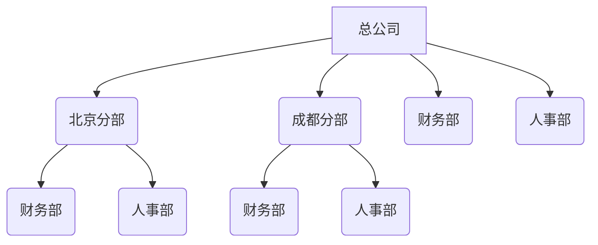
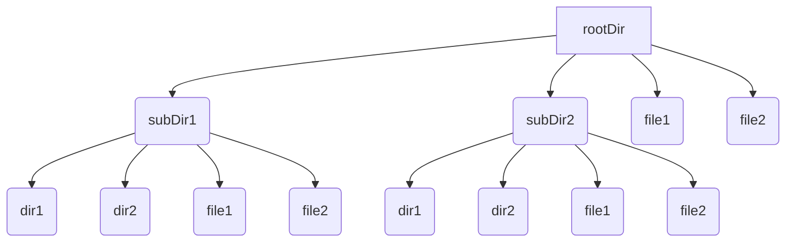
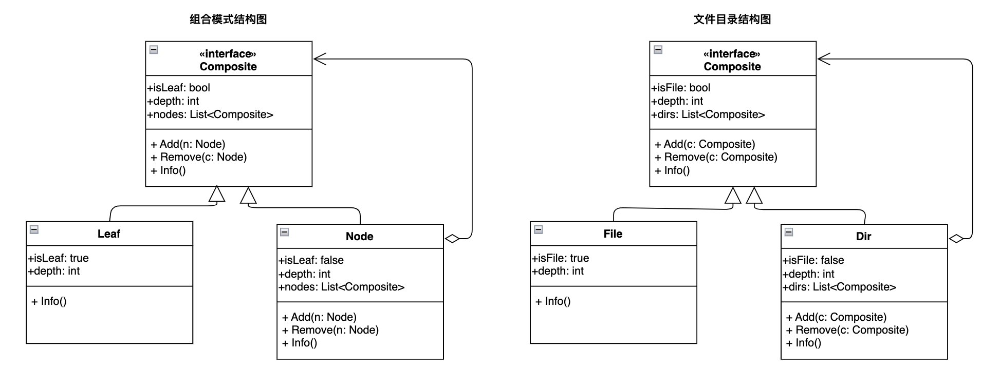

\---

theme: awesome-green

highlight: monokai-sublime

\---

# 前言

如果你的代码要实现一个"**树形层次结构**"，那么应该考虑使用\*\*组合设计模式。"树形层次结构"\*\*指的是什么样的结构呢？比如企业的组织形式，有总公司，总公司下设有分公司，总公司和各分公司又包含各种职能部门：



再如，你的文件目录结构，有一个根目录，根目录下有文件和各个子目录，子目录下又可能有子目录和文件：



类似上述企业的组织结构与文件目录结构，这种"\*\*树形层次结构"\*\*均体现了一种"**整体与部分**"关系，当我们需要对"**整体与部分进行一致对待**"时，就是组合模式的体现。

什么叫"**整体与部分一致对待**"? 意思是对整体与部分拥有一致的行为。例如，在企业的组织结构中，无论是总公司还是分公司，亦或者是人事部、财务部，都有新增、删除、展示信息等行为；再如文件目录结构中，无论是目录还是文件，无论是子目录还是子文件，也都可以进行新增、删除、展示信息等。

# 需求假设

假设本文通过组合模式来实现一个文件目录结构，对每一个目录或者文件均拥有如下一致的操作行为：

* 新增：添加一个目录或者文件；

* 删除：删除一个目录或者文件；

* 显示：展示一个目录或者文件的基本信息；

# 模式定义

**组合(Composite)模式：将对象组合成**树形结构以表示"整体-部分"的**层次结构**。组合模式使得用户对单个对象和组合对象的**使用具有一致性**。



# 模式构成

组合模式中**具有一个或者多个同质化的枝节点**`(Node)`,在整个树形结构中属于弱拥有的聚合关系。\
每个枝节点都实现了一致的接口，但可以根据具体需要来指定每个节点应该具有怎样的行为。\
在本文示例中，每个节点均具有如下三个行为：

* Add：新增节点

* Remove：移除节点

* Info：展示节点信息

在层次结构中，处于最末端的是**叶子结点**`(Leaf)`**, 不具有新增和删除节点的行为，代表的是树形结构末端。**

例如在一个目录结构中，我们可以在根目录下新建、移除一个或者多个子目录，也可以在子目录下继续新建、移除子目录。每个目录中也都可以新建、移除一个或者多个文件，但文件处于目录层次的末端，无法实现在文件下新建、移除目录或文件。

# 代码示例

## golang

```go
/*
 * File: composite.go
 * Created Date: 2023-03-27 01:26:11
 * Author: ysj
 * Description: 设计模式之组合模式--组合接口
 */
package main

type Compositer interface {
    Add(c Compositer)
    Remove(c Compositer)
    Info()
    addDepth(depth int)
    getName() string
}
```

```go
/*
 * File: dir.go
 * Created Date: 2023-03-27 01:30:17
 * Author: ysj
 * Description: 设计模式之组合模式--目录
 */

package main

import (
    "fmt"
    "strings"
)

type Dir struct {
    name    string       // 目录名称
    isLeaf  bool         // 是否叶子节点
    depth   int          // 层次深度
    subDirs []Compositer // 子目录树
}

// 初始化
func NewDir(name string) Compositer {
    return &Dir{
        name:    name,
        isLeaf:  false,
        depth:   1,
        subDirs: make([]Compositer, 0),
    }
}

// 添加一个目录
func (d *Dir) Add(c Compositer) {
    d.subDirs = append(d.subDirs, c)
    c.addDepth(d.depth + 1)
}

// 移除一个目录
func (d *Dir) Remove(c Compositer) {
    for i, subdir := range d.subDirs {
        if subdir.getName() == c.getName() {
            d.subDirs = append(d.subDirs[:i], d.subDirs[i+1:]...)
            break
        }
    }
}

// 显示目录信息
func (d *Dir) Info() {
    fmt.Println(strings.Repeat("-", d.depth) + " " + d.name)
    for _, subdir := range d.subDirs {
        subdir.Info()
    }
}

// 增加深度
func (d *Dir) addDepth(depth int) {
    d.depth = depth
}

// 目录名称
func (d *Dir) getName() string {
    return d.name
}
```

```go
/*
 * File: file.go
 * Created Date: 2023-03-27 01:30:45
 * Author: ysj
 * Description: 设计模式之组合模式--文件
 */

package main

import (
    "fmt"
    "strings"
)

type File struct {
    name   string // 文件名称
    isLeaf bool   // 是否叶子节点
    depth  int    // 层次深度
}

// 初始化
func NewFile(name string) Compositer {
    return &File{
        name:   name,
        isLeaf: true,
        depth:  1,
    }
}

// 添加一个目录
func (d *File) Add(c Compositer) {
    fmt.Println("a file can not add a compositer!")
}

// 移除一个目录
func (d *File) Remove(c Compositer) {
    fmt.Println("a file can not remove a compositer!")
}

// 显示目录信息
func (d *File) Info() {
    fmt.Println(strings.Repeat("-", d.depth) + " " + d.name)
}

// 增加深度
func (d *File) addDepth(depth int) {
    d.depth = depth
}

// 目录名称
func (d *File) getName() string {
    return d.name
}
```

```go
/*
 * File: main.go
 * Created Date: 2023-03-27 01:25:47
 * Author: ysj
 * Description: 组合模式客户端调用
 */

package main

import "fmt"

func main() {
    // 创建根目录，在其下创建两个目录，两个文件
    rootDir := NewDir("根目录")
    subDir1 := NewDir("子目录1")
    subDir2 := NewDir("子目录2")
    file1 := NewFile("文件1")
    file2 := NewFile("文件2")
    rootDir.Add(subDir1)
    rootDir.Add(subDir2)
    rootDir.Add(file1)
    rootDir.Add(file2)

    // 在子目录1下创建一个目录和一个文件
    dir1_1 := NewDir("子目录1-1")
    file1_1 := NewFile("文件1-1")
    subDir1.Add(dir1_1)
    subDir1.Add(file1_1)

    rootDir.Info()

    fmt.Println()
    // 删除根目录下的文件2和子目录2
    rootDir.Remove(file2)
    rootDir.Remove(subDir2)

    rootDir.Info()
}
```

```shell
$ go run .
- 根目录
-- 子目录1
--- 子目录1-1
--- 文件1-1
-- 子目录2
-- 文件1
-- 文件2

- 根目录
-- 子目录1
--- 子目录1-1
--- 文件1-1
-- 文件1
```

## python

```python
#!/usr/bin/env python3
# -*- coding:utf-8 -*-
###
# File: compositer.py
# Created Date: 2023-03-27 03:07:02
# Author: ysj
# Description:  设计模式之组合模式--组合接口
###
from __future__ import annotations
# from typing import Self # python3.11
from abc import ABCMeta, abstractmethod


class Compositer(metaclass=ABCMeta):
    @abstractmethod
    def add(self, c: Compositer):
        pass

    @abstractmethod
    def remove(self, c: Compositer):
        pass

    @abstractmethod
    def info(self):
        pass
```

```python
#!/usr/bin/env python3
# -*- coding:utf-8 -*-
###
# File: dir.py
# Created Date: 2023-03-27 03:07:11
# Author: ysj
# Description: 设计模式之组合模式--目录
###

from typing import List
from compositer import Compositer


class Dir(Compositer):
    def __init__(self, name):
        self.name = name
        self.is_leaf = False
        self.depth = 1
        self.sub_dirs: List[Compositer] = []

    # 添加一个目录
    def add(self, c: Compositer):
        self.sub_dirs.append(c)
        c.depth += 1

    # 移除一个目录
    def remove(self, c: Compositer):
        for i, subdir in enumerate(self.sub_dirs):
            if subdir.name == c.name:
                self.sub_dirs.pop(i)

    # 显示目录信息
    def info(self):
        print("-"*self.depth + " " + self.name)
        for subdir in self.sub_dirs:
            subdir.info()
```

```python
#!/usr/bin/env python3
# -*- coding:utf-8 -*-
###
# File: file.py
# Created Date: 2023-03-27 03:07:15
# Author: ysj
# Description: 设计模式之组合模式--文件
###
from compositer import Compositer


class File(Compositer):
    def __init__(self, name):
        self.name = name
        self.is_leaf = True
        self.depth = 1

    # 添加一个目录
    def add(self, c: Compositer):
        print("a file can not add a compositer!")

    # 移除一个目录
    def remove(self, c: Compositer):
        print("a file can not remove a compositer!")

    # 显示目录信息
    def info(self):
        print("-"*self.depth + " " + self.name)
```

```python
#!/usr/bin/env python3
# -*- coding:utf-8 -*-
###
# File: main.py
# Created Date: 2023-03-27 03:07:20
# Author: ysj
# Description: 组合模式客户端调用
###

from dir import Dir
from file import File

# 创建根目录，在其下创建两个目录，两个文件
root_dir = Dir("根目录")
sub_dir1 = Dir("子目录1")
sub_dir2 = Dir("子目录2")
file1 = File("文件1")
file2 = File("文件2")
root_dir.add(sub_dir1)
root_dir.add(sub_dir2)
root_dir.add(file1)
root_dir.add(file2)

# 在子目录1下创建一个目录和一个文件
dir1_1 = Dir("子目录1-1")
file1_1 = File("文件1-1")
sub_dir1.add(dir1_1)
sub_dir1.add(file1_1)

root_dir.info()

print()
# 删除根目录下的文件2和子目录2
root_dir.remove(file2)
root_dir.remove(sub_dir2)

root_dir.info()
```

```shell
$ python3 main.py

- 根目录
-- 子目录1
-- 子目录1-1
-- 文件1-1
-- 子目录2
-- 文件1
-- 文件2

- 根目录
-- 子目录1
-- 子目录1-1
-- 文件1-1
-- 文件1
```

# 适用场景

组合模式中，基本对象可以被组合成更为复杂的组合对象，组合对象又可以继续被组合，如此递归下去，在客户端代码中，无论是基本对象还是组合对象都可以进行一致的调用。

当你发现需求体现的是"整体-部分"的**树形层次结构**时，以及可以忽略组合对象与单个对象的不同，**统一地使用组合结构中的所有对象**时，就应该考虑用组合模式了。

# 参考资料

程杰.大话设计模式\[M\].北京：清华大学出版社，2007.12