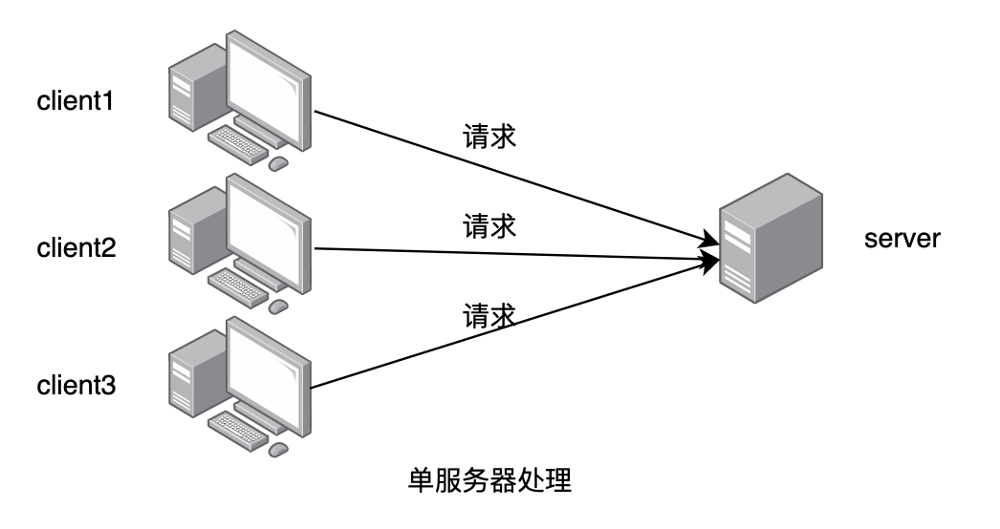
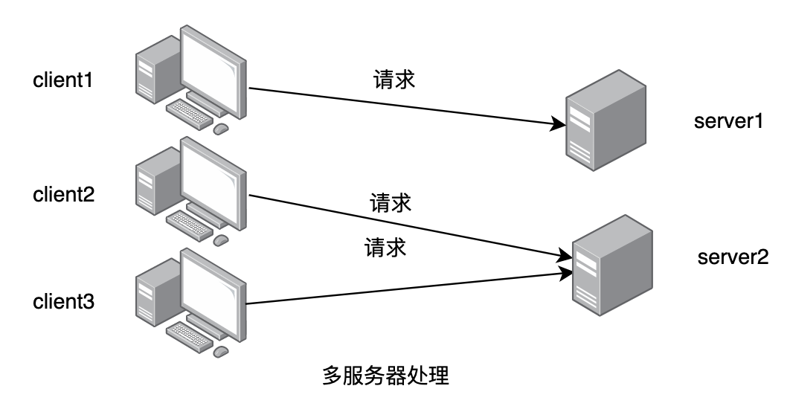
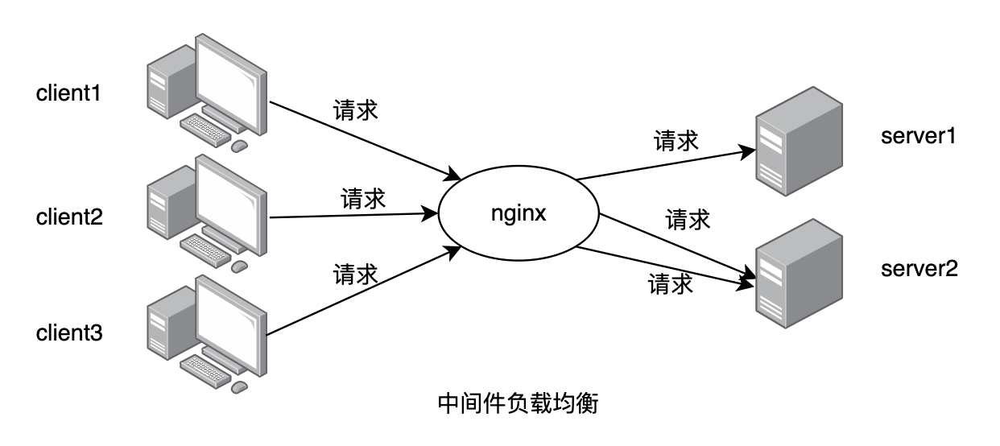
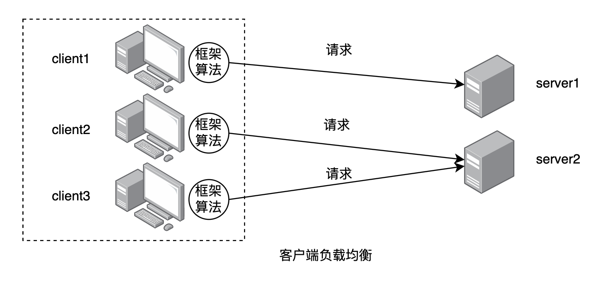
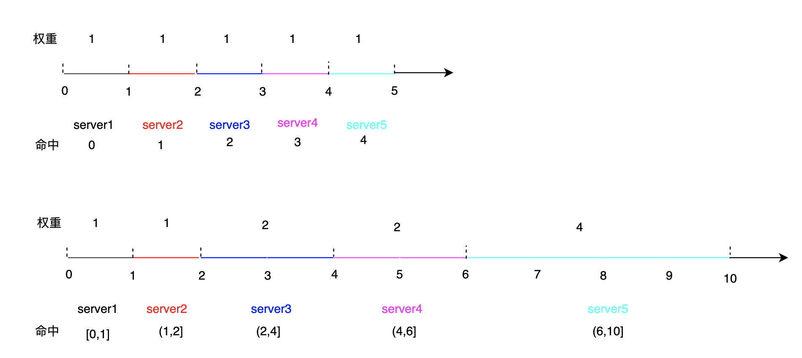
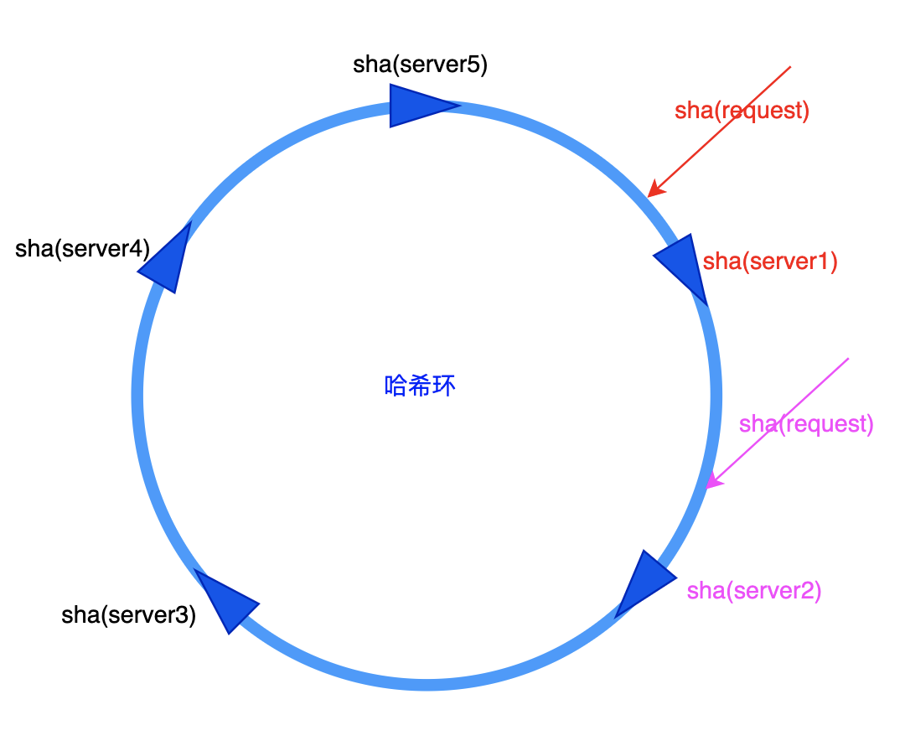
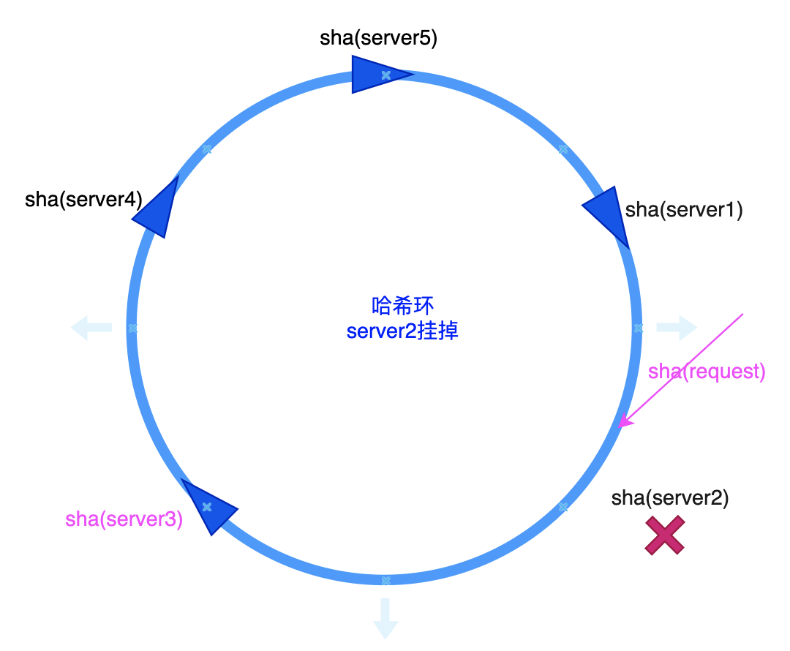
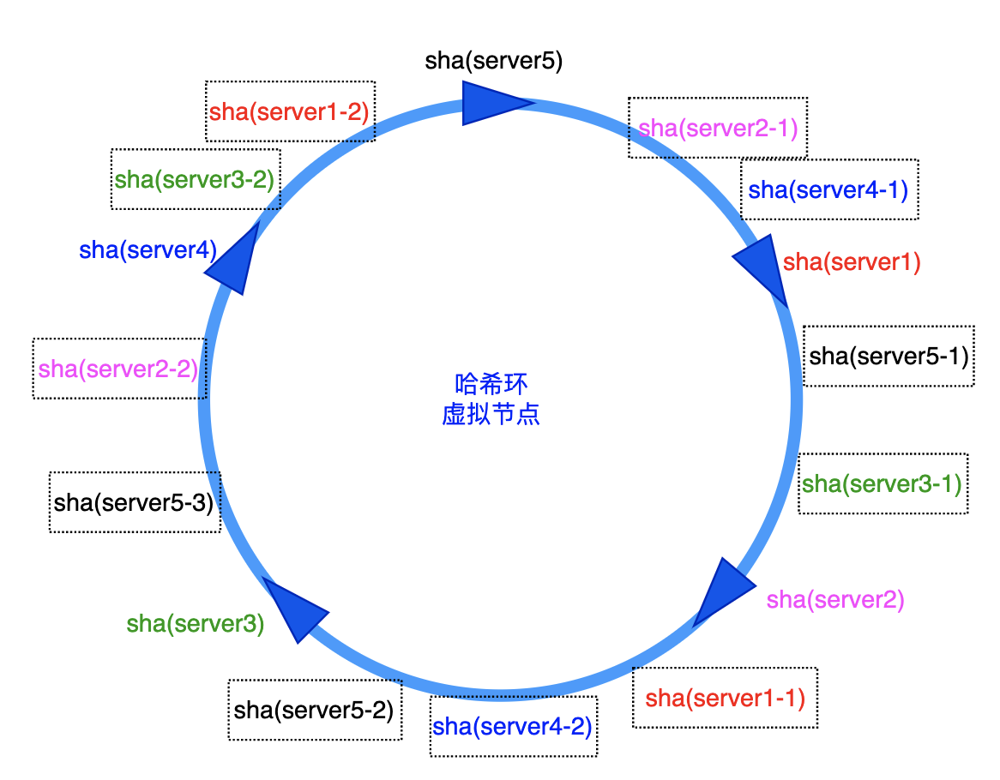

# 什么时候需要负载均衡

负载均衡的目的让每个服务器都能充分发挥自身的处理能力。当客户端发起请求，只存在一个服务端进行响应时，不需要考虑负载均衡的问题，因为所有的请求都只能由一个服务器进行处理：



当服务能力不足，需要将服务器扩展至多台时，就需要考虑负载均衡的问题了。因为客户端需要选择向哪一台服务器发起处理请求。而选择的方法就称为负载均衡算法。通过负载均衡算法，客户端请求被分散到不同的服务器进行处理:



# 负载均衡常用的实现方式

## nginx

负载均衡可以通过硬件实现。但更多的是通过软件实现，比如常用的nginx。在nginx上配置好目标服务器地址，客户端的请求首先通过nginx，nginx通过配置的负载均衡算法再将请求分发至某一服务器上进行处理，此时nginx充当了一个中间代理的角色：




## client

另一种常见的实现方式，就是客户端负载均衡。当我们知道目标服务器地址是什么、有多少个时，客户端可通过一定的算法来决定请求的目标地址。在微服务开发中，往往会使用etcd或者consul来进行服务注册与发现。客户端并不需要将服务地址写死在代码中，只需要通过ectd或者consul就可以获取到某个服务当前所有的服务地址。开发框架特别是微服务框架通常都自行实现了客户端负载均衡，只需要按照框架规范写代码就行了:



# 负载均衡主要算法及实现

尽管通过nginx以及众多开发框架，我们通常不需要自行去实现负载均衡。但是，有时候我们开发的项目并不总是基于某个框架，也没有必要非得使用nginx。这个时候就需要我们在项目中自行实现负载均衡，了解常见的负载均衡算法及实现是很有必要的。

假如我们有` 192.168.10.1, 192.168.10.2, 192.168.10.3,  192.168.10.4,  192.168.10.5`五台服务器。下面将以此为前提分别介绍随机、轮询、哈希及最小活跃数算法。

## 随机算法

### 简单随机

在五台服务器中，客户端应该向哪一台服务器发起请求呢？最简单的一种方式就是随便哪一个，即完全随机。在五台服务器中，每次只需要随机选择一个下标，然后返回对应服务器地址即可。golang实现代码为：

```go
/*
 * File: simpleRandom.go
 * Created Date: 2022-07-21 01:58:56
 * Author: ysj
 * Description:  负载均衡-简单随机算法
 */
package lb

import (
	"math/rand"
)

type SimpleRandom struct {
	servers []string  // 目标服务器地址
}

// 初始化
func NewSimpleRandom(servers []string) SimpleRandom {
	return SimpleRandom{
		servers: servers,
	}
}

// 选择服务器
func (s SimpleRandom) GetServer() string {
	n := rand.Intn(len(s.servers))
	return s.servers[n]
}
```

运行简单随机算法10万次后，可以看到五台服务器各占20%命中率:

```go
package main

import (
	"fmt"
	"lb/lb"
)
// 辅助函数: 统计服务器命中次数
func sampling(n int, getServer func() string) {
	out := make(map[string]float32)
	for i := 0; i < n; i++ {
		server := getServer()
		out[server] += 1.
	}

	for k, v := range out {
		fmt.Printf("%v: %v %.0f%%\n", k, v, v/float32(n)*100)
	}
}

func main() {
	servers := []string{
		"192.168.10.1",
		"192.168.10.2",
		"192.168.10.3",
		"192.168.10.4",
		"192.168.10.5",
	}
	fmt.Println("==========简单随机==========")
	sr := lb.NewSimpleRandom(servers)
	sampling(100000, sr.GetServer)
}

// ==========简单随机==========
// 192.168.10.2: 20357 20%
// 192.168.10.3: 19922 20%
// 192.168.10.5: 19640 20%
// 192.168.10.4: 19897 20%
// 192.168.10.1: 20184 20%
```

### 加权随机

当服务器的处理能力相同时，比如cpu、内存等配置一样时，简单随机算法其实已经可以很好的平衡服务器压力了。但有时候，服务器的配置并不一致，有些服务器配置相对较高。如果仍采用简单随机算法，那么对配置较高的服务器而言，它的处理能力可能利用不足，而其他服务器可能处理过载。这时候理想的状态应该是，服务器的处理能力越高，其承担的处理请求也越多。因此，一种解决办法是在随机选择中给不同的服务器以不同的权重，处理能力越好的服务器权重越大。

简单随机其实是加权随机的一个特例，因为简单随机可以看作是服务器的权重都为1的加权随机。

加权是如何对服务器进行选择的呢？画一个坐标横轴就可以理解:



加权随机的逻辑步骤为:

1. 给定一个权重，将权重求和(等权坐标到5，1+1+2+2+4坐标到10)；
2. 在权重和(即坐标范围内)随机选择一个数；
3. 选择随机数对应范围的服务器即可

3中根据随机数选择服务器的具体方法为:

| 服务器  | 权重 | 坐标范围 | 判断方法                  |
| ------- | ---- | -------- | ------------------------- |
| server1 | 1    | [0,1]    | 随机数小于等于1           |
| server2 | 1    | (1,2]    | 随机数-1后小于等于1       |
| server3 | 2    | (2,4]    | 随机数-1-1后小于等于2     |
| server4 | 2    | (4,6]    | 随机数-1-1-2后小于等于2   |
| server5 | 4    | (6,10]   | 随机数-1-1-2-2后小于等于4 |

在代码实现中，我们只需要给定一个服务器列表，一个可自定义的权重列表即可。

```go
/*
 * File: weightRandom.go
 * Created Date: 2022-07-21 02:21:15
 * Author: ysj
 * Description:  负载均衡-简单与加权随机算法
 */

package lb

import "math/rand"

type Random struct {
	servers   []string
	weights   []int
	weightSum int
}

// 初始化
func NewRandom(servers []string, weightsOpt ...[]int) Random {
	weights := make([]int, len(servers))
	// 默认权重
	for i := 0; i < len(servers); i++ {
		weights[i] = 1
	}

	// 自定义权重
	for _, wts := range weightsOpt {
		weights = wts
	}

	// 权重和 步骤1
	weightSum := 0
	for _, v := range weights {
		weightSum += v
	}

	return Random{
		servers:   servers,
		weights:   weights,
		weightSum: weightSum,
	}
}

func (r Random) GetServer() string {
	wt := rand.Intn(r.weightSum)+1 //步骤2

	for i, s := range r.servers { //步骤3
		if wt <= r.weights[i] {
			return s
		}
		wt -= r.weights[i] 
	}

	return r.servers[0]
}
```

同样运行加权随机算法10万次后，可以看到五台服务器在默认等权情况下各占20%，在权重为`1,1,2,2,4`时分别占比`10%,10%,20%,20%,40%`,如预期按照权重进行分布。

```go
package main

import (
	"fmt"
	"lb/lb"
)

func main() {
	servers := []string{
		"192.168.10.1",
		"192.168.10.2",
		"192.168.10.3",
		"192.168.10.4",
		"192.168.10.5",
	}
  
	fmt.Println("==========加权随机(权重1)==========")
	wr1 := lb.NewRandom(servers)
	sampling(100000, wr1.GetServer)

	fmt.Println("==========加权随机(1,1,2,2,4)==========")
	wr2 := lb.NewRandom(servers, []int{1, 1, 2, 2, 4})
	sampling(100000, wr2.GetServer)
}

// ==========加权随机(权重1)==========
// 192.168.10.5: 20157 20%
// 192.168.10.3: 19682 20%
// 192.168.10.4: 19754 20%
// 192.168.10.1: 20123 20%
// 192.168.10.2: 20284 20%
// ==========加权随机(1,1,2,2,4)==========
// 192.168.10.1: 9902 10%
// 192.168.10.3: 20138 20%
// 192.168.10.2: 10110 10%
// 192.168.10.5: 39922 40%
// 192.168.10.4: 19928 20%
```

## 轮询算法

尽管随机算法已经表现出均衡的特性，但这仅限于选择的次数够多的情况下。上述示例中，选择的次数为10万次。假如我们将选择的次数降底到1万、1千、或者1百次，将会看到等权情况下，五台服务器分别被选中次数并不均衡，极端情况下，所有请求可能都被打在同一台服务器上。这就是概率论中频率的随机性。只有选择次数足够大时随机算法才会达到理想的状态。

轮询算法可以在选择次数较少的情况下就可以达到较好的均衡效果。很多框架的均衡实现都选择轮询作为默认选项。

### 简单轮询

简单轮询的意思就是"排好队，一个一个的来！"。五台服务器，按顺序从第一台选到最后一台，然后回到第一台又选到最后一台，如此循环往复。

```go
/*
 * File: simplePoll.go
 * Created Date: 2022-07-21 03:37:45
 * Author: ysj
 * Description:  负载均衡-简单轮询算法
 */

package lb

type SimpePoll struct {
	servers []string
	pos     int // 下标位置，初始为0
}

// 初始化
func NewSimpePoll(servers []string) SimpePoll {
	return SimpePoll{
		servers: servers,
		pos:     0,
	}
}

func (s *SimpePoll) GetServer() string {
	server := s.servers[s.pos]
	s.pos++
	
  // 回到最初
	if s.pos >= len(s.servers) {
		s.pos = 0
	}

	return server
}
```

运行简单轮询10万次，可以看到每台服务器的选择达到了完全平均，各2万次:

```go
/*
 * File: main.go
 * Created Date: 2022-07-21 01:10:52
 * Author: ysj
 * Description: 负载均衡
 */

package main

import (
	"fmt"
	"lb/lb"
)
func main() {
	servers := []string{
		"192.168.10.1",
		"192.168.10.2",
		"192.168.10.3",
		"192.168.10.4",
		"192.168.10.5",
	}
	fmt.Println("==========简单轮询==========")
	sp := lb.NewSimpePoll(servers)
	sampling(100000, sp.GetServer)
}

// ==========简单轮询==========
// 192.168.10.1: 20000 20%
// 192.168.10.2: 20000 20%
// 192.168.10.3: 20000 20%
// 192.168.10.4: 20000 20%
// 192.168.10.5: 20000 20%
```

### 加权轮询

加权的思想和前述加权随机中的加权是相同的道理，在轮询的过程中，让权重大的服务器被选中的次数多一些。要达到此目的，一种最简单的处理就是"按权重进行排队"。比如五台服务器的权重分别为`1,1,2,2,4`，那么待轮询的服务器队列为`server1,server2,server3,server3,server4,server4,server5,server5,server5,server5`。然后直接按照简单轮询的方式处理即可。

这种处理方式虽然简单，但需要考虑到服务器较多的时候，假如有1万台、10万或者更多时候呢？按照权重展开的话，服务器列表将变得非常非常大，浪费内存空间，实在不优雅。

与简单随机类似，简单轮询其实也是加权轮询的特例，权重均为1。加权轮询的处理方式与加权随机非常相似, 步骤为：

1. 给定一个权重，将权重求和；
2. 从0开始自增轮询次数，并对权重和取余；
3. 选择余数对应范围的服务器即可；

> 步骤3中的选择方法与加权随机中选择方法是一样的，只需要将此处的余数对应前文中的随机数即可。

go的实现代码为:

```go
/*
 * File: poll.go
 * Created Date: 2022-07-21 03:56:22
 * Author: ysj
 * Description:  负载均衡-简单与加权轮询
 */

package lb

type Poll struct {
	servers   []string // 服务器列表
	weights   []int //权重列表
	weightSum int  //权重和
	index     int64 //轮询次数
}

// 初始化
func NewPoll(servers []string, weightsOpt ...[]int) Poll {
	weights := make([]int, len(servers))

	// 默认权重
	for i := 0; i < len(servers); i++ {
		weights[i] = 1
	}

	// 自定义权重
	for _, wts := range weightsOpt {
		weights = wts
	}

	// 权重和 步骤1
	weightsSum := 0
	for _, v := range weights {
		weightsSum += v
	}

	return Poll{
		servers:   servers,
		weights:   weights,
		weightSum: weightsSum,
	}
}

func (p *Poll) GetServer() string {
	p.index++
	pos := p.index % int64(p.weightSum) //步骤2
	for i, s := range p.servers { // 步骤3
		if pos < int64(p.weights[i]) {
			return s
		}
		pos -= int64(p.weights[i])
	}

	return p.servers[0]
}
```

运行加权轮询10万次，可以看到等权重下，加权轮询与简单轮询结果一致。当权重为`1,1,6,1,1`时，各服务器被选中的次数比完全等同权重比。

```go
package main

import (
	"fmt"
	"lb/lb"
)
func main() {
	servers := []string{
		"192.168.10.1",
		"192.168.10.2",
		"192.168.10.3",
		"192.168.10.4",
		"192.168.10.5",
	}
	fmt.Println("==========加权轮询(权重1)==========")
	wp1 := lb.NewPoll(servers)
	sampling(100000, wp1.GetServer)

	fmt.Println("==========加权轮询==========")
	wp2 := lb.NewPoll(servers, []int{1, 1, 6, 1, 1})
	sampling(100000, wp2.GetServer)
	for i := 0; i < 10; i++ {
		server := wp2.GetServer()
		fmt.Printf("server: %v\n", server)
	}
}
// ==========加权轮询(权重1)==========
// 192.168.10.4: 20000 20%
// 192.168.10.5: 20000 20%
// 192.168.10.1: 20000 20%
// 192.168.10.2: 20000 20%
// 192.168.10.3: 20000 20%
// ==========加权轮询==========
// 192.168.10.2: 10000 10%
// 192.168.10.3: 60000 60%
// 192.168.10.4: 10000 10%
// 192.168.10.5: 10000 10%
// 192.168.10.1: 10000 10%
// server: 192.168.10.2
// server: 192.168.10.3
// server: 192.168.10.3
// server: 192.168.10.3
// server: 192.168.10.3
// server: 192.168.10.3
// server: 192.168.10.3
// server: 192.168.10.4
// server: 192.168.10.5
// server: 192.168.10.1
```

### 平滑加权轮询

在加权轮询中存在一个问题，即"热点集中"。也就是说可能出现某一时刻请求都集中在权重较大的服务器上，比如上述示例，在10次轮询中，服务器3按照权重大小被连续选中了6次。这段时间服务器3可能压力较大，而其他服务器可能就闲着在"吃瓜"。理想的状态应该是服务器3被选中的6次分散开来，形如: `1,3,3,2,3,3,4,3,3,5、3,1,3,2,3,3,4,3,5,3`等。这就是平滑加权轮询达到的效果。

该算法的难点在于平滑是如何实现的。初始给定一个权重列表，作为固定权重。有固定权重，对应的就有变动权重，也可以称其为平滑权重。初始固定权重等于平滑权重。具体处理方式以一个表格进行说明, 假定初始权重为`1,1,6,1,1`:

| 轮询次数 | 固定权重    | 平滑权重(变动) | Max(平滑权重) | 目标服务器   | Max权重-权重和  | 各权重+固定权重 |
| -------- | ----------- | -------------- | ------------- | ------------ | --------------- | --------------- |
| 1        | (1,1,6,1,1) | (1,1,6,1,1)    | 6             | 192.168.10.3 | (1,1,-4,1,1)    | (2,2,2,2,2)     |
| 2        | (1,1,6,1,1) | (2,2,2,2,2)    | 2             | 192.168.10.1 | (-8,2,2,2,2)    | (-7,3,8,3,3)    |
| 3        | (1,1,6,1,1) | (-7,3,8,3,3)   | 8             | 192.168.10.3 | (-7,3,-2,3,3)   | (-6,4,4,4,4)    |
| 4        | (1,1,6,1,1) | (-6,4,4,4,4)   | 4             | 192.168.10.2 | (-6,-6,4,4,4)   | (-5,-5,10,5,5)  |
| 5        | (1,1,6,1,1) | (-5,-5,10,5,5) | 10            | 192.168.10.3 | (-5,-5,0,5,5)   | (-4,-4,6,6,6)   |
| 6        | (1,1,6,1,1) | (-4,-4,6,6,6)  | 6             | 192.168.10.3 | (-4,-4,-4,6,6)  | (-3,-3,2,7,7)   |
| 7        | (1,1,6,1,1) | (-3,-3,2,7,7)  | 7             | 192.168.10.4 | (-3,-3,2,-3,7)  | (-2,-2,8,-2,8)  |
| 8        | (1,1,6,1,1) | (-2,-2,8,-2,8) | 8             | 192.168.10.3 | (-2,-2,-2,-2,8) | (-1,-1,4,-1,9)  |
| 9        | (1,1,6,1,1) | (-1,-1,4,-1,9) | 9             | 192.168.10.5 | (-1,-1,4,-1,-1) | (0,0,10,0,0)    |
| 10       | (1,1,6,1,1) | (0,0,10,0,0)   | 10            | 192.168.10.3 | (0,0,0,0,0)     | (1,1,6,1,1)     |

将上述过程总结为三个字:

1. 选——选最大权重。让初始平滑权重等于给定的固定权重，然后选择每次选择平滑权重中的最大者；
2. 减——减权重和。将平滑权重中的最大者减去固定权重和；
3. 加——加各自固定权重。此时权重和保持不变(即又回到10)。

go的实现代码为:

```go
/*
 * File: smoothPoll.go
 * Created Date: 2022-07-21 04:27:50
 * Author: ysj
 * Description:  负载均衡-平滑加权轮询算法
 */

package lb

type SmoothPoll struct {
	servers       []string
	weights       []int // 固定权重
	smoothWeights []int // 平滑权重(变动)
	weightsSum    int  // 权重和
}

// 初始化
func NewSmoothPoll(servers []string, weightsOpt ...[]int) SmoothPoll {
	weights := make([]int, len(servers))
	smoothWeights := make([]int, len(servers))
	// 默认权重
	for i := 0; i < len(servers); i++ {
		weights[i] = 1
	}

	// 自定义权重
	for _, wts := range weightsOpt {
		weights = wts
	}

	// 平滑权重——初始等于固定权重
	copy(smoothWeights, weights)

	// 权重和
	weightsSum := 0
	for _, v := range weights {
		weightsSum += v
	}

	return SmoothPoll{
		servers:       servers,
		weights:       weights,
		smoothWeights: smoothWeights,
		weightsSum:    weightsSum,
	}
}

func (sp *SmoothPoll) GetServer() string {
	// 1. 选---选最大权重
	maxLoc := sp.findMax()
	server := sp.servers[maxLoc]

	// 2. 减---减权重和
	tempWeight := sp.smoothWeights[maxLoc] - sp.weightsSum

	// 3. 加---加各自固定权重
	for i := 0; i < len(sp.smoothWeights); i++ {
		if i == maxLoc {
			sp.smoothWeights[i] = tempWeight + sp.weights[i]
		} else {
			sp.smoothWeights[i] = sp.smoothWeights[i] + sp.weights[i]
		}
	}

	return server
}

func (sp *SmoothPoll) findMax() int {
	max := 0
	maxLoc := 0
	for i := 0; i < len(sp.smoothWeights); i++ {
		if sp.smoothWeights[i] > max {
			max = sp.smoothWeights[i]
			maxLoc = i
		}
	}
	return maxLoc
}
```

运行平滑加权轮询，可以看到等权情形下，效果等同于加权轮询，等同于简单轮询。非等权情形下，各服务器被选中的次数严格按照给定的权重`1,1,6,1,1`分布。10次轮询中，服务器3被选中6次，且6次被均衡散开，夹杂在其他服务器的选中次序中：

```go
package main

import (
	"fmt"
	"lb/lb"
)
func main() {
	servers := []string{
		"192.168.10.1",
		"192.168.10.2",
		"192.168.10.3",
		"192.168.10.4",
		"192.168.10.5",
	}
	fmt.Println("==========平滑加权轮询(权重1)==========")
	smp1 := lb.NewSmoothPoll(servers)
	sampling(100000, smp1.GetServer)

	fmt.Println("==========平滑加权轮询==========")
	smp2 := lb.NewSmoothPoll(servers, []int{1, 1, 6, 1, 1})
	sampling(100000, smp2.GetServer)

	for i := 0; i < 10; i++ {
		server := smp2.GetServer()
		fmt.Printf("server: %v\n", server)
	}
}

// ==========平滑加权轮询==========
// 192.168.10.5: 10000 10%
// 192.168.10.3: 60000 60%
// 192.168.10.1: 10000 10%
// 192.168.10.2: 10000 10%
// 192.168.10.4: 10000 10%
// server: 192.168.10.3
// server: 192.168.10.1
// server: 192.168.10.3
// server: 192.168.10.2
// server: 192.168.10.3
// server: 192.168.10.3
// server: 192.168.10.4
// server: 192.168.10.3
// server: 192.168.10.5
// server: 192.168.10.3
```

## 一致性哈希算法

哈希算法首先将服务器地址计算哈希值，然后按照哈希值从小到大的顺序构成一个环，称为哈希环（就是传说中的`hash ring`）。客户端在发起请求时，根据一定的特征(如客户端地址、请求路由等)先行计算一个哈希值，然后在哈希环中选择第一个大于等于该值的节点为目标节点，对应的服务器即为目标服务器。



在目前的条件下，如果某个服务器宕机了，那么下一个服务器将存在压力过大的问题。假如服务器2挂掉了，原本应该由服务器2处理的请求，将会分发到服务器3上，服务器3可能处理不过来。



为了避免服务器宕机造成负载不均衡的问题，可以在环中加入虚拟节点。可以均等的也可以按照一定的权重加入虚拟节点。加入虚拟节点后，即使某一个服务器挂掉了，对节点均衡分布的影响并不大，原本应该由挂掉服务器处理的请求被分散到了多个服务器上，避免了集中在下一个服务器进行处理的情形。



哈希算法的步骤为:

1. 根据权重计算各服务器加入环中的虚拟节点数，然后计算hash值并加入环；
2. 对hash环中所有节点按hash值从小到大排序，得到最终的需要的hash环；
3. 根据客户端调用传递的值计算hash值，找出第一个大于等于该值的服务器哈希值；
4. 该hash值对应的服务器即为选择的目标服务器。

go的实现代码为:

```go
/*
 * File: hashRing.go
 * Created Date: 2022-07-21 05:18:34
 * Author: ysj
 * Description:  负载均衡-一致性哈希算法
 */

package lb

import (
	"crypto/sha1"
	"fmt"
	"sort"
)

// 节点定义
type Node struct {
	server    string // 服务器
	weight    int    // 权重
	hashValue uint32 // 哈希value
}

type HashRing []Node // 所有节点

// 初始化
func NewHashRing(servers []string, virtualNum int) HashRing {
	weights := make([]int, len(servers))
	for i := 0; i < len(servers); i++ {
		weights[i] = 1
	}
	return NewHashRingWithWeights(servers, weights, virtualNum)
}

// 带权重初始化
func NewHashRingWithWeights(servers []string, weights []int, virtualNum int) HashRing {
	// 权重和
	weightsSum := 0.0
	for _, v := range weights {
		weightsSum += float64(v)
	}

	nodes := make([]Node, 0)

	for i := 0; i < len(servers); i++ {
		// 按权重计算节点数 步骤1
		nodeNum := int(float64(virtualNum*len(servers)) * (float64(weights[i]) / weightsSum))
		for ii := 0; ii < nodeNum; ii++ {
			hashStr := fmt.Sprintf("%s:%v", servers[i], ii)
			sh := sha1.New()
			sh.Write([]byte(hashStr))
			hashKey := sh.Sum(nil)
			node := Node{
				server:    servers[i],
				weight:    weights[i],
				hashValue: getHashValue(hashKey[6:10]),
			}
			nodes = append(nodes, node)
			sh.Reset()
		}
	}
	
  // 排序，形成最终hash环 步骤2
	sort.Slice(nodes, func(i, j int) bool {
		return nodes[i].hashValue < nodes[j].hashValue
	})

	return nodes
}

func (hr HashRing) GetServer(key string) string {
	sh := sha1.New()
	sh.Write([]byte(key))
	hashKey := sh.Sum(nil)
	hashValue := getHashValue(hashKey[6:10])
	i := sort.Search(len(hr), func(i int) bool { return hr[i].hashValue >= hashValue }) //步骤3

	if i == len(hr) {
		i = 0
	}

	return hr[i].server // 步骤4
}

//将bs转成uint32
func getHashValue(bs []byte) uint32 {
	if len(bs) < 4 {
		return 0
	}
	v := (uint32(bs[3]) << 24) | (uint32(bs[2]) << 16) | (uint32(bs[1]) << 8) | (uint32(bs[0]))
	return v
}
```

运行hash算法10万次，结果为：

```go
package main

import (
	"fmt"
	"lb/lb"
)

func hashSampling(n int, getServer func(arg string) string) {
	out := make(map[string]float32)
	for i := 0; i < n; i++ {
		server := getServer(fmt.Sprintf("%v", i))
		out[server] += 1.
	}

	for k, v := range out {
		fmt.Printf("%v: %v %.0f%%\n", k, v, v/float32(n)*100)
	}
}

func main() {
	servers := []string{
		"192.168.10.1",
		"192.168.10.2",
		"192.168.10.3",
		"192.168.10.4",
		"192.168.10.5",
	}
	fmt.Println("==========一致性hash(等权)==========")
	hr1 := lb.NewHashRing(servers, 20)
	hashSampling(100000, hr1.GetServer)

	fmt.Println("==========一致性hash==========")
	hr2 := lb.NewHashRingWithWeights(servers, []int{1, 1, 6, 1, 1}, 20)
	hashSampling(100000, hr2.GetServer)
}

// ==========一致性hash(等权)==========
// 192.168.10.5: 17894 18%
// 192.168.10.4: 20115 20%
// 192.168.10.2: 18538 19%
// 192.168.10.3: 24585 25%
// 192.168.10.1: 18868 19%
// ==========一致性hash==========
// 192.168.10.5: 11252 11%
// 192.168.10.3: 62439 62%
// 192.168.10.1: 8997 9%
// 192.168.10.4: 7994 8%
// 192.168.10.2: 9318 9%
```

## 最小活跃数算法

最小活跃数算法，也叫最小压力算法。这是负载均衡最符合实际的一种算法，但同时也是实现起来最不方便的算法。这个算法出发点是不同的服务器有不同的处理能力，某一时刻的请求应该由当前处理压力最小的服务器进行处理。处理压力最小意味着当前正在处理的请求数最少，即活跃请求数最少。

此算法需要目标节点配合，接收到请求时活跃数+1，处理完成后活跃数-1。操作步骤为：

1. 首先找出活跃数最小的目标节点
2. 如果目标节点存在多个，则根据权重进行选择，退化为加权算法。

这种算法往往需要一个中心化的活跃数据存储，客户端在发起请求的时候首先去查询当前活跃数记录最小的服务器地址，然后再发起请求处理。

具体实现略过。虽然负载更符合实际，但是不如直接用其他算法来的简单直接。
