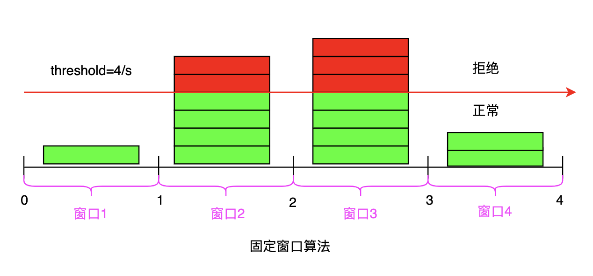
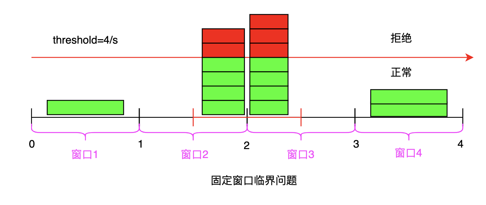
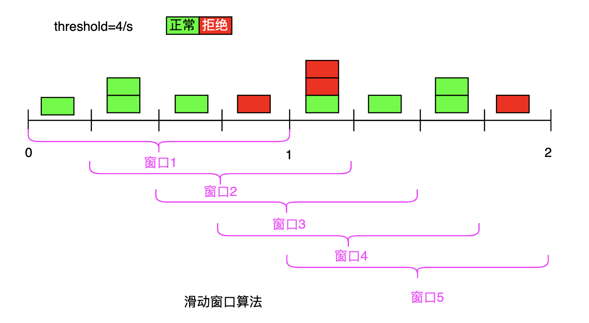
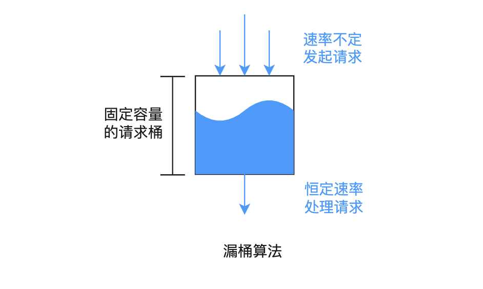
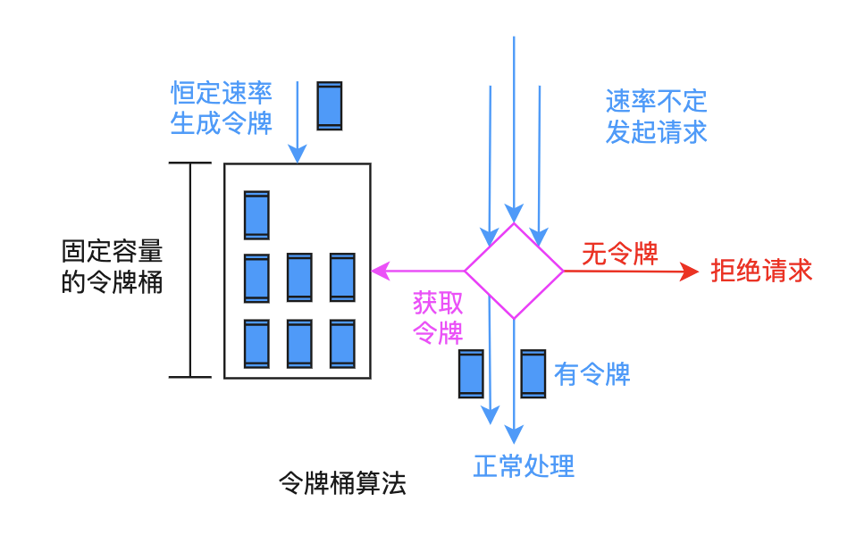

所谓限流，就是限制客户端的请求数在设定的阈值范围内。

为什么需要限流？

* 保证服务的稳定性。当大量请求到来时，要保证服务在自身的处理能力之内，避免出现资源用尽、服务挂掉等情况；
* 防止恶意访问。攻击者可能通过拒绝服务攻击(Dos或者DDos)发起大量的请求，以致超出服务器的承受能力，从而让正常的访问都被服务器拒绝。限流在一定程度上可以限制恶意访问。
* 保护数据的安全。特别是对敏感数据资源来说，如果服务遭受攻击，攻击者可能通过不断的请求以获取到所有数据，限流可以让数据资产在短时间不至于全部暴露。

限流在企业开发中经常用到。大多数情况下，对于限流的实现，通常框架直接集成，开箱即用，或者直接引入第三方实现的包，即可达到业务需求。但有些时候却少不了需要我们自己去实现限流算法，比如项目没有基于框架开发、框架没有实现限流、或者需要我们自定义限流实现特殊需求时。

下面介绍四种常用的经典限流算法，并给出golang代码实现。

# 固定窗口算法

固定窗口算法是指在一个固定的时间窗口内，请求数不能超过多少。比如限制请求数在1秒内不能超过4个。超过4个请求将被拒绝。



固定窗口算法实现的思路:

1. 每次请求到来，判断当前请求时间距离上次是否超过时间窗口，如果超过则重置当前请求数
2. 当前请求数+1，判断当前请求数是否超过设定的阈值，如果超过则拒绝当前请求，否则请求通过。

golang实现代码示例:

```go
/*
 * File: fixedWindow.go
 * Created Date: 2022-07-25 02:35:50
 * Author: ysj
 * Description:  限流算法——固定窗口算法
 */

package limiter

import (
	"time"
)

type FixedWindowLimiter struct {
	windowStart  time.Time // 窗口开始时间
	threshold    int       // 阈值qps,每秒请求上限
	currentCount int       // 当前请求数
}

// 初始化
func NewFixedWindowLimiter(threshold int) FixedWindowLimiter {
	return FixedWindowLimiter{
		windowStart:  time.Now(),
		threshold:    threshold,
		currentCount: 0,
	}
}

// Limit
func (l *FixedWindowLimiter) Limit() bool {
	if time.Since(l.windowStart) > 1*time.Second {
		l.windowStart = time.Now()
		l.currentCount = 0
	}
	l.currentCount++

	return l.currentCount > l.threshold
}

func (l *FixedWindowLimiter) CurrentCount() int {
	return l.currentCount
}
func (l *FixedWindowLimiter) Threshold() int {
	return l.threshold
}
```

编写测试代码:

* 每秒请求数不超过4次
* 情形1: 每50ms发起一次请求，共发起10次请求
* 情形2: 每500ms发起一次请求，共发起10次请求

```go
package main

import (
	"fmt"
	"rl/limiter"
	"time"
)

type WindowLimiter interface {
	Limit() bool
	CurrentCount() int
	Threshold() int
}

// 模拟请求n次，每d毫秒发起一次请求
func mockRequest(n int, d time.Duration, l WindowLimiter) {
	for i := 0; i < n; i++ {
		time.Sleep(d * time.Millisecond)
		if l.Limit() {
			fmt.Printf("currentCount: %v > threshold:%v limit\n", l.CurrentCount(), l.Threshold())
		} else {
			fmt.Printf("currentCount: %v   threshold:%v pass\n", l.CurrentCount(), l.Threshold())
		}
	}
}

func main() {
	fmt.Println("=================固定窗口算法==============")
	fwl := limiter.NewFixedWindowLimiter(4)
  // 每50ms发起一次请求，共发起10次请求
	mockRequest(10, 50, &fwl)
  // 每500ms发起一次请求，共发起10次请求
	mockRequest(10, 500, &fwl)
}

// =================固定窗口算法==============
// currentCount: 1   threshold:4 pass
// currentCount: 2   threshold:4 pass
// currentCount: 3   threshold:4 pass
// currentCount: 4   threshold:4 pass
// currentCount: 5 > threshold:4 limit
// currentCount: 6 > threshold:4 limit
// currentCount: 7 > threshold:4 limit
// currentCount: 8 > threshold:4 limit
// currentCount: 9 > threshold:4 limit
// currentCount: 10 > threshold:4 limit
// ------------------------------------------
// currentCount: 1   threshold:4 pass
// currentCount: 2   threshold:4 pass
// currentCount: 1   threshold:4 pass
// currentCount: 2   threshold:4 pass
// currentCount: 1   threshold:4 pass
// currentCount: 2   threshold:4 pass
// currentCount: 1   threshold:4 pass
// currentCount: 2   threshold:4 pass
// currentCount: 1   threshold:4 pass
// currentCount: 2   threshold:4 pass
```

从测试结果来看，请求阈值为每秒4次：

* 情形1: 当每50ms发起一次请求时，一秒内可发起20次请求，请求超过4次会被拒绝，符合预期；
* 情形2: 当每500ms发起一次请求时，一秒内最多2次请求，始终不会超过4次，所有请求均通过，符合预期；

固定窗口算法虽然能够起到限流作用，但是存在一个较大的缺陷，就是**窗口临界问题**。窗口临界问题就是请求集中于窗口的分界处，从而造成请求数超过阈值后依然通过的问题。如图所示:



请求数在窗口1到窗口4中均没有超过阈值4，但是在1.5秒到2.5秒这个时间段里，实际请求数为8，超过了每秒4次请求的限制。滑动窗口可以解决窗口临界问题。

# 滑动窗口算法

针对固定窗口的缺陷，滑动窗口算法将时间窗口细分为多个小的时间窗格，每个时间窗格对请求单独计数，每过一个窗格的时间，窗口便向后移动一个窗格，同时将移出的窗格所占请求数从当前窗口的请求数中减去，当请求数大于设定的阈值时，就拒绝请求。



滑动窗口算法的实现思路：

1. 设定请求阈值，例如每秒请求数

2. 设定窗口划分粒度，例如窗口期为1s，每秒分为4个窗格，每个窗格有自己的请求计数

3. 当请求时间距离上次超过一个窗格时间时，窗口滑动一个时间窗格，即：

   * 当前请求数-滑出窗格的请求数

   * 划入窗格的请求数置为1(本次请求)

   * 当前请求数+1

   否则：

   * 当前请求数+1
   * 当前窗格请求数+1

4. 比较判断当前请求数与阈值，超过阈值则拒绝请求

```go
/*
 * File: slideWindow.go
 * Created Date: 2022-07-25 02:36:07
 * Author: ysj
 * Description:  限流算法——滑动窗口算法
 */

package limiter

import (
	"time"
)

type SlideWindowLimiter struct {
	windowSize      int           // 窗格数
	interval        time.Duration // 每个窗格时间间隔
	windows         []int         // 每个窗格请求数
	currentWindowId int           // 当前窗格id
	lastTime        time.Time     // 上次请求的时间
	currentCount    int           // 当前请求数
	threshold       int           // 阈值qps,每秒请求上限
}

// 初始化
func NewSlideWindowLimiter(threshold, windowSize int) SlideWindowLimiter {

	return SlideWindowLimiter{
		windowSize:      windowSize,
		interval:        time.Second / time.Duration(windowSize),
		windows:         make([]int, windowSize),
		currentWindowId: 0,
		lastTime:        time.Now(),
		currentCount:    0,
		threshold:       threshold,
	}
}

// Limit
func (l *SlideWindowLimiter) Limit() bool {
	
	if time.Since(l.lastTime) > l.interval {
		l.currentCount -= l.windows[l.currentWindowId]
		l.currentWindowId++
		l.currentWindowId = l.currentWindowId % l.windowSize
		l.windows[l.currentWindowId] = 0
		l.lastTime = time.Now()
	}

	l.windows[l.currentWindowId]++
	l.currentCount++

	return l.currentCount > l.threshold
}

func (l *SlideWindowLimiter) CurrentCount() int {
	return l.currentCount
}
func (l *SlideWindowLimiter) Threshold() int {
	return l.threshold
}
```

编写测试代码:

1. 情形1: 每40ms发起一次请求，共请求10次
2. 情形2: 每70ms发起一次请求，共请求10次

```go
package main

import (
	"fmt"
	"rl/limiter"
	"time"
)

type WindowLimiter interface {
	Limit() bool
	CurrentCount() int
	Threshold() int
}

func mockRequest(n int, d time.Duration, l WindowLimiter) {
	for i := 0; i < n; i++ {
		time.Sleep(d * time.Millisecond)
		if l.Limit() {
			fmt.Printf("currentCount: %v > threshold:%v limit\n", l.CurrentCount(), l.Threshold())
		} else {
			fmt.Printf("currentCount: %v   threshold:%v pass\n", l.CurrentCount(), l.Threshold())
		}
	}
}

func main() {	
	fmt.Println("=================滑动窗口算法==============")
	swl := limiter.NewSlideWindowLimiter(4, 4)
	mockRequest(10, 40, &swl)
	fmt.Println("------------------------------------------")
	mockRequest(10, 70, &swl)
}

// =================滑动窗口算法==============
// currentCount: 1   threshold:4 pass
// currentCount: 2   threshold:4 pass
// currentCount: 3   threshold:4 pass
// currentCount: 4   threshold:4 pass
// currentCount: 5 > threshold:4 limit
// currentCount: 1   threshold:4 pass
// currentCount: 2   threshold:4 pass
// currentCount: 3   threshold:4 pass
// currentCount: 4   threshold:4 pass
// currentCount: 5 > threshold:4 limit
// ------------------------------------------
// currentCount: 2   threshold:4 pass
// currentCount: 3   threshold:4 pass
// currentCount: 4   threshold:4 pass
// currentCount: 1   threshold:4 pass
// currentCount: 2   threshold:4 pass
// currentCount: 3   threshold:4 pass
// currentCount: 4   threshold:4 pass
// currentCount: 1   threshold:4 pass
// currentCount: 2   threshold:4 pass
// currentCount: 3   threshold:4 pass
```

分析测试结果，每秒请求数不超过4次，时间窗口为1s，每个时间窗口分为4个小窗格，每个窗格250ms：

* 情形1: 每40ms请求一次，每个窗格最多可以发起6次请求，从而超过阈值，10次请求会被限流两次，符合预期；
* 情形2: 每70ms请求一次，每个窗格最多发起4次请求，无论如何都不会超过阈值，不会被限流，如何预期；

滑窗算法虽然解决了窗口的临界问题，但是对于突发请求超过阈值全部给拒绝了，事实上只要突发的请求在服务可承受的能力之内均应该被接受，而不是直接拒绝。

漏桶算法和令牌桶算法在面对突发请求时就具有一定的柔性。

# 漏桶算法

漏桶算法假定请求就像流水一样涌入桶中，对请求的处理就像漏水一样以恒定的速率进行。根据服务器的能力不同，可以设定桶的容量，当大量的请求到来时，请求数只要在桶的容量内均可以被接收，然后请求会以恒定的速率进行处理。当请求数大于桶的容量时，就像溢出的水一样直接抛弃即可。



漏桶算法的实现思路为:

1. 给定桶的容量，即服务器在一瞬间最多可以接受的请求数；
2. 给定处理速率，比如每秒请求处理数；
3. 每次请求时，计算桶中剩余待处理请求数，也就是当前请求数:
   * (本次请求时间-上次请求时间)x请求处理速率 = 两次请求间隔内处理完成的请求数
   * 当前请求数(本次请求前剩余待处理请求数)-请求间隔内处理完成的请求数 = 最新的当前请求数(本次请求后剩余待处理请求数）
4. 比较当前请求数是否超过桶的容量，如果是则拒绝本次请求，否则请求通过且当前请求数+1(剩余待处理请求数+1)

golang示例代码为：

```go
/*
 * File: leakyBucket.go
 * Created Date: 2022-07-25 02:37:07
 * Author: ysj
 * Description:  限流算法——漏桶算法
 */

package limiter

import (
	"fmt"
	"time"
)

type LeakyBucketLimiter struct {
	capacity     int       // 桶容量
	currentCount int       // 当前请求数，即当前待处理请求数
	threshold    int       // 阈值，每秒处理数
	lastTime     time.Time // 上次请求的时间
}

// 初始化
func NewLeakyBucketLimiter(threshold, capacity int) LeakyBucketLimiter {
	return LeakyBucketLimiter{
		capacity:  capacity,
		threshold: threshold,
		lastTime:  time.Now(),
	}
}

// Limit
func (l *LeakyBucketLimiter) Limit() bool {
   // 两次请求间隔内应当处理完成的请求数
	leakyCount := int(time.Since(l.lastTime).Seconds() * float64(l.threshold))
	fmt.Printf("leakyCount: %v ", leakyCount)
	if leakyCount > 0 {
		l.currentCount -= leakyCount
		l.lastTime = time.Now()
	}

	if l.currentCount < 0 {
		l.currentCount = 0
	}
	// 如果当前请求数在容量范围内，则请求通过且当前请求数+1(剩余待处理请求数+1)
	if l.currentCount < l.capacity {
		l.currentCount++
		return false
	}

	return true
}

func (l *LeakyBucketLimiter) CurrentCount() int {
	return l.currentCount
}
func (l *LeakyBucketLimiter) Threshold() int {
	return l.threshold
}
func (l *LeakyBucketLimiter) Capacity() int {
	return l.capacity
}
```

漏桶算法测试代码，假定请求处理的速度为每秒4个，桶的容量为5个请求(仅为了测试):

1. 情形1: 以每50ms的速度发起请求，共请求10次；
2. 情形2: 以每500ms的速度发起请求，共请求10次；

```go
package main

import (
	"fmt"
	"rl/limiter"
	"time"
)

type BucketLimiter interface {
	Limit() bool
	CurrentCount() int
	Threshold() int
	Capacity() int
}

func mockRequest1(n int, d time.Duration, l BucketLimiter) {
	for i := 0; i < n; i++ {
		time.Sleep(d * time.Millisecond)
		if l.Limit() {
			fmt.Printf("currentCount: %v > capacity:%v limit\n", l.CurrentCount(), l.Capacity())
		} else {
			fmt.Printf("currentCount: %v   capacity:%v pass\n", l.CurrentCount(), l.Capacity())
		}
	}
}

func main() {	
	fmt.Println("=================漏桶算法=================")
	lbl1 := limiter.NewLeakyBucketLimiter(4, 5)
	mockRequest1(10, 50, &lbl1)
	lbl2 := limiter.NewLeakyBucketLimiter(4, 5)
	fmt.Println("------------------------------------------")
	mockRequest1(10, 500, &lbl2)
}

// =================漏桶算法=================
// leakyCount: 0 currentCount: 1   capacity:5 pass
// leakyCount: 0 currentCount: 2   capacity:5 pass
// leakyCount: 0 currentCount: 3   capacity:5 pass
// leakyCount: 0 currentCount: 4   capacity:5 pass
// leakyCount: 1 currentCount: 4   capacity:5 pass
// leakyCount: 0 currentCount: 5   capacity:5 pass
// leakyCount: 0 currentCount: 5 > capacity:5 limit
// leakyCount: 0 currentCount: 5 > capacity:5 limit
// leakyCount: 0 currentCount: 5 > capacity:5 limit
// leakyCount: 1 currentCount: 5   capacity:5 pass
// ------------------------------------------
// leakyCount: 2 currentCount: 1   capacity:5 pass
// leakyCount: 2 currentCount: 1   capacity:5 pass
// leakyCount: 2 currentCount: 1   capacity:5 pass
// leakyCount: 2 currentCount: 1   capacity:5 pass
// leakyCount: 2 currentCount: 1   capacity:5 pass
// leakyCount: 2 currentCount: 1   capacity:5 pass
// leakyCount: 2 currentCount: 1   capacity:5 pass
// leakyCount: 2 currentCount: 1   capacity:5 pass
// leakyCount: 2 currentCount: 1   capacity:5 pass
// leakyCount: 2 currentCount: 1   capacity:5 pass
```

从测试结果来看，请求处理速率为每秒4个，也就是说每250ms处理完一个请求：

* 情形1中，每50ms发起一次请求，那么250ms内就可以发起5次请求，此时刚好处理完成一个请求，剩余待处理请求数为4，第6次请求达到桶容量5，第7、8、9次请求都将超过容量限制而被限流，符合预期；
* 情形2中，每500ms发起一次请求，当前每250ms就可以处理一个请求，请求速度不及处理速度，此时所有请求都会通过，符合预期；

漏桶算法总是以恒定的速率处理请求，在实际情况中我们可能更希望请求来的更多时，也处理的更多，只要在服务器的承受范围内，处理速度应该跟随请求速度变化。这就是令牌桶算法的目的。

# 令牌桶算法

令牌桶算法假定在一个容量固定的桶中以恒定的速率生成令牌，所有到来的请求都要先在桶中获取一个令牌，当存在令牌时请求才能被正常处理，否则获取不到令牌说明请求来得太快已经超过了服务的处理能力，该请求将被拒绝处理。



令牌桶实现的思路为:

1. 给定桶的容量，即服务器在一瞬间最多可以接受的请求数；
2. 给定令牌生成速率，比如每秒生成数；
3. 每次请求时，计算桶中剩余令牌数，也就是当前令牌数:
   * (本次请求时间-上次请求时间)x令牌生成速率 = 两次请求间隔内生成的令牌数
   * 当前令牌数(本次请求前剩余令牌数)+请求间隔内生成的令牌数 = 最新的当前令牌数(本次请求后剩余令牌数）
4. 比较当前令牌数是否还有剩余，如果是则令牌数-1，请求得到正常处理，否则令牌耗尽，请求拒绝。

golang示例代码为：

```go
/*
 * File: tokenBucket.go
 * Created Date: 2022-07-25 02:37:43
 * Author: ysj
 * Description:  限流算法——令牌桶算法
 */

package limiter

import (
	"fmt"
	"time"
)

type TokenBucketLimiter struct {
	capacity     int       // 桶容量
	currentCount int       // 当前令牌数
	threshold    int       // 令牌产生的速度，即每秒生成多少个令牌
	lastTime     time.Time // 上次请求的时间
}

// 初始化
func NewTokenBucketLimiter(threshold, capacity int) TokenBucketLimiter {
	return TokenBucketLimiter{
		capacity:     capacity,
		currentCount: 0,
		threshold:    threshold,
		lastTime:     time.Now(),
	}
}

// Limit
func (l *TokenBucketLimiter) Limit() bool {
  // 两次请求间隔内生成的令牌数
	genTokenCount := int(time.Since(l.lastTime).Seconds() * float64(l.threshold))
	fmt.Printf("genTokenCount: %v ", genTokenCount)
	if genTokenCount > 0 {
		l.currentCount += genTokenCount
		l.lastTime = time.Now()
	}
	// 令牌数不能超过令牌桶的容量
	if l.currentCount > l.capacity {
		l.currentCount = l.capacity
	}
	
  // 领取令牌
	if l.currentCount > 0 {
		l.currentCount--
		return false
	}

	return true
}

func (l *TokenBucketLimiter) CurrentCount() int {
	return l.currentCount
}
func (l *TokenBucketLimiter) Threshold() int {
	return l.threshold
}
func (l *TokenBucketLimiter) Capacity() int {
	return l.capacity
}
```

编写测试代码，假定令牌的生成速度是每秒4个，令牌桶的容量为5个(只为测试):

1. 情形1: 以每50ms的速度发起请求，共请求10次；
2. 情形2: 以每500ms的速度发起请求，共请求10次；

```go
package main

import (
	"fmt"
	"rl/limiter"
	"time"
)

type BucketLimiter interface {
	Limit() bool
	CurrentCount() int
	Threshold() int
	Capacity() int
}

func mockRequest2(n int, d time.Duration, l BucketLimiter) {
	for i := 0; i < n; i++ {
		time.Sleep(d * time.Millisecond)
		if l.Limit() {
			fmt.Printf("currentTokenCount: %v <= 0 limit\n", l.CurrentCount())
		} else {
			fmt.Printf("currentTokenCount: %v      pass\n", l.CurrentCount())
		}
	}
}

func main() {	
	fmt.Println("=================令牌桶算法=================")
	tbl1 := limiter.NewTokenBucketLimiter(4, 5)
	mockRequest2(10, 50, &tbl1)
	fmt.Println("------------------------------------------")
	tbl2 := limiter.NewTokenBucketLimiter(4, 5)
	mockRequest2(10, 500, &tbl2)
}

// =================令牌桶算法=================
// genTokenCount: 0 currentTokenCount: 0 <= 0 limit
// genTokenCount: 0 currentTokenCount: 0 <= 0 limit
// genTokenCount: 0 currentTokenCount: 0 <= 0 limit
// genTokenCount: 0 currentTokenCount: 0 <= 0 limit
// genTokenCount: 1 currentTokenCount: 0      pass
// genTokenCount: 0 currentTokenCount: 0 <= 0 limit
// genTokenCount: 0 currentTokenCount: 0 <= 0 limit
// genTokenCount: 0 currentTokenCount: 0 <= 0 limit
// genTokenCount: 0 currentTokenCount: 0 <= 0 limit
// genTokenCount: 1 currentTokenCount: 0      pass
// ------------------------------------------
// genTokenCount: 2 currentTokenCount: 1      pass
// genTokenCount: 2 currentTokenCount: 2      pass
// genTokenCount: 2 currentTokenCount: 3      pass
// genTokenCount: 2 currentTokenCount: 4      pass
// genTokenCount: 2 currentTokenCount: 4      pass
// genTokenCount: 2 currentTokenCount: 4      pass
// genTokenCount: 2 currentTokenCount: 4      pass
// genTokenCount: 2 currentTokenCount: 4      pass
// genTokenCount: 2 currentTokenCount: 4      pass
// genTokenCount: 2 currentTokenCount: 4      pass
```

从测试结果来看，令牌桶的生成速度为每秒4个，即每250ms生成一个令牌：

* 情形1中，每50ms发起一次请求，到第5次、10次请求才会各生成一个令牌，其余请求均被拒绝，符合预期；
* 情形2中，每500ms发起一起请求，令牌生成速度远大于请求速度，所有请求均能获得令牌而被正常处理，符合预期；

# 总结

* 固定窗口算法：存在窗口临界问题
* 滑动窗口算法：解决了临界问题，但面对大量请求时不具有柔性；
* 漏桶算法：面对大量请求时具有柔性，但请求处理速度恒定；
* 令牌桶算法：面对大量请求时具有柔性，且请求处理速度可以随请求速度而变。
