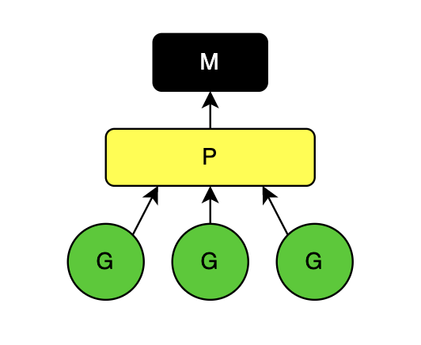
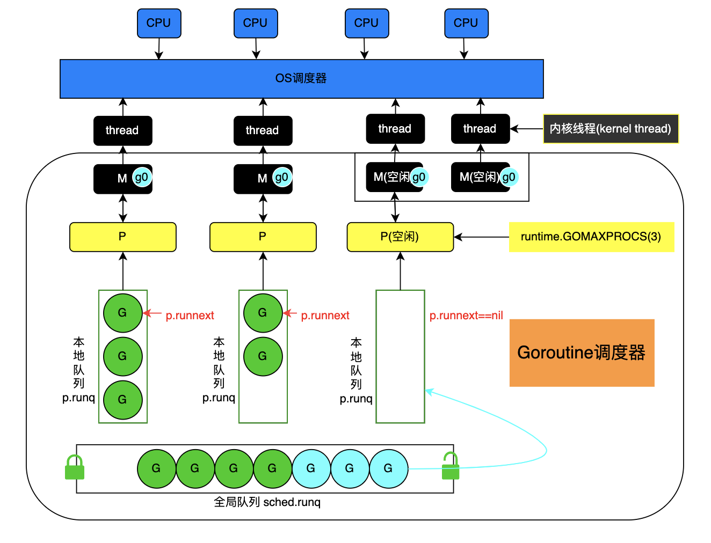
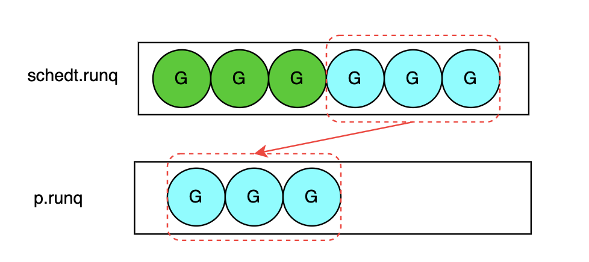
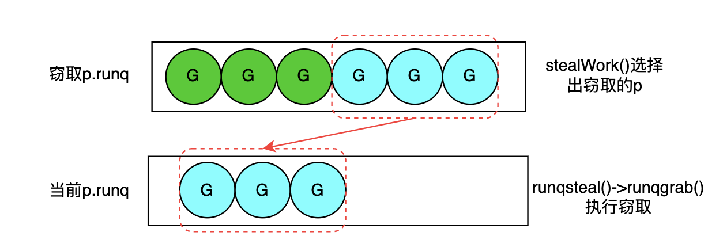

# 协程设计-GMP模型

线程是操作系统调度到CPU中执行的基本单位，多线程总是交替式地抢占CPU的时间片，线程在上下文的切换过程中需要经过操作系统用户态与内核态的切换。golang的协程(`G`)依然运行在工作线程(`M`)之上，但是借助语言的调度器，协程只需要在用户态即可完成切换，工作线程是感受不到协程存在的。golang在设计上通过逻辑处理器(`P`)建立起了工作线程与协程之间的联系。最简单的GMP关系模型为(图是静态的，在程序运行的过程中，GMP三者之间的绑定关系都是不固定的):




## 工作线程M

工作线程是最终运行协程的实体。操作系统中的线程与在运行时代表线程的m结构体进行了绑定：

```go
// go/src/runtime/runtime2.go

type m struct {
	g0      *g     // goroutine with scheduling stack
	tls           [tlsSlots]uintptr // thread-local storage (for x86 extern register)
	curg          *g       // current running goroutine
	p             puintptr // attached p for executing go code (nil if not executing go code)
	nextp         puintptr
	oldp          puintptr // the p that was attached before executing a syscall
	park          note
  ...
}
```

为了执行go代码，每一个工作线程m都与一个逻辑处理器p进行绑定，同时记录了线程当前正在运行的用户协程`curg`。

每一个工作线程中都有一个特殊的协程`g0`，称为调度协程，其主要作用是执行协程调度。而普通的协程`g`无差别地用于执行用户代码。当用户协程`g`主动让渡、退出或者是被抢占时，m内部就需要重新执行协程调度，这时需要从用户协程g切换到调度协程g0，g0调度一个普通协程g来执行用户代码，便从g0又切换回普通协程g。每个工作线程内部都在完成`g->g0->g`这样的调度循环。

操作系统的线程与m结构体是通过线程本地存储(`thread-local storage`)进行绑定的。普通的全局变量对进程中的所有线程可见，而线程本地存储(`tls`)中的变量只对当前线程可见。系统线程通过`m.tls`即可在任意时刻获取到当前线程上的正在运行的协程g、逻辑处理器p、特殊协程g0、线程结构体m等信息。

## 逻辑处理器p

系统线程m想要运行用户协程g，必须先绑定逻辑处理器p。在代码中可以通过`runtime.GOMAXPROCS()`具体指定程序运行需要使用多少个逻辑处理器p。通常指定多少个逻辑处理器p最多就可以同时使用到多少个CPU核心数。

逻辑处理器p通过结构体p进行定义：

```go
type p struct {
	id          int32
	status      uint32 // one of pidle/prunning/...
  schedtick   uint32     // incremented on every scheduler call
	syscalltick uint32     // incremented on every system call
	m           muintptr   // back-link to associated m (nil if idle)
	// Queue of runnable goroutines. Accessed without lock.
	runqhead uint32
	runqtail uint32
	runq     [256]guintptr
	runnext guintptr
  ... 
}
```

在p中，通过字段m维护了与工作线程m的绑定关系。每一个逻辑处理器p都具有唯一的`id`，以及当前的状态`status`。如果p的状态为正在运行中，则必然绑定到了一个工作线程`m`上，当逻辑处理完成后，解绑工作线程(`m==nil`)，p的状态便是空闲的。需要注意的是，m与p的数量没有绝对关系，当m阻塞时，p就会切换到一个空闲的m，当不存在空闲的m时，便会创建一个m。所以即使p的数量是1，也有可能会创建很多个m出来。

程序中往往有成千上万的协程存在，不可能同时被执行。协程需要进行调度执行，而那些等待被调度执行的协程存储在运行队列中。go语言调度器将运行队列分为全局运行队列与局部运行队列。逻辑处理器p中维护了局部运行队列`runq`。局部运行队列是每个p特有的长度为256的数组。该数组模拟了一个循环队列，`p.runqhead`为队头，`p.runqtail`为队尾，协程g都从队尾入队，从队头获取。而全局运行队列维护在`schedt.runq`中(见后文)。

p中还有一个特殊的`runnext`字段，用于标识下一个要执行的协程g，如果`p.runnext`不为空，则会直接执行`runnext`指向的协程，而不会再去`p.runq`数组中寻找。

## 协程g

协程通常分为特殊的调度协程g0以及执行用户代码的普通协程g。无论g0还是g，都通过结构体g进行定义：

```go
// go/src/runtime/runtime2.go

type g struct {
	stack       stack   // offset known to runtime/cgo
	m         *m      // current m; offset known to arm liblink
	sched     gobuf
  ...
}

// Stack describes a Go execution stack.
type stack struct {
	lo uintptr
	hi uintptr
}

type gobuf struct {
	sp   uintptr
	pc   uintptr
	g    guintptr
	ctxt unsafe.Pointer
	ret  uintptr
	lr   uintptr
	bp   uintptr // for framepointer-enabled architectures
}
```

协程g中包含了协程的执行栈空间(`stack`)，执行当前协程的工作线程`m`以及执行现场`sched`。协程g执行上下文切换时需要保存当前的执行现场，以便在切回协程g时能够继续正常执行。协程g中的执行现场由结构体`gobuf`定义，其保存了CPU中几个重要的寄存器值，以及执行现场信息属于哪个协程g。

## 全局调度信息`schedt`

golang协程设计中，除了工作线程m、逻辑处理器p、协程g以外，还存在一个存储全局调度信息的结构体`schedt`：

```go
// go/src/runtime/runtime2.go

type schedt struct {
	lock mutex

	midle        muintptr // idle m's waiting for work
	nmidle       int32    // number of idle m's waiting for work
	nmidlelocked int32    // number of locked m's waiting for work
	mnext        int64    // number of m's that have been created and next M ID
	maxmcount    int32    // maximum number of m's allowed (or die)
	nmsys        int32    // number of system m's not counted for deadlock
	nmfreed      int64    // cumulative number of freed m's

	ngsys uint32 // number of system goroutines; updated atomically

	pidle      puintptr // idle p's
	npidle     uint32
	nmspinning uint32 // See "Worker thread parking/unparking" comment in proc.go.

	// Global runnable queue.
	runq     gQueue
	runqsize int32
  
  // Global cache of dead G's.
	gFree struct {
		lock    mutex
		stack   gList // Gs with stacks
		noStack gList // Gs without stacks
		n       int32
	}
  
	// freem is the list of m's waiting to be freed when their
	// m.exited is set. Linked through m.freelink.
	freem *m
	...
}

```

`schedt`中维护了空闲的工作线程`midle`、空闲工作线程的数量`nmidle`、等待被释放的线程列表`freem`、系统协程g的数量`ngsys`、空闲逻辑处理器`pidle`、空闲逻辑处理器的数量`npidle`、以及全局运行队列`runq`及全局运行队列的大小`runqsize`、处于新建或者被销毁状态的协程g列表`gFree`等信息。

`schedt`中的信息是全局共享的，例如全局运行队列`runq`被所有p共享，所以`schedt`中也持有一个锁`lock`以保证原子性访问。

## GMP详细示图

通过上述说明，我们可以进一步细化GMP模型示图为: 



# 协程调度

已经知道，每个工作线程m中都有一个调度协程`g0`，专门执行协程的调度循环(`g->g0->g->g0-g`)。在调度循环中，协程g具体是如何被调度的呢？go语言调度器实现了自己的调度策略。

## 调度策略

工作线程m需要通过协程调度获得具体可运行的某一协程g。获取协程g的一般策略主要包含三大步:

```flow
op1=>operation: 1. 查找p本地的局部运行队列
op2=>operation: 2. 查找schedt中的全局运行队列
op3=>operation: 3. 窃取其他p中的局部运行队列

op1->op2->op3
```

在运行时通过`findRunnable()`函数获取可运行的协程g:

```go
// go/src/runtime/proc.go

// Finds a runnable goroutine to execute.
func findRunnable() (gp *g, inheritTime, tryWakeP bool) {
  ...
  // Check the global runnable queue once in a while to ensure fairness.
	// Otherwise two goroutines can completely occupy the local runqueue
	// by constantly respawning each other.
	if _p_.schedtick%61 == 0 && sched.runqsize > 0 {
		lock(&sched.lock)
		gp = globrunqget(_p_, 1)
		unlock(&sched.lock)
		if gp != nil {
			return gp, false, false
		}
	}
  ...
  // local runq
	if gp, inheritTime := runqget(_p_); gp != nil {
		return gp, inheritTime, false
	}

	// global runq
	if sched.runqsize != 0 {
		lock(&sched.lock)
		gp := globrunqget(_p_, 0)
		unlock(&sched.lock)
		if gp != nil {
			return gp, false, false
		}
	}
  ...
  	// Spinning Ms: steal work from other Ps.
	//
	// Limit the number of spinning Ms to half the number of busy Ps.
	// This is necessary to prevent excessive CPU consumption when
	// GOMAXPROCS>>1 but the program parallelism is low.
	procs := uint32(gomaxprocs)
	if _g_.m.spinning || 2*atomic.Load(&sched.nmspinning) < procs-atomic.Load(&sched.npidle) {
		if !_g_.m.spinning {
			_g_.m.spinning = true
			atomic.Xadd(&sched.nmspinning, 1)
		}

		gp, inheritTime, tnow, w, newWork := stealWork(now)
		now = tnow
		if gp != nil {
			// Successfully stole.
			return gp, inheritTime, false
		}
	...
	}
}
```

### 获取本地运行队列

在查找可运行的协程g时，首先通过函数`runqget()`从p本地的运行队列中获取:

首先尝试从`runnext`中获取下一个执行的g。当`runnext`不为空时则返回对应的协程g，如果为空则继续从局部运行队列`runq`中查找。
当循环队列的队头`runqhead`和队尾`runqtail`相同时，说明循环队列中没有任何可运行的协程，否则从队列头部获取一个协程返回。
由于可能存在其他逻辑处理器p来窃取协程，从而造成当前p与其他p同时访问局部队列的情况，因此在此处需要加锁访问，访问结束后释放锁。

```go
// go/src/runtime/proc.go

func runqget(_p_ *p) (gp *g, inheritTime bool) {
	// If there's a runnext, it's the next G to run.
	next := _p_.runnext
	// If the runnext is non-0 and the CAS fails, it could only have been stolen by another P,
	// because other Ps can race to set runnext to 0, but only the current P can set it to non-0.
	// Hence, there's no need to retry this CAS if it falls.
	if next != 0 && _p_.runnext.cas(next, 0) {
		return next.ptr(), true
	}

	for {
		h := atomic.LoadAcq(&_p_.runqhead) // load-acquire, synchronize with other consumers
		t := _p_.runqtail
		if t == h {
			return nil, false
		}
		gp := _p_.runq[h%uint32(len(_p_.runq))].ptr()
		if atomic.CasRel(&_p_.runqhead, h, h+1) { // cas-release, commits consume
			return gp, false
		}
	}
}
```

协程调度时由于总是优先查找局部运行队列中的协程g，如果只是循环往复的地执行局部队列中的g，那么全局队列中的g可能一个都不会被调度到。因此，为了保证调度的公平性，p中每执行61次调度，就会优先从全局队列中获取一个g到当前p中执行:

```go
// go/src/runtime/proc.go

func findRunnable() (gp *g, inheritTime, tryWakeP bool) {
  ...
	if _p_.schedtick%61 == 0 && sched.runqsize > 0 {
		lock(&sched.lock)
		gp = globrunqget(_p_, 1)
		unlock(&sched.lock)
		if gp != nil {
			return gp, false, false
		}
	}
  ...
}
```

### 获取全局运行队列

当p每执行61次调度，或者p本地运行队列不存在可运行的协程时，需要从全局运行队列中获取一批协程分配给本地运行队列。由于每个p共享了全局运行队列，因此为了保证公平，需要将全局运行队列中的g按照p的数量进行平分，平分后数量也不能超过局部运行队列容量的一半(即128=256/2)。最后通过循环调用`runqput`将全局队列中的g放入到p的局部运行队列中。



```go
// go/src/runtime/proc.go

// Try get a batch of G's from the global runnable queue.
// sched.lock must be held.
func globrunqget(_p_ *p, max int32) *g {
	assertLockHeld(&sched.lock)

	if sched.runqsize == 0 {
		return nil
	}

	n := sched.runqsize/gomaxprocs + 1
	if n > sched.runqsize {
		n = sched.runqsize
	}
	if max > 0 && n > max {
		n = max
	}
	if n > int32(len(_p_.runq))/2 {
		n = int32(len(_p_.runq)) / 2
	}

	sched.runqsize -= n

	gp := sched.runq.pop()
	n--
	for ; n > 0; n-- {
		gp1 := sched.runq.pop()
		runqput(_p_, gp1, false)
	}
	return gp
}
```

### 协程窃取

当p在局部运行队列、全局运行队列中都找不到可运行的协程时，就需要从其他p的本地运行队列中窃取一批可用的协程。所有的p都存储在全局的`allp []*p`变量中, 调度器随机在其中选择一个p来进行协程窃取工作。窃取工作总共会执行不超过4次，当窃取成功时即返回。

```go
// go/src/runtime/proc.go

// stealWork attempts to steal a runnable goroutine or timer from any P.
func stealWork(now int64) (gp *g, inheritTime bool, rnow, pollUntil int64, newWork bool) {
	pp := getg().m.p.ptr()

	ranTimer := false

	const stealTries = 4
	for i := 0; i < stealTries; i++ {
		stealTimersOrRunNextG := i == stealTries-1

		for enum := stealOrder.start(fastrand()); !enum.done(); enum.next() {
			if sched.gcwaiting != 0 {
				// GC work may be available.
				return nil, false, now, pollUntil, true
			}
			p2 := allp[enum.position()]
			if pp == p2 {
				continue
			}
			...
			// Don't bother to attempt to steal if p2 is idle.
			if !idlepMask.read(enum.position()) {
				if gp := runqsteal(pp, p2, stealTimersOrRunNextG); gp != nil {
					return gp, false, now, pollUntil, ranTimer
				}
			}
		}
	}
  ...
}
```

协程窃取的主要执行逻辑通过`runqsteal`以及`runqgrab`函数实现，窃取的核心逻辑是：将要窃取的p本地运行队列中g个数的一半放入到自己的运行队列中。



```go
// Steal half of elements from local runnable queue of p2
// and put onto local runnable queue of p.
// Returns one of the stolen elements (or nil if failed).
func runqsteal(_p_, p2 *p, stealRunNextG bool) *g {
	t := _p_.runqtail
	n := runqgrab(p2, &_p_.runq, t, stealRunNextG)
	if n == 0 {
		return nil
	}
	n--
	gp := _p_.runq[(t+n)%uint32(len(_p_.runq))].ptr()
	if n == 0 {
		return gp
	}
	h := atomic.LoadAcq(&_p_.runqhead) // load-acquire, synchronize with consumers
	if t-h+n >= uint32(len(_p_.runq)) {
		throw("runqsteal: runq overflow")
	}
	atomic.StoreRel(&_p_.runqtail, t+n) // store-release, makes the item available for consumption
	return gp
}

// Grabs a batch of goroutines from _p_'s runnable queue into batch.
func runqgrab(_p_ *p, batch *[256]guintptr, batchHead uint32, stealRunNextG bool) uint32 {
	for {
		h := atomic.LoadAcq(&_p_.runqhead) // load-acquire, synchronize with other consumers
		t := atomic.LoadAcq(&_p_.runqtail) // load-acquire, synchronize with the producer
		n := t - h
		n = n - n/2
		...
		for i := uint32(0); i < n; i++ {
			g := _p_.runq[(h+i)%uint32(len(_p_.runq))]
			batch[(batchHead+i)%uint32(len(batch))] = g
		}
		if atomic.CasRel(&_p_.runqhead, h, h+n) { // cas-release, commits consume
			return n
		}
	}
}
```

## 调度时机

调度策略让我们知道了协程是如何调度的，下面继续说明什么时候会发生协程调度。

### 主动调度

协程可以选择主动让渡自己的执行权，这主要通过在代码中主动执行`runtime.Gosched()`函数实现。

* 主动调度会从当前协程g切换到g0并更新协程状态由运行中`_Grunning`变为可运行`_Grunnable`；

* 然后通过`dropg()`取消g与m的绑定关系；

* 接着通过`globrunqput()`将g放入到全局运行队列中；

* 最后调用`schedule()`函数开启新一轮的调度循环。

```go
// go/src/runtime/proc.go

// Gosched yields the processor, allowing other goroutines to run. It does not
// suspend the current goroutine, so execution resumes automatically.
func Gosched() {
	checkTimeouts()
	mcall(gosched_m) //
}

// Gosched continuation on g0.
func gosched_m(gp *g) {
	...
	goschedImpl(gp) //
}

func goschedImpl(gp *g) {
	...
	casgstatus(gp, _Grunning, _Grunnable)
	dropg() //
	lock(&sched.lock)
	globrunqput(gp)
	unlock(&sched.lock)

	schedule()
}

// dropg removes the association between m and the current goroutine m->curg (gp for short).
func dropg() {
	_g_ := getg()

	setMNoWB(&_g_.m.curg.m, nil)
	setGNoWB(&_g_.m.curg, nil)
}
```

### 被动调度

当协程休眠、通道堵塞、网络堵塞、垃圾回收导致暂停时，协程会被动让渡出执行的权利给其他可运行的协程继续执行。调度器通过`gopark()`函数执行被动调度逻辑。`gopark()`函数最终调用`park_m()`函数来完成调度逻辑。

* 首先会从当前协程g切换到g0并更新协程状态由运行中`_Grunning`变为等待中`_Gwaiting`；
* 然后通过`dropg()`取消g与m的绑定关系；
* 接着执行`waitunlockf`函数，如果该函数返回`false`,则协程g立即恢复执行，否则等待唤醒；
* 最后调用`schedule()`函数开启新一轮的调度循环。

```go
// go/src/runtime/proc.go

// Puts the current goroutine into a waiting state and calls unlockf on the
// system stack.
func gopark(unlockf func(*g, unsafe.Pointer) bool, lock unsafe.Pointer, reason waitReason, traceEv byte, traceskip int) {
	...
	mcall(park_m)
}

// park continuation on g0.
func park_m(gp *g) {
	...
	casgstatus(gp, _Grunning, _Gwaiting)
	dropg()

	if fn := _g_.m.waitunlockf; fn != nil {
		ok := fn(gp, _g_.m.waitlock)
		_g_.m.waitunlockf = nil
		_g_.m.waitlock = nil
		if !ok {
			...
			casgstatus(gp, _Gwaiting, _Grunnable)
			execute(gp, true) // Schedule it back, never returns.
		}
	}
	schedule()
}
```

与主动调度不同的是，被动调度的协程g不会放入到全局队列中进行调度。而是一直处于等待中`_Gwaiting`状态等待被唤醒。当等待中的协程被唤醒时，协程的状态由`_Gwaiting`变为可运行`_Grunnable`状态，然后被添加到当前p的局部运行队列中。唤醒逻辑通过函数`goready()`调用`ready()`实现：

```go
// go/src/runtime/proc.go

func goready(gp *g, traceskip int) {
	systemstack(func() {
		ready(gp, traceskip, true)
	})
}

// Mark gp ready to run.
func ready(gp *g, traceskip int, next bool) {
	...
	// status is Gwaiting or Gscanwaiting, make Grunnable and put on runq
	casgstatus(gp, _Gwaiting, _Grunnable)
	runqput(_g_.m.p.ptr(), gp, next)
	wakep()
	...
}
```

### 抢占调度

go应用程序在启动时会开启一个特殊的线程来执行系统监控任务，系统监控运行在一个独立的工作线程m上，该线程不用绑定逻辑处理器p。系统监控每隔10ms会检测是否有准备就绪的网络协程，并放置到全局队列中。

为了保证每个协程都有执行的机会，系统监控服务会对执行时间过长(`大于10ms`)的协程、或者处于系统调用(`大于20微秒`)的协程进行抢占。抢占的核心逻辑通过`retake()`函数实现:

```go
// go/src/runtime/proc.go

// forcePreemptNS is the time slice given to a G before it is
// preempted.
const forcePreemptNS = 10 * 1000 * 1000 // 10ms

func retake(now int64) uint32 {
	n := 0
	lock(&allpLock)
	for i := 0; i < len(allp); i++ {
		_p_ := allp[i]
		if _p_ == nil {
			continue
		}
		pd := &_p_.sysmontick
		s := _p_.status
		sysretake := false
		if s == _Prunning || s == _Psyscall {
			// Preempt G if it's running for too long.
			t := int64(_p_.schedtick)
			if int64(pd.schedtick) != t {
				pd.schedtick = uint32(t)
				pd.schedwhen = now
			} else if pd.schedwhen+forcePreemptNS <= now {
				preemptone(_p_)
				// In case of syscall, preemptone() doesn't
				// work, because there is no M wired to P.
				sysretake = true
			}
		}
		if s == _Psyscall {
			// Retake P from syscall if it's there for more than 1 sysmon tick (at least 20us).
      t := int64(_p_.syscalltick)
			if !sysretake && int64(pd.syscalltick) != t {
				pd.syscalltick = uint32(t)
				pd.syscallwhen = now
				continue
			}
			if runqempty(_p_) && atomic.Load(&sched.nmspinning)+atomic.Load(&sched.npidle) > 0 && pd.syscallwhen+10*1000*1000 > now {
				continue
			}
      ...
	}
	unlock(&allpLock)
	return uint32(n)
}
```

