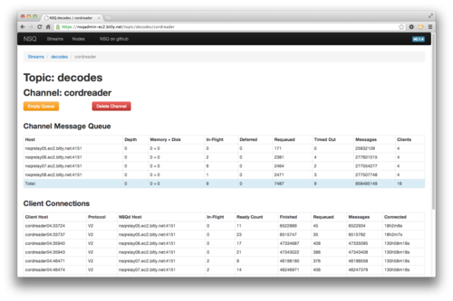
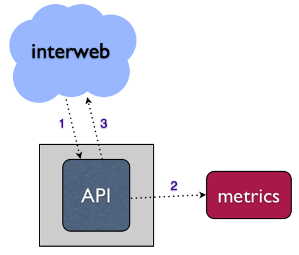
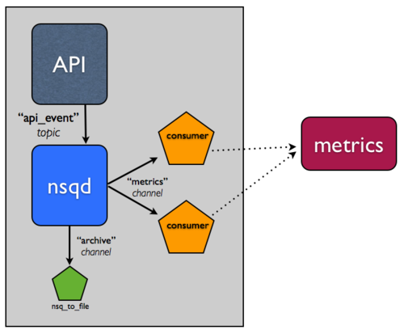
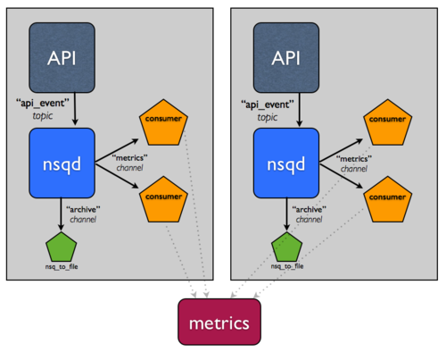
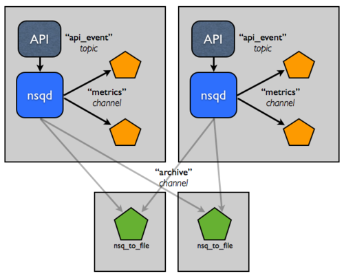
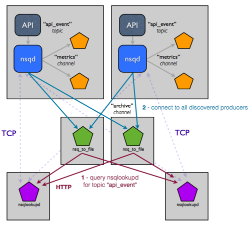

<p style='text-align:center;font-size:30px;font-weight:bold'>NSQ v1.2.0中文文档</p>

# 概览

## 快速开始

下述步骤将在你的本地机器上运行一个小型**NSQ**集群，贯穿了消息的发布、消费以及归档至磁盘。

1. 首先跟随[安装说明](https://juejin.cn/post/6932866637519552525/)文档进行安装；

2. 在shell中开启`nsqlookupd`:

   ```shell
   $ nsqlookupd
   ```

3. 在另一个shell中开启`nsqd`:

   ```shell
   $ nsqd --lookupd-tcp-address=127.0.0.1:4160
   ```

4. 在另一个shell中开启`nsqadmin`：

   ```shell
   $ nsqadmin --lookupd-http-address=127.0.0.1:4161
   ```

5. 发布一个初始消息（也就是在集群中创建一个主题）

   ```shell
   $ curl -d 'hello world 1' 'http://127.0.0.1:4151/pub?topic=test'
   ```

6. 最后，在另一个shell中开启`nsq_to_file`:

   ```shell
   $ nsq_to_file --topic=test --output-dir=/tmp --lookupd-http-address=127.0.0.1:4161
   ```

7. 发布更多消息到`nsqd`:

   ```shell
   $ curl -d 'hello world 2' 'http://127.0.0.1:4151/pub?topic=test'
   $ curl -d 'hello world 3' 'http://127.0.0.1:4151/pub?topic=test'
   ```

8. 为了验证上述工作是否如预期进行，可以打开浏览器地址http://127.0.0.1:4171/ 通过`nsqadmin`UI界面查看统计信息。当然，你也可以检查写到`/tmp`目录下的日志文件(`test.*.log`)内容。

这里有个比较重要的内容是，客户端并没有明确地指明`test`主题从哪里产生，`nsq_to_file`将从`nsqlookupd`提取这些信息，即使正处于连接中，也不会有消息丢失。

## 特征与保证

`NSQ`是一个实时分布式消息平台。

### 特征

* 支持无SPOF的分布式拓扑
* 水平扩展(无代理，可无缝地向集群中添加更多节点)
* 消息传递低延迟推送（[性能](https://nsq.io/overview/performance.html)）
* 负载均衡以及多种风格消息路由组合
* 擅长流式处理（高吞吐量）和面向作业（低吞吐量）的工作负载
* 主要在内存中（超出某个水平，消息将以透明的方式保存在磁盘上）
* 运行时服务发现，对于消费者查找生产者[(nsqlookupd)](https://github.com/nsqio/nsq/tree/master/nsqlookupd/README.md)
* 传输层安全 （TLS）
* 数据格式不可知
* 依赖少，易于部署，具有合理、清晰有界的默认配置
* 简单 TCP 协议支持任何语言的客户端库
* 用于统计信息、管理操作和生产者（无需发布客户端库）的 HTTP 接口
* 与实时检测的[statsd](https://github.com/etsy/statsd/)集成
* 强大的集群管理接口 （[nsqadmin](https://github.com/nsqio/nsq/tree/master/nsqadmin/README.md))

### 保证

与任何分布式系统一样，实现你的目标都需要一个明智的权衡过程。通过透明地权衡这些折衷的现实，我们希望对NSQ在生产中部署时的行为设定如下期望：

* **消息不是持久化的(默认)**
  尽管系统支持通过`--mem-queue-size`设置"释放阀(release valve)",消息将被透明地保存在磁盘上，但NSQ主要还是一个基于内存的消息平台。

  **`--mem-queue-size`可以被设置为0以确保所有到来的消息被持久化到磁盘**。在这种情况下，如果节点发生故障，那么您很容易感知到面临的故障会减少（例如OS或底层IO子系统是否发生故障）

  并**没有内置的复制集。**但是，管理这种权衡的方法有很多种，例如部署拓扑和技术以容错的方式主动持久化主题到磁盘。

* **消息至少传递一次**

  与上述密切相关，假定给定的`nsqd`节点不会失败。

  这意味着，**由于各种原因（客户端超时、断开连接、重新入队等），消息可以多次传递**。而执行幂等操作或删除重复信息是客户端的职责。

* **收到的消息是无序的**

  **不能依赖传递给消费者的消息顺序。**

  与消息传递的字面意义类似，消息是重新排列队列的结果，是内存和磁盘存储的组合。事实上每一个`nsqd`节点之间并不共享任何东西。

  通过在你的消费者中引入一个延迟窗口来接收消息并且在处理这些消息之前（尽管为了保持这些不变的消息，必须丢弃掉位于该窗口之外的消息）进行排序，以此来实宽松的排序(即对于给定的消费者，它的消息是有序的，但是在整个集群中却不能保证)是相对直截了当的。

* **消费者最终可以找到所有主题生产者**

  发现服务[(nsqlookupd)](https://github.com/nsqio/nsq/tree/master/nsqlookupd/README.md)被设计为最终一致。 `nsqlookupd`节点不会共同维护状态或应答查询。

  网络分区不会影响可用性，从这层意义上来说，分区的两侧仍然可以应答查询。部署拓扑对缓解这些类型的问题具有最重要的作用。

## 常见问题

### 部署

- **`nsqd`的推荐拓扑是什么？**

  我们强烈建议**在生成消息的任何服务旁边运行一个`nsqd`**

  `nsqd`是一个相对轻量级的进程，可限定内存占用，这使得它非常适合"与别人好好玩耍"（*“playing nice with others”*.）。

  这种模式有助于将消息流构建为消费问题，而不是生产问题。

  另一个好处是，这种模式在给定主机上为主题形成了一个独立的、分片的数据孤岛。

  注意：这不是一个绝对的要求，它只是更为简单（见下面的问题）。

- **为什么生产者不能使用`nsqlookupd`来查找发布到哪儿？**

  因为必须告诉消费者在哪里找到他们需要的主题，NSQ提倡**消费者端发现**模型，以减轻前期配置负担。

  然而，对于服务应发布到哪里，这并没有提供任何解决问题的手段。这是鸡和蛋的问题，主题在发布之前并不存在。

  通过对`nsqd`的共同定位（请参阅上面的问题），你完全回避了此问题（你的服务只是发布到本地`nsqd`）， NSQ 的运行时发现系统自然地进行工作。

- **我只想在单个节点上使用 `nsqd`作为工作队列， 这是一个合适的用例吗？**

  是的， `nsqd`在单节点上也可以运行得很好。

  `nsqlookupd`更有利于在较大的分布式环境中使用。

- **我应该运行多少 `nsqlookupd`?**

  通常只有几个，具体取决于集群大小、`nsqd`节点数和消费者数量以及你所需的容错性。

  对于几百台主机和数千个消费者，部署3个或5个就可以很好地工作。

  `nsqlookupd`节点**不需要**协作应答查询。集群中的元数据最终是*一致的*。

### 发布

- **我需要客户端库来发布消息吗？**

  不！只需使用 HTTP端点来发布（ `/pub`和`/mpub` ）。它很简单，很容易，而且几乎在任何编程环境中都无处不在。

  事实上，绝大多数 NSQ 部署都使用 HTTP 来发布。

- **为什么要强制客户端处理TCP 协议的 `PUB` 和`MPUB`命令的响应？**

  我们认为 NSQ 的默认操作模式应优先考虑安全性，我们希望协议简单且一致。

- **`PUB` 或`MPUB`什么时候可能失败？**

  1. 主题名称的格式不正确（字符/长度限制）。请参阅[主题和频道名称规格](https://nsq.io/clients/tcp_protocol_spec.html#notes)。
  2. 消息太大（此限制作为参数被暴露给`nsqd` ）。
  3. 主题正在被删除。
  4. `nsqd`正在清理退出。
  5. 发布期间与客户端连接相关的任何失败时。

  1和 2 应视为编程错误。3和4是不常见的。5是任何基于 TCP 协议自然有的。

- **如何缓解上述第3个问题？**

  删除主题是一个相对不频繁的操作。如果需要删除主题，请协调时间，删除要经过足够的时间，以便发布所引出的主题创建永远不会执行。

### 设计与理论

- **如何推荐命名主题和通道？**

  主题名称应描述流中的数据。

  通道名称应描述其消费者所执行的工作。

  例如，好的主题名称可以为 `encodes`，`decodes`，`api_requests`，`page_views`；好的通道名称为 `archive`，`analytics_increment`，`spam_analysis`。

- **单个`nsqd`可以支持的主题和通道的数量是否有任何限制？**

  没有施加内置限制。它仅受限于`nsqd`所运行主机的内存和 CPU （每个客户端的 CPU 使用率极大地减少[#236](https://github.com/nsqio/nsq/pull/236)）。

- **如何向群集宣布新主题？**

  第一次`PUB`或者`SUB`一个主题将在`nsqd`上创建主题。主题元数据接下来将传播到配置的`nsqlookupd` 。其他订阅者将定期查询`nsqlookupd` 来发现此主题。

- **NSQ 能做 Rpc 吗？**

  这是可能的，但是在设计NSQ时并未考虑到该用例。

  我们打算发布一些文档，以了解如何构建该内容，但在此期间，如果您有兴趣，请伸出援手。

### pynsq 特定的问题

- **你为什么强迫我使用Tornado？**

  `pynsq`最初打算作为以消费者为导向的库，在 Python 的异步框架（特别是由于 NSQ 面向推送的协议）中使用 NSQ 协议要简单得多。

  Tornado的 API 很简单，性能相当好。

- **Tornado的 IOLoop需要发布吗？**

  不需要，`nsqd`暴露了 HTTP 端点(`/PUB`和`/MPUB`)以非常简单的用于编程语言不可知的发布（agnostic publishing）。

  如果你担心 HTTP 的开销，那没有必要。此外，`/mpub`通过批量发布（原子发布！）来减少 HTTP 的开销。

- **我什么时候要使用`Writer`?**

  当高性能和低开销是一个优先事项。

  `Writer`使用TCP协议`PUB`和`MPUB`命令，与其他HTTP同行相比拥有更小的开销。

- **如果我只想 "fire and forget" （我可以容忍消息丢失！**

  使用 `Writer`并且对发布方法不指定回调。

  注意：这只有利于产生更简单的`pynsq`客户端代码，在幕后仍要处理来自`nsqd`的响应（就是说这样做没有什么性能优势）。

特别感谢Dustin Oprea ([@DustinOprea](https://twitter.com/DustinOprea))启动这个常见问题

## 性能

主仓库有一个脚本(`bench/bench.py`)，它会自动执行一个EC2上的分布式基准测试。它会引导N个节点，一些节点正在运行`nsqd`，一些节点在负载生成PUB和SUB应用，然后解析这些节点的输出以供总体聚合。

### 安装

下面运行的命令反应了6个`c3.2xlarge`的默认参数，最便宜的实例类型支持1gbit的链接。3个节点分别运行了一个`nsqd`实例，其余节点运行着`bench_reader(SUB)`实例和`bench_writer(PUB)`实例，以此生成依赖于基准测试模式的负载。

```shell
$ ./bench/bench.py --access-key=... --secret-key=... --ssh-key-name=...
[I 140917 10:58:10 bench:102] launching 6 instances
[I 140917 10:58:12 bench:111] waiting for instances to launch...
...
[I 140917 10:58:37 bench:130] (1) bootstrapping ec2-54-160-145-64.compute-1.amazonaws.com (i-0a018ce1)
[I 140917 10:59:37 bench:130] (2) bootstrapping ec2-54-90-195-149.compute-1.amazonaws.com (i-0f018ce4)
[I 140917 11:00:00 bench:130] (3) bootstrapping ec2-23-22-236-55.compute-1.amazonaws.com (i-0e018ce5)
[I 140917 11:00:41 bench:130] (4) bootstrapping ec2-23-23-40-113.compute-1.amazonaws.com (i-0d018ce6)
[I 140917 11:01:10 bench:130] (5) bootstrapping ec2-54-226-180-44.compute-1.amazonaws.com (i-0c018ce7)
[I 140917 11:01:43 bench:130] (6) bootstrapping ec2-54-90-83-223.compute-1.amazonaws.com (i-10018cfb)
```

### 生产者吞吐量

此基准测试仅测量了生产者的吞吐量，没有额外的负载。消息的大小是100字节，并且消息分布于3个主题中。

```shell
$ ./bench/bench.py --access-key=... --secret-key=... --ssh-key-name=... --mode=pub --msg-size=100 run
[I 140917 12:39:37 bench:140] launching nsqd on 3 host(s)
[I 140917 12:39:41 bench:163] launching 9 producer(s) on 3 host(s)
...
[I 140917 12:40:20 bench:248] [bench_writer] 10.002s - 197.463mb/s - 2070549.631ops/s - 4.830us/op
```

进入速度(`ingress`)约为`2.07mm` msgs/sec，消耗了总计197mb/s的带宽。

### 生产者和消费者吞吐量

此基准通过为生产者和消费者提供服务，更准确地反映了真实情况。同样，消息大小为 100 字节，消息分布在 3 个主题中，每个主题具有单个*通道*（每个通道 24 个客户端）。

```
$ ./bench/bench.py --access-key=... --secret-key=... --ssh-key-name=... --msg-size=100 run
[I 140917 12:41:11 bench:140] launching nsqd on 3 host(s)
[I 140917 12:41:15 bench:163] launching 9 producer(s) on 3 host(s)
[I 140917 12:41:22 bench:186] launching 9 consumer(s) on 3 host(s)
...
[I 140917 12:41:55 bench:248] [bench_reader] 10.252s - 76.946mb/s - 806838.610ops/s - 12.706us/op
[I 140917 12:41:55 bench:248] [bench_writer] 10.030s - 80.315mb/s - 842149.615ops/s - 11.910us/op
```

在大约`842k `和 `806k` msgs/s 的入口和出口时，消耗了 总计156mb/s 的带宽，我们现在在`nsqd`节点上最大化了 CPU 容量。通过引入消费者，`nsqd`需要维护每个通道的消息传递，因此负载自然会更高。

消费者的数量略低于生产者，因为消费者发送的命令数量是生产者的两倍（必须为每条消息发送一个`FIN`命令），从而影响了吞吐量。

再添加 2 个节点（一个`nsqd`和一个负载生成(load-generating)）达到超过 `1mm` msgs/s:

```shell
$ ./bench/bench.py --access-key=... --secret-key=... --ssh-key-name=... --msg-size=100 run
[I 140917 13:38:28 bench:140] launching nsqd on 4 host(s)
[I 140917 13:38:32 bench:163] launching 16 producer(s) on 4 host(s)
[I 140917 13:38:43 bench:186] launching 16 consumer(s) on 4 host(s)
...
[I 140917 13:39:12 bench:248] [bench_reader] 10.561s - 100.956mb/s - 1058624.012ops/s - 9.976us/op
[I 140917 13:39:12 bench:248] [bench_writer] 10.023s - 105.898mb/s - 1110408.953ops/s - 9.026us/op
```

### 单节点性能

免责声明：请记住**，NSQ**旨在以分布式方式使用。单节点性能虽然很重要，但不是我们所要实现的一切。此外， 基准测试是愚蠢的， 但这里多少做个展示：

- 2012 MacBook Air i7 2ghz

- go1.2

- NSQ v0.2.24

- 200 byte message

**GOMAXPROCS=1（1个发布者、1个消费者）**

```shell
$ ./bench.sh 
results...
PUB: 2014/01/12 22:09:08 duration: 2.311925588s - 82.500mb/s - 432539.873ops/s - 2.312us/op
SUB: 2014/01/12 22:09:19 duration: 6.009749983s - 31.738mb/s - 166396.273ops/s - 6.010us/op
```

**GOMAXPROCS=4（4个发布者，4个消费者)**

```shell
$ ./bench.sh 
results...
PUB: 2014/01/13 16:58:05 duration: 1.411492441s - 135.130mb/s - 708469.965ops/s - 1.411us/op
SUB: 2014/01/13 16:58:16 duration: 5.251380583s - 36.321mb/s - 190426.114ops/s - 5.251us/op
```

## 设计

注：有关随附的视觉插图，请参阅此[幻灯片组](https://speakerdeck.com/snakes/nsq-nyc-golang-meetup)。

> 不翻墙你是打不开的。

**NSQ**是[simplequeue](https://github.com/bitly/simplehttp/tree/master/simplequeue) ([simplehttp](https://github.com/bitly/simplehttp)的一部分)的后继者，因此设计为（没有特定顺序）：

- 支持高可用且消除了 SPOFs 的拓扑
- 满足了更强有力的保证消息传递的需要
- 限制了单个进程的内存占用（通过将某些消息持久化到磁盘）
- 极大地简化了生产者和消费者的配置要求
- 提供了简单直接的升级路径
- 提高了效率

### 简化配置和管理

单个`nsqd`实例设计为一次处理多个数据流。数据流称为"主题"，主题有 1 个或多个"通道"（channels）。每个通道接收主题的所有消息副本。实际上，一个通道对应着一个下游消费主题的服务。

主题和通道并未优先配置。通过发布到命名主题或订阅有关命名主题的通道，主题在首次使用时创建。而通过订阅命名通道，通道在首次使用时创建。

主题和通道所有缓冲区数据彼此独立，以防止缓慢的消费导致其他通道的积压（这同样适用于主题级别）。

一个通道通常可以连接多个客户端。假设所有连接的客户端处于准备接收消息的状态，则每条消息都将传递到一个随机的客户端。例如：


总之，消息来自主题 -> 通道（每个通道接收该主题的所有消息副本），但从通道 -> 消费者，消息是均匀分布的（每个消费者接收该通道的部分消息）。

**NSQ**还包括一个辅助应用程序`nsqlookupd` ，它提供了一个目录服务，消费者可以在其中查找到提供给他们订阅主题的`nsqd`实例地址。在配置方面，这使消费者与生产者分离（他们只需要知道在哪里联系`nsqlookupd`通用实例，从不是彼此之间直接联系），降低了复杂性和维护成本。

在底层，每个`nsqd`与`nsqlookupd`之间都具有一个 TCP 长连接(long-lived)，并定期推送其状态给`nsqlookupd`。此数据用于`nsqlookupd`将哪些`nsqd`地址通知给消费者。对于消费者，将暴露 HTTP 端点`/lookup`以进行轮询。

要引入新的主题消费者，只需启动一个配置了`nsqlookupd`实例地址的**NSQ**客户端。添加新的消费者或新的发布者无需更改配置，从而大大降低了开销和复杂性。

注意：在将来的版本中，启发式`nsqlookupd` 可能基于深度、连接的客户端数量或其他"智能"策略来返回`nsqd`地址。当前的实现就是全部。归根结底，目标是深度保持在接近于零的水平，确保所有生产者都能够被订阅。

需要注意的重要点是，`nsqd`和 `nsqlookupd`守护进程被设计为独立运行，同类进程之间没有沟通与协作。

我们也认为，通过一种方法来查看、思考和整体管理集群非常重要。我们为了做到这一点而构建了`nsqadmin`。它提供了一个 Web UI 来浏览主题/通道/消费者的层次结构，并检查每个层的深度和其他关键统计信息。此外，它支持一些管理命令，如删除和清空通道（当通道中的消息可以安全地抛出以将深度带回 0 时，这是一个有用的工具）。



### 简单直接的升级路径

这是我们的最高优先事项之一。我们的生产系统处理着大量的流量，全部都基于我们现有的消息工具，因此我们需要一种缓慢且有条理的方法来升级基础架构的特定部分，带来的影响微乎其微。

首先，在消息生产者方面，我们构建了`nsqd`来匹配[simplequeue](https://github.com/bitly/simplehttp/tree/master/simplequeue)。具体地说，`nsqd` 暴露了 HTTP `/pub`端点，就像`simplequeue`一样发送二进制数据（需要注意的是，端点需要一个额外的查询参数来指定"主题"）。想要切换服务，向`nsqd`发布消息，只需进行少量的代码更改。

其次，我们构建了与现有库功能和习惯相匹配的Python 和 Go 库。通过将代码更改限制为自举（bootstrap），从而缓解了在消费者端的过渡。所有业务逻辑保持不变。

最后，我们构建了将新旧组件粘合在一起的实用程序。这些都可在存储库中的`examples`目录中获得：

- `nsq_to_file`- 将给定主题的所有消息持久化写入文件
- `nsq_to_http`- 对主题中的所有消息向(多个)端点执行 HTTP 请求

### 消除 SPOFs

**NSQ**专为分布式使用而设计。`nsqd` 客户端（通过 TCP）连接到所有实例，并提供特定的主题消息。没有中间人，没有消息中间件，也没有SPOFs：


此拓扑消除了对单个的、聚合的源进行链接的必要。相反，直接从**所有生产者**处进行消费。从技术上讲，哪个客户端连接到哪个**NSQ**并不重要，只要有足够的客户端连接到所有的生产者来满足消息量，就能保证消息最终得到处理。

对于 `nsqdlookupd`，通过运行多个实例实现了高可用。它们之间不直接相互通信，并且数据最终被认为是一致的。消费者会轮询其配置的所有`nsqlookupd`实例并联合(union)响应结果。陈旧过时、无法访问或其他节点故障都不会使系统停止运行。

### 消息传递保证

**NSQ**保证消息将至少**传递一次，**尽管消息可能重复。消费者应该对此有所意料，并进行重复消息删除或执行幂等操作。

此保证强制作为协议的一部分，其工作方式如下（假设客户端已成功连接并订阅了主题）：

1. 客户端表示他们已准备好接收消息
2. **NSQ**发送消息并临时将数据存储在本地（在重新入队或超时时）
3. 客户端答复 FIN（完成finish）或 REQ（重新入队re-queue），分别表示成功或失败。如果**NSQ**超时(可配置)未收到客户端的答复，消息也会自动重新入队）

这可确保导致消息丢失的唯一边缘情况是`nsqd`进程未正常关闭(unclean shutdown)。在这种情况下，内存中的任何消息（或任何未刷新到磁盘的缓冲消息）都会丢失。

如果防止消息丢失至关重要，则即使此边缘情况也可以缓和。一种解决方案是支持接收相同消息副本的冗余`nsqd`对（在单独的主机上）。由于已将消费者写为幂等的，因此在这些消息上重复执行两次操作不会对下游产生影响，系统可以承受任何单点故障而不丢失消息。

重要的是**NSQ**提供了构建基础（building blocks），以支持各种生产用例和持久化深度的配置。

### 可限定内存占用

`nsqd`提供了一个配置选项`--mem-queue-size`，用以确定给定的队列在内存中保留消息的数量。如果队列的深度超过此阈值，则消息将透明地写入磁盘。这使得`nsqd`进程的内存占用量限制为：`mem-queue-size * #_of_channels_and_topics`


此外，精明的人可能已经发现了一个便捷的方式，即通过设置此值为较低的数（比如 1甚至 0），以获得更高的传递保证。磁盘队列旨在承受非正常启动（尽管消息可能传递两次）。

此外，与消息传递保证有关的是，正常关闭(clean shutdowns)（通过向`nsqd`进程发送TERM 信号）可以安全地持久化当前内存中的、正在传递的、延迟的和各种内部缓冲的消息。

请注意，主题或通道的名称以`#ephemeral`结尾的，将不会缓冲到磁盘，相反在超过`mem-queue-size`后会被删除消息。这使的不需要消息保证的消费者也能够订阅频道。这些临时的(ephemeral)通道在最后一个客户端断开连接时也会消失。对于临时主题，这意味着至少有一个通道已创建、使用和删除（通常是临时通道）。

### 效率

**NSQ**设计为使用"像 memcached 一样"的命令协议来进行通信，具有简单的以大小为前缀的响应结果。所有的消息数据都保存在核心中，包括尝试次数、时间戳等元数据。这消除了服务端与客户端之间来来回回的数据复制，这是重新入队消息时上一个工具链的固有属性。这也简化了客户端，因为它们不再需要负责维护消息状态。

此外，通过降低配置复杂性，设置和开发的时间大大缩短（尤其是在主题消费者 >1 的情况下）。

对于数据协议，我们做了一个关键的设计决策，那就是通过将数据推送到客户端而不是等待客户端来提取，以此最大化性能和吞吐量。这个概念，我们称之为`RDY`状态，本质上是客户端流控的一种形式。

当客户端连接到并订阅通道时，它被放置在`RDY` 0 的状态。这意味着不会向客户端发送任何消息。当客户端准备好接收消息时，它会发送一个命令，将状态更新到某个它准备处理(多少条消息)的#状态，例如#100。在没有任何额外命令的情况下，100 条消息将推送到客户端（服务端将会为该客户端进行RDY 计数）。

客户端库的设计是在计数达到配置的`max-in-flight`（适当考虑与多个`nsqd`实例的连接，适当拆分）的约25% 时，发送命令来更新RDY计数。


这是一个显著的性能旋钮，因为一些下游系统能够更容易地批量处理消息，并受益于更高的`max-in-flight`。

值得注意的是，因为它既有缓冲又有推送功能，并且能够满足对流（通道）的独立副本需求，因此我们生成了一个类似于`simplequeue`和`pubsub` 组合的守护程序，我们传统上会维护上面讨论过的较旧的工具链，这在简化我们系统的拓扑方面非常强大。

### Go

我们很早就做出了一个战略决策，在Go 中构建NSQ [核心](https://golang.org/)。我们最近写了关于我们使用Go的[博客](https://word.bitly.com/post/29550171827/go-go-gadget)并提到这个项目 - 浏览该帖，了解我们对语言的思考可能会有所帮助。

关于**NSQ**，Go 通道（不要与**NSQ**通道混淆）和语言内置的并发功能非常适合`nsqd`的内部工作。我们利用缓冲通道来管理内存中的消息队列，并无缝地将溢出的消息写入磁盘。

通过标准库，可以轻松地编写网络层和客户端代码。内置内存和 cpu 分析钩子突显了优化机会，并且集成需要很少的精力。我们还发现，在隔离中测试组件、使用接口模拟类型以及迭代构建功能非常容易。

## 内部

NSQ 由 3 个守护进程组成：

- **[nsqd](https://nsq.io/components/nsqd.html)**是消息接收、排队和传递消息给客户端的守护进程。
- **[nsqlookupd](https://nsq.io/components/nsqlookupd.html)**是管理拓扑信息并提供最终一致的发现服务的守护进程。
- **[nsqadmin](https://nsq.io/components/nsqadmin.html)**是一个 Web UI，可以实时省察集群（并执行各种管理任务）。

NSQ 中的数据流被模型化为流和消费者的树结构。一个**主题**代表一种数据流。**通道**是订阅特定主题的消费者的逻辑分组。


单个**nsqd**可以包含多个主题，每个主题可以具有多个通道。通道接收主题的所有消息副本，启用多播样式(multicast style)传递，而通道上的每条消息都在其订阅者之间分发，从而实现负载均衡。

这些基元构成了一个强大的框架，用于表达[各种简单而复杂的拓扑](https://nsq.io/deployment/topology_patterns.html)。

有关 NSQ 设计的信息，请参阅[设计文档](https://nsq.io/overview/design.html)。

### 主题和通道

主题和通道是 NSQ 的核心基元(primitives)，它很好地体现了系统设计如何无缝地转换为 Go 的功能。

Go 的通道（因此称为"go-chan"，用于消除歧义）是表达队列的自然方式，因此，NSQ 主题/通道的核心只是消息结构体`Message`指针的缓冲"go-chan"。缓冲的大小等于配置参数`--mem-queue-size`

在从网络中读取数据后，将消息发布到主题涉及如下行为：

1. `Message`结构体的实例化（以及消息体`[]byte`的分配）
2. 读锁(read-lock)获得`Topic`
3. 读锁(read-lock)检查发布能力
4. 发送给一个缓冲"go-chan"

若要将消息从主题发送到其通道，该主题不能依赖于典型的 go-chan 接收语义，因为在 go-chan 上接收的多个 goroutine将分发消息，而所需的最终结果是将每条消息复制到每个通道（goroutine）。

相反，每个主题维护了 3 个主要 的goroutine：

第一个称为`router` ，负责从传入 go-chan 的消息中读取最新发布的消息，并将其存储在队列（内存或磁盘）中。

第二个称为`messagePump` ，负责复制并推送消息到上述通道。

第三个负责 磁盘队列(`DiskQueue`)IO，稍后将讨论.

通道要复杂一些，但共有一个底层目标：暴露一个单输入和单输出的go-chan (以抽象出在内部消息可能存在于内存或磁盘中的事实)：


此外，每个通道维护 2 个按时间排序的优先级队列，负责延迟和在途(in-flight)消息的超时（ 附带2个监视它们的goroutine）。

通过管理每个通道的数据结构（而不是依赖于 Go 运行时的全局计时器调度）并行化得以改进。

**注：**在内部，Go 运行时使用单优先级队列和 goroutine来管理计时器。这支持（但不限于）整个`time`包。它通常不需要时间排序的优先级队列，但重要的是要记住，它是一个单一的数据结构，只有一个锁，可能会影响`GOMAXPROCS > 1`时的性能。请参阅[runtime/time.go](https://github.com/golang/go/blob/release-branch.go1.9/src/runtime/time.go#L92)。（在 go-1.10+中不再是了）

### 后台/磁盘队列

NSQ 的设计目标之一是限制内存中保留的消息数。它通过`DiskQueue`(主题或通道的第三个主要goroutine)透明地将消息溢出写入磁盘。

由于内存队列仅仅是一个go-chan，如果可能的话，它首先会尝试将消息路由至内存，然后回调至磁盘：

```go
for msg := range c.incomingMsgChan {
	select {
	case c.memoryMsgChan <- msg:
	default:
		err := WriteMessageToBackend(&msgBuf, msg, c.backend)
		if err != nil {
			// ... handle errors ...
		}
	}
}
```

利用 Go 的`select`语句，只需几行代码就可以表示此功能：上述`default`语句只有在`memoryMsgChan`满了之后才会执行。

NSQ 也有临时**主题/通道**的概念。它们丢弃了(discard)消息溢出（而不是写入磁盘），并在不再有订阅的客户端时消失。这是 Go 接口的完美用例。主题和通道具有一个声明为接口而不是具体类型的结构体成员`Backend`。普通主题和通道使用的是`DiskQueue`, 而临时主题和通道暂存在 `DummyBackendQueue`中，实现了无操作后端(Backend)。

### 减少GC压力

在任何垃圾回收环境中，都会受限于吞吐量（执行有用的工作）、延迟（响应能力）和驻留集大小（resident set size, 占用空间）。

自 Go 1.2 起，the GC is mark-and-sweep (parallel), non-generational, non-compacting, stop-the-world and mostly precise（翻译不来，自行体会🤪）。它大多是精确的，因为剩余的工作没有及时完成（预定要到Go1.3）。

Go 的GC肯定会继续改进，但普遍的事实是：创造的垃圾越少，收集垃圾的时间就越少。

首先，了解GC在实际工作负载下的表现非常重要。为此，**nsqd**以[statsd](https://github.com/etsy/statsd/)格式（与其他内部指标一起）发布了 GC 统计信息。**nsqadmin**展示了这些指标的图表，让您深入了解 GC 在频率和持续时间方面的影响：


为了真正减少垃圾，您需要知道垃圾的生成地点。Go 工具链提供了答案：

1. 使用[`test`](https://golang.org/pkg/testing/)包和`go test -benchmem`来基准测试热代码路径（to benchmark hot code paths）。它描述了每次迭代的分配数（基准测试可以与[`benchcmp`](https://godoc.org/golang.org/x/tools/cmd/benchcmp) 进行比较运行。
2. 使用`go build -gcflags -m`编译 ，输出[escape analysis](https://en.wikipedia.org/wiki/Escape_analysis)的结果。

有鉴于此，以下优化证明对**nsqd 很有用**：

1. 避免`[]byte`转换`string`。
2. 重用缓冲区(buffers)或对象(objects)（之后可能会是[`sync.Pool`](https://groups.google.com/forum/#!topic/golang-dev/kJ_R6vYVYHU)也就是[issue 4720](https://code.google.com/p/go/issues/detail?id=4720)）。
3. 预分配切片(在 `make`中指定容量)，并始终知道条目的数量和大小。
4. 对各种可配置的`dials`（例如消息大小）应用合理的限制。
5. 避免装箱`boxing`（使用 `interface{}`） 或不必要的类型包装（如"多个值"的`go-chan`结构体）。
6. 避免在热代码路径（hot code paths）中使用`defer`。

### TCP 协议

[NSQ TCP 协议](https://nsq.io/clients/tcp_protocol_spec.html)是使用 GC 优化概念以产生巨大效果的光辉示例。

该协议用长度前缀帧(length prefixed frames)进行结构化，使得它编码和解码简单直接，性能好：

```shell
[x][x][x][x][x][x][x][x][x][x][x][x]...
|  (int32) ||  (int32) || (binary)
|  4-byte  ||  4-byte  || N-byte
------------------------------------...
    size      frame ID     data
```

由于帧组件的确切类型和大小是提前知道的，我们可以避免[`encoding/binary`](https://golang.org/pkg/encoding/binary/)包的便利性[`Read（）`](https://golang.org/pkg/encoding/binary/#Read)和[`Write（）`](https://golang.org/pkg/encoding/binary/#Write)封装（及其无关的接口查找和转换），相反直接调用合适的二[`binary.BigEndian`](https://golang.org/pkg/encoding/binary/#ByteOrder)方法。

为了减少套接字 IO 的系统调用，客户端`net.Conn`用[`bufio.Reader和bufio.Writer`进行封装。`Reader`暴露了[`ReadSlice（）`](https://golang.org/pkg/bufio/#Reader.ReadSlice)方法，它重用了其内部缓冲区。这几乎消除了在读取套接字时的分配，大大降低了GC压力。这是可能的，因为与大多数命令关联的数据不会转义（在边缘情况下不是如此，数据会被显式复制）。

在更底层，一个`MessageID`被声明为`[16]byte`，能够使用它作为`map`键（切片不能用作map键）。但是，由于从套接字读取的数据存储为`[]byte` ，而不是通过分配`string`键产生垃圾，并且为了避免`MessageID`从切片到背后数组的复制，使用了`unsafe`包来将切片直接转换为一个`MessageID` 

```go
id := *(*nsq.MessageID)(unsafe.Pointer(&msgID))
```

**注意：**这是一个hack。如果编译器对此进行了优化，就没有必要这样做。并且[打开的issue 3512 ](https://code.google.com/p/go/issues/detail?id=3512)有可能解决此问题。值得一读[issue 5376](https://code.google.com/p/go/issues/detail?id=5376)，其中谈到"const like"`byte`类型可以在接受字符串的地方与其互换使用的可能性，而无需分配和复制。

同样，Go 标准库仅提供了数字转换`string`的方法。为了避免`string`分配，**nsqd**在操作`[]byte`上直接使用了[自定义基10转换方法](https://github.com/nsqio/nsq/blob/v1.2.0/internal/protocol/byte_base10.go#L9-L29)转换方法。

这些看起来像微优化，但TCP协议包含一些最热门的代码路径(hottest code paths)。总的来说，以每秒数万条消息的速度，它们对分配和开销的量有重大影响：

```shell
benchmark                    old ns/op    new ns/op    delta
BenchmarkProtocolV2Data           3575         1963  -45.09%

benchmark                    old ns/op    new ns/op    delta
BenchmarkProtocolV2Sub256        57964        14568  -74.87%
BenchmarkProtocolV2Sub512        58212        16193  -72.18%
BenchmarkProtocolV2Sub1k         58549        19490  -66.71%
BenchmarkProtocolV2Sub2k         63430        27840  -56.11%

benchmark                   old allocs   new allocs    delta
BenchmarkProtocolV2Sub256           56           39  -30.36%
BenchmarkProtocolV2Sub512           56           39  -30.36%
BenchmarkProtocolV2Sub1k            56           39  -30.36%
BenchmarkProtocolV2Sub2k            58           42  -27.59%
```

### HTTP

NSQ 的 HTTP API 构建在 Go 的[`net/http包`](https://golang.org/pkg/net/http/)之上。因为它只是HTTP，所以几乎在任何现代编程环境中都可以利用它，而无需特定的客户端库。

它的简单性掩盖了它的力量，因为 Go 的 HTTP 工具箱中最有趣的方面之一是它支持的广泛调试功能。[`net/http/pprof`](https://golang.org/pkg/net/http/pprof/)包直接与本机 HTTP 服务器集成，暴露出端点以获取 CPU、heap、goroutine和os thread配置。可以直接通过`go tool`定位：

```shell
$ go tool pprof http://127.0.0.1:4151/debug/pprof/profile
```

对于调试和分析正在运行的进程来说，这是一个极其宝贵的价值！

此外，`/stats`端点可以以 JSON 或文本的格式返回大量指标，管理员能够轻松地从命令行进行实时省查：

```shell
$ watch -n 0.5 'curl -s http://127.0.0.1:4151/stats | grep -v connected'
```

这将生成连续输出，如：

```shell
[page_views     ] depth: 0     be-depth: 0     msgs: 105525994 e2e%: 6.6s, 6.2s, 6.2s
    [page_view_counter        ] depth: 0     be-depth: 0     inflt: 432  def: 0    re-q: 34684 timeout: 34038 msgs: 105525994 e2e%: 5.1s, 5.1s, 4.6s
    [realtime_score           ] depth: 1828  be-depth: 0     inflt: 1368 def: 0    re-q: 25188 timeout: 11336 msgs: 105525994 e2e%: 9.0s, 9.0s, 7.8s
    [variants_writer          ] depth: 0     be-depth: 0     inflt: 592  def: 0    re-q: 37068 timeout: 37068 msgs: 105525994 e2e%: 8.2s, 8.2s, 8.2s

[poll_requests  ] depth: 0     be-depth: 0     msgs: 11485060 e2e%: 167.5ms, 167.5ms, 138.1ms
    [social_data_collector    ] depth: 0     be-depth: 0     inflt: 2    def: 3    re-q: 7568  timeout: 402   msgs: 11485060 e2e%: 186.6ms, 186.6ms, 138.1ms

[social_data    ] depth: 0     be-depth: 0     msgs: 60145188 e2e%: 199.0s, 199.0s, 199.0s
    [events_writer            ] depth: 0     be-depth: 0     inflt: 226  def: 0    re-q: 32584 timeout: 30542 msgs: 60145188 e2e%: 6.7s, 6.7s, 6.7s
    [social_delta_counter     ] depth: 17328 be-depth: 7327  inflt: 179  def: 1    re-q: 155843 timeout: 11514 msgs: 60145188 e2e%: 234.1s, 234.1s, 231.8s

[time_on_site_ticks] depth: 0     be-depth: 0     msgs: 35717814 e2e%: 0.0ns, 0.0ns, 0.0ns
    [tail821042#ephemeral     ] depth: 0     be-depth: 0     inflt: 0    def: 0    re-q: 0     timeout: 0     msgs: 33909699 e2e%: 0.0ns, 0.0ns, 0.0ns
```

最后，每个新的 Go 版本通常都会带来[可衡量的性能提升](https://github.com/davecheney/autobench)。当针对最新版本的 Go重新编译时，相当于提供了免费提升， 这总是很好的！

### 依赖项

来自其他生态系统，Go 关于依赖管理的理念（或缺乏依赖性）需要一点时间来习惯。

NSQ从一个单一的大型仓库发展而来，具有相对导入和内部软件包之间几乎无分隔的特征，完全采纳了有关结构和依赖管理的最佳实践建议。

有两种主要的思想流派：

1. **Vendoring**：以正确的版本将依赖**项**复制到应用程序的存储库中，并修改导入路径以引用本地副本。
2. **Virtual Env**：列出所需的依赖项及版本，并在构建时生成包含这些固定依赖项的`GOPATH`环境。

**注意：**这实际上仅适用于二进制软件包，因为对于可导入的软件包而言，就使用哪个版本的依赖项做出中间决策没有任何意义。

NSQ使用上述(2)方法。（它最开始使用[gpm](https://github.com/pote/gpm)，然后使用[dep](https://github.com/golang/dep)，现在使用[Go模块](https://github.com/golang/go/wiki/Modules)）。

### 测试

Go为编写测试和基准提供了坚实的内置支持，并且使得模型化并发操作非常容易，因此在测试环境中建立起一个完整的**nsqd**实例很简单 。

然而，初始实现时有一个方面对测试造成了问题：全局状态(`global state`)。最明显的"违法者"(offendar)是使用全局变量，该全局变量在运行时保留了对**nsqd**实例的引用，例如：`var nsqd *NSQd`。

某些测试会使用短变量赋值，即在局部作用域内使用`nsqd := NewNSQd(...)`无意中屏蔽了此全局变量。这意味着全局引用未指向当前正在运行的实例，从而破坏了测试。

为了解决这个问题，传递了一个`Context`结构，该结构包含配置元数据和对父**nsqd**的引用。所有对全局状态的引用都被替换为局部 `Context`，从而使子程序（`children`: 主题`topics`，频道`channel`，协议处理程序`protocol handlers`等）可以安全地访问此数据，并使测试更加可靠。

### 鲁棒性

面对不断变化的网络状况或突发事件而不够健壮的系统，在分布式生产环境中是无法正常运行的。

NSQ的设计和实现方式允许系统容忍故障并以一致、可预测和平常的方式运行。

首要原则是快速失败，将错误视为致命错误，并提供一种方法调试所有发生的问题。

但是，为了做出反应，您需要能够发现异常情况……

### 心跳和超时

NSQ TCP协议是面向推送的。连接，握手和订阅后，消费者将处于的`RDY`状态`0`。当消费者准备好接收消息时，它将`RDY`状态更新为将要接收的消息数。NSQ客户端库在幕后持续对其进行管理，从而形成了流控制的消息流。

**nsqd**会定期通过连接发送心跳。客户端可以配置心跳间隔，但是**nsqd**在发送下一个心跳之前需要得到一个响应。

应用程序级别的心跳和`RDY`状态的组合避免了[行首阻塞](https://en.wikipedia.org/wiki/Head-of-line_blocking)，否则可能导致心跳无用（即，如果消费者在处理消息流时落后，则操作系统的接收缓冲区将填满，从而阻塞心跳）。

为了保证进度，所有网络IO都必须有相对于配置的心跳间隔截止日期。这意味着您可以从字面上拔出**nsqd**与消费者之间的网络连接，它将检测并正确处理该错误。

当检测到致命错误时，客户端连接将被强制关闭。传输中的消息会超时并重新排队以传递给其他消费者。最后，将记录错误并增加各种内部指标。

### 管理Goroutine

启动`goroutines`非常容易。不幸的是，安排它们的清理却并不是那么容易。避免死锁也具有挑战性。通常，这归结为一个排序问题，即在`go-chan`上接收消息的`goroutine`在上游`goroutine`发送消息之前就退出了。

为什么要关心这个问题呢？很简单，孤立的`goroutine`就是内存泄漏。内存泄漏在长时间运行的守护进程中是很糟糕的，尤其是当其他所有操作都失败时，你期望你的程序稳定运行。

更复杂的是，典型的**nsqd**进程在消息传递中涉及许多`goroutine`。在内部，消息的"归属权"经常发生变化。为了在关闭时能够清理干净，考虑所有进程内的消息是非常重要的。

尽管没有任何灵丹妙药(`magic bullets`)，但以下技术可以让管理更容易一些……

#### 等待组

[`sync`](https://golang.org/pkg/sync/)包提供了[`sync.WaitGroup`](https://golang.org/pkg/sync/#WaitGroup)，可用于执行实时goroutine计数（并提供一种等待它们退出的方法）。

为了减少典型的样板(`boilerplate`)代码，**nsqd**使用了以下包装：

```go
type WaitGroupWrapper struct {
	sync.WaitGroup
}

func (w *WaitGroupWrapper) Wrap(cb func()) {
	w.Add(1)
	go func() {
		cb()
		w.Done()
	}()
}

// can be used as follows:
wg := WaitGroupWrapper{}
wg.Wrap(func() { n.idPump() })
...
wg.Wait()
```

#### 退出信号

在多个子`goroutine`中触发事件的最简单方法是提供一个准备就绪时可以关闭的`go-chan`。该`go-chan`上的所有未决接收(`pending receives`)将激活，而不必向每个`goroutine`发送单独的信号。

```go
func work() {
    exitChan := make(chan int)
    go task1(exitChan)
    go task2(exitChan)
    time.Sleep(5 * time.Second)
    close(exitChan)
}
func task1(exitChan chan int) {
    <-exitChan
    log.Printf("task1 exiting")
}

func task2(exitChan chan int) {
    <-exitChan
    log.Printf("task2 exiting")
}
```

#### 同步退出

要实现一个可靠的，无死锁的退出路径，这是非常困难的。一些提示：

1. 理想情况下，负责向`go-chan`发送消息的`goroutine`也应负责关闭`go-chan`。
2. 如果不能丢失消息，请确保清空相关的`go-chans`（尤其是无缓冲的`go-chan`），以确保发送者可以取得进展。
3. 此外，如果消息不再相关，则应该在发送单个`go-chan`的情况下将其转换为`select`，并添加退出信号（如上所述），以确保进度。
4. 一般顺序应为：
   1. 停止接受新的连接（关闭监听器）
   2. 向子`goroutine`发出退出信号（如上）
   3. 使用`WaitGroup`等待`goroutine`退出（如上）
   4. 恢复缓冲的数据
   5. 清除磁盘上剩余的所有内容

#### 日志

最后，最重要的工具是记录`goroutine`的进入和退出！在死锁或内存泄漏的情况下，这将使罪魁祸首的确定变得无限容易。

**nsqd**日志行包含`goroutine`与其同级（和父级）相关联的信息，例如 客户端的远程地址 或 主题/通道名称。

日志是冗长的，但不是说需要冗长的日志。**nsqd**倾向于在发生故障时在日志中提供更多信息，而不是尝试以牺牲有用性来减少闲谈(`chattiness`)。

# 组件

## nsqd

`nsqd` 是接收消息，形成消息队列并将消息传递到客户端的守护进程。

它可以独立运行，但通常在具有`nsqlookupd` 实例的集群中配置（在这种情况下，它将声明主题和通道用以服务发现）。

它侦听两个TCP端口，一个侦听客户端，另一个侦听HTTP API。也可以选择在第三个端口上侦听HTTPS。

### 命令行参数选项

```shell
-auth-http-address value
    <addr>:<port> to query auth server (may be given multiple times)
-broadcast-address string
    address that will be registered with lookupd (defaults to the OS hostname) (default "yourhost.local")
-broadcast-http-port int
    HTTP port that will be registered with lookupd (defaults to the HTTP port that this nsqd is listening to)
-broadcast-tcp-port int
    TCP port that will be registered with lookupd (defaults to the TCP port that this nsqd is listening to)
-config string
    path to config file
-data-path string
    path to store disk-backed messages
-deflate
    enable deflate feature negotiation (client compression) (default true)
-e2e-processing-latency-percentile value
    message processing time percentiles (as float (0, 1.0]) to track (can be specified multiple times or comma separated '1.0,0.99,0.95', default none)
-e2e-processing-latency-window-time duration
    calculate end to end latency quantiles for this duration of time (ie: 60s would only show quantile calculations from the past 60 seconds) (default 10m0s)
-http-address string
    <addr>:<port> to listen on for HTTP clients (default "0.0.0.0:4151")
-http-client-connect-timeout duration
    timeout for HTTP connect (default 2s)
-http-client-request-timeout duration
    timeout for HTTP request (default 5s)
-https-address string
    <addr>:<port> to listen on for HTTPS clients (default "0.0.0.0:4152")
-log-level value
    set log verbosity: debug, info, warn, error, or fatal (default INFO)
-log-prefix string
    log message prefix (default "[nsqd] ")
-lookupd-tcp-address value
    lookupd TCP address (may be given multiple times)
-max-body-size int
    maximum size of a single command body (default 5242880)
-max-bytes-per-file int
    number of bytes per diskqueue file before rolling (default 104857600)
-max-channel-consumers int
    maximum channel consumer connection count per nsqd instance (default 0, i.e., unlimited)
-max-deflate-level int
    max deflate compression level a client can negotiate (> values == > nsqd CPU usage) (default 6)
-max-heartbeat-interval duration
    maximum client configurable duration of time between client heartbeats (default 1m0s)
-max-msg-size int
    maximum size of a single message in bytes (default 1048576)
-max-msg-timeout duration
    maximum duration before a message will timeout (default 15m0s)
-max-output-buffer-size int
    maximum client configurable size (in bytes) for a client output buffer (default 65536)
-max-output-buffer-timeout duration
    maximum client configurable duration of time between flushing to a client (default 30s)
-max-rdy-count int
    maximum RDY count for a client (default 2500)
-max-req-timeout duration
    maximum requeuing timeout for a message (default 1h0m0s)
-mem-queue-size int
    number of messages to keep in memory (per topic/channel) (default 10000)
-min-output-buffer-timeout duration
    minimum client configurable duration of time between flushing to a client (default 25ms)
-msg-timeout duration
    default duration to wait before auto-requeing a message (default 1m0s)
-node-id int
    unique part for message IDs, (int) in range [0,1024) (default is hash of hostname) (default 248)
-output-buffer-timeout duration
    default duration of time between flushing data to clients (default 250ms)
-snappy
    enable snappy feature negotiation (client compression) (default true)
-statsd-address string
    UDP <addr>:<port> of a statsd daemon for pushing stats
-statsd-interval duration
    duration between pushing to statsd (default 1m0s)
-statsd-mem-stats
    toggle sending memory and GC stats to statsd (default true)
-statsd-prefix string
    prefix used for keys sent to statsd (%s for host replacement) (default "nsq.%s")
-statsd-udp-packet-size int
    the size in bytes of statsd UDP packets (default 508)
-sync-every int
    number of messages per diskqueue fsync (default 2500)
-sync-timeout duration
    duration of time per diskqueue fsync (default 2s)
-tcp-address string
    <addr>:<port> to listen on for TCP clients (default "0.0.0.0:4150")
-tls-cert string
    path to certificate file
-tls-client-auth-policy string
    client certificate auth policy ('require' or 'require-verify')
-tls-key string
    path to key file
-tls-min-version value
    minimum SSL/TLS version acceptable ('ssl3.0', 'tls1.0', 'tls1.1', or 'tls1.2') (default 769)
-tls-required
    require TLS for client connections (true, false, tcp-https)
-tls-root-ca-file string
    path to certificate authority file
-verbose
    [deprecated] has no effect, use --log-level
-version
    print version string
-worker-id
    [deprecated] use --node-id
```

### HTTP API

- [`/ping`](https://nsq.io/components/nsqd.html#get-ping) -是否存活
- [`/info`](https://nsq.io/components/nsqd.html#get-info) - 版本信息
- [`/stats`](https://nsq.io/components/nsqd.html#get-stats) -详尽的运行时遥测
- [`/pub`](https://nsq.io/components/nsqd.html#post-pub) -发布主题消息
- [`/mpub`](https://nsq.io/components/nsqd.html#post-mpub) -将多个消息发布到一个主题
- [`/config`](https://nsq.io/components/nsqd.html#get-confignsqlookupdtcpaddresses) -配置nsqd
- [`/debug/pprof`](https://nsq.io/components/nsqd.html#get-debugpprof) -pprof调试门户
- [`/debug/pprof/profile`](https://nsq.io/components/nsqd.html#get-debugpprofprofile) -生成pprof CPU配置文件
- [`/debug/pprof/goroutine`](https://nsq.io/components/nsqd.html#get-debugpprofgoroutine) -生成pprof goroutine配置文件
- [`/debug/pprof/heap`](https://nsq.io/components/nsqd.html#get-debugpprofheap) -生成pprof堆配置文件
- [`/debug/pprof/block`](https://nsq.io/components/nsqd.html#get-debugpprofblock) -生成pprof block配置文件
- [`/debug/pprof/threadcreate`](https://nsq.io/components/nsqd.html#get-debugpprofthreadcreate) -生成pprof OS线程配置文件

`v1`命名空间（自`nsqd` `v0.2.29+`）：

- [`/topic/create`](https://nsq.io/components/nsqd.html#post-topiccreate) -创建一个新主题
- [`/topic/delete`](https://nsq.io/components/nsqd.html#post-topicdelete) -删除主题
- [`/topic/empty`](https://nsq.io/components/nsqd.html#post-topicempty) -清空主题
- [`/topic/pause`](https://nsq.io/components/nsqd.html#post-topicpause) -暂停主题的消息流
- [`/topic/unpause`](https://nsq.io/components/nsqd.html#post-topicunpause) -取消暂停的主题消息流
- [`/channel/create`](https://nsq.io/components/nsqd.html#post-channelcreate) -建立新通道
- [`/channel/delete`](https://nsq.io/components/nsqd.html#post-channeldelete) -删除通道
- [`/channel/empty`](https://nsq.io/components/nsqd.html#post-channelempty) -清空通道
- [`/channel/pause`](https://nsq.io/components/nsqd.html#post-channelpause) -暂停通道的消息流
- [`/channel/unpause`](https://nsq.io/components/nsqd.html#post-channelunpause) -取消暂停的通道消息流


- #### `POST` `/pub`

  发布一个消息：

  Query Params:

  ```shell
  topic - 要发布的主题
  defer - 消息延迟发送的毫秒数(可选参数)
  ```

  Body:

  ```shell
  原始消息字节
  ```

  Example:

  ```shell
  $ curl -d "<message>" http://127.0.0.1:4151/pub?topic=name
  ```

- #### `POST` `/mpub`

  一次往返发布多条消息

  Query Params:

  ```shell
  topic - 要发布的主题
  binary - 布尔值 ('true' or 'false')，是否开启二进制模式
  ```

  Body

  ```shell
  \n 分割的原始消息字节
  ```

  **注意**：默认情况下，`/mpub`期望用`\n`来分隔消息，使用`?binary=true`query参数来启用二进制模式，其中POST body应采用以下格式（发送的HTTP header中`Content-Length`应为`POST` body的总大小）：

  ```shell
  [ 4-byte num messages ]
  [ 4-byte message #1 size ][ N-byte binary data ]
        ... (repeated <num_messages> times)
  ```

  Example:

  ```shell
  $ curl -d "<message>\n<message>\n<message>" http://127.0.0.1:4151/mpub?topic=name
  ```

- #### `POST` `/topic/create`

  创建一个主题

  Query Params:

  ```shell
  topic - 要创建的主题
  ```

  Example:

  ```sh
  $ curl -X POST http://127.0.0.1:4151/topic/create?topic=name
  ```

- #### `POST` `/topic/delete`

  删除一个现存的主题（以及所有的通道）

  Query Params:

  ```shell
  topic - 要删除的主题
  ```

  Example:

  ```sh
  $ curl -X POST http://127.0.0.1:4151/topic/delete?topic=name
  ```

- #### `POST` `/channel/create`

  给现存的主题创建一个通道

  Query Params:

  ```shell
  topic - 现存的主题
  channel - 要创建的通道
  ```

  Example:

  ```shell
  $ curl -X POST http://127.0.0.1:4151/channel/create?topic=name&channel=name
  ```

- #### `POST` `/channel/delete`

  删除一个现有主题的一个通道

  Query Params:

  ```shell
  topic - 现存的主题
  channel - 要删除的通道
  ```

  Example:

  ```shell
  $ curl -X POST http://127.0.0.1:4151/channel/delete?topic=name&channel=name
  ```

- #### `POST` `/topic/empty`

  清空一个现有主题的所有队列消息（内存和磁盘中的）

  Query Params:

  ```
  topic - 要清空的现有主题
  ```

  Example:

  ```sh
  $ curl -X POST http://127.0.0.1:4151/topic/empty?topic=name
  ```

- #### `POST` `/channel/empty`

  清空一个现有通道的所有队列消息（内存和磁盘中的）

  Query Params:

  ```
  topic - 现有主题
  channel - 要清空的通道
  ```

  Example:

  ```
  $ curl -X POST http://127.0.0.1:4151/channel/empty?topic=name&channel=name
  ```

- #### `POST` `/topic/pause`

  暂停一个主题所有通道的消息流（消息将以主题进行排队）

  Query Params:

  ```sh
  topic - 现有主题
  ```

  Example:

  ```shell
  $ curl -X POST http://127.0.0.1:4151/topic/pause?topic=name
  ```

- #### `POST` `/topic/unpause`

  恢复现有已暂停主题的通道消息流

  Query Params:

  ```shell
  topic -现有主题
  ```

  Example:

  ```shell
  $ curl -X POST http://127.0.0.1:4151/topic/unpause?topic=name
  ```

- #### `POST` `/channel/pause`

  暂停发往消费者的通道消息流（消息将以通道进行排队）

  Query Params:

  ```shell
  topic - 现有主题
  channel - 要暂停的通道
  ```

  Example:

  ```shell
  $ curl -X POST http://127.0.0.1:4151/channel/pause?topic=name&channel=name
  ```

- #### `POST` `/channel/unpause`

  恢复发往消费者的已暂停的通道消息流

  Query Params:

  ```shell
  topic - 现有主题
  channel - 要恢复的通道
  ```

  Example:

  ```shell
  $ curl -X POST http://127.0.0.1:4151/channel/unpause?topic=name&channel=name
  ```

- #### `GET` `/stats`

  返回内部统计

  Query Params

  ```shell
  format - (可选) `text` or `json` (default = `text`)
  topic - (可选) 筛选主题
  channel - (可选) 筛选通道
  ```

  Example:

  ```shell
  $ curl http://127.0.0.1:4151/stats
  ```

- #### `GET` `/ping`

  监控端点，应该返回`200 OK`。如果运行不健康，返回HTTP 500。

  **注意：**唯一的"unhealthy"状态是在发生溢出时未能将消息写入磁盘。

- #### `GET` `/info`

  版本信息

- #### `GET` `/debug/pprof`

  可用的调试端点索引页。

- #### `GET` `/debug/pprof/profile`

  启动`pprof`CPU配置文件30秒钟，并通过请求返回输出

  **注意**：此端点未在`/debug/pprof`索引页面中列出，因为它会影响运行时性能。

- #### `GET` `/debug/pprof/goroutine`

  返回所有运行中的`goroutines`的栈追踪。

- #### `GET` `/debug/pprof/heap`

  返回堆和内存统计配置信息（顶部可以用作`pprof`内存配置信息）

- #### `GET` `/debug/pprof/block`

  返回一个`goroutine blocking` 配置信息

- #### `GET` `/debug/pprof/threadcreate`

  返回创建OS线程的`goroutine`栈跟踪

- #### `GET` `/config/nsqlookupd_tcp_addresses`

  nsqlookupd TCP地址列表

  Example:

  ```shell
  $ curl http://127.0.0.1:4151/config/nsqlookupd_tcp_addresses
  ```

- #### `PUT` `/config/nsqlookupd_tcp_addresses`

  更新nsqlookupd TCP地址。

  Body:

  ```shell
  JSON array of TCP addresses.
  ```

  Example:

  ```shell
  $ curl -X PUT http://127.0.0.1:4151/config/nsqlookupd_tcp_addresses \
      -d '["127.0.0.1:4160", "127.0.0.2:4160"]'
  ```

### 调试和分析

`nsqd`提供了一套可与Go的[pprof](https://golang.org/pkg/net/http/pprof/#pkg-overview) 工具直接集成的性能分析端点。如果您安装了go工具套件，只需运行：

```shell
# memory profiling
$ go tool pprof http://localhost:4151/debug/pprof/heap

# cpu profiling
$ go tool pprof http://localhost:4151/debug/pprof/profile
```

### TLS

当`nsqd`配置了`--tls-cert`与`--tls-key`，客户端可以协商升级他们的TLS连接以增强安全性。

此外，您可以 使用`--tls-required`要求客户端协商TLS（自`nsqd` `v0.2.28+`）。

您可以通过`--tls-client-auth-policy`（`require`或 `require-verify`）配置`nsqd`客户端证书策略：

- `require` -客户必须提供证书，否则被拒绝
- `require-verify`-客户必须根据默认的CA或指定的链`--tls-root-ca-file`提供有效的证书，否则将被拒绝

这可以用作客户端身份验证的一种形式（自`nsqd` `v0.2.28+`）。

如果要使用openssl生成无密码的自签名证书：

```shell
$ openssl req -x509 -newkey rsa:2048 -keyout key.pem -out cert.pem -days 365 -nodes
```

### AUTH

注意： `nsqd v0.2.29+`可用

要配置`nsqd`为需要授权，您需要使用`-auth-http-address=host:port` 来指定一个符合Auth HTTP协议的Auth Server。

注意：当使用授权时，期望只有`nsqd`TCP协议公开给外部客户端，而不是HTTP(S)端点。请参阅以下有关使用auth向客户端公开统计信息和查找的注释。

身份验证服务器必须接受以下HTTP请求：

```shell
/auth?remote_ip=...&tls=...&auth_secret=...
```

然后返回以下格式的响应：

```shell
{
  "ttl": 3600,
  "identity": "username",
  "identity_url": "https://....",
  "authorizations": [
    {
      "permissions": [
        "subscribe",
        "publish"
      ],
      "topic": ".*",
      "channels": [
        ".*"
      ]
    }
  ]
}
```

请注意，主题和频道字符串必须是正则表达式`nsqd`才能应用权限。`nsqd`将在TTL持续时间内缓存响应，并在该时间间隔内重新请求授权。

预期在大多数情况下，TLS将使用授权来保障从客户端传递到`nsqd`的敏感信息加密传递。`nsqd`和Auth Server之间的通信应该通过受信任的网络进行（并且不会进行加密）。如果Auth Server仅基于远程IP信息进行身份验证选择，则客户端可以使用占位符字符串（如`.`）来作为`AUTH`命令主体(`body`)。

一个Auth Server示例是[pynsqauthd](https://github.com/jehiah/nsqauth-contrib#pynsqauthd)。

可以在[nsqauthfilter中](https://github.com/jehiah/nsqauth-contrib#nsqauthfilter)找到一个帮助服务器，该服务器向客户端公开了通过Auth Server权限过滤的`nsqlookupd`和`nsqd` `/stats`数据。

使用命令行实用程序时，可以通过`--reader-opt`标志使用授权。

```shell
$ nsq_tail ... -reader-opt="tls_v1,true" -reader-opt="auth_secret,$SECRET"
```

### 端到端处理延迟

您可以选择使用`--e2e-processing-latency-percentile`标志配置`nsqd`来收集和发起可配置百分比的端到端消息处理延迟。

使用*[《数据流上有偏分位数的有效计算》](https://www.cs.rutgers.edu/~muthu/bquant.pdf)*所述的概率百分位技术来计算值。我们使用 [bmizerany](https://github.com/bmizerany)的[perks](https://github.com/bmizerany/perks)包，这个包实现了该算法。

为了使视图偏向于最近的处理行为，我们仅保留了过去`N`分钟的分位数信息（可通过`--e2e-processing-latency-window-time`进行配置）。在内部，我们每个通道维护两个分位数，每个分位数存储`N/2`分钟的延迟数据。每隔一 `N/2`分钟我们就会重置一个分位数（并开始向其中插入新数据）。由于分位数可以合并，因此会导致滚动窗口变大。

由于我们仅在通道层级收集数据，因此对于一个主题，我们汇总并合并了所有通道分位数。仅当数据在同一`nsqd`实例上时才能使用此技术。但是，当跨`nsqd`（例如通过`nsqlookupd`）累积数据时，我们取每个`nsqd`分位数的平均值。考虑到跨`nsqd`的延迟分布，为了保持某些统计的准确性，除了平均值以外，我们还提供了最小/最大值。

注意：如果没有消费者连接，则尽管（很明显）排队消息的端到端处理时间在逐渐增加，但值仍然无法更新。这是因为对于来自客户端给定的消息，只有当`nsqd`接收了`FIN`信号时，才会计算端到端的指标。当消费者重新连接时，这些值将适当调整。

### Statsd / Graphite集成

当使用`--statsd-address`为 [statsd](https://github.com/etsy/statsd)（或如statsdemon之类的一个statsd端口）指定UDP `<addr>:<port>`时，`nsqd`将根据`--statsd-interval`指定的间隔(重要：此间隔应 **始终**小于或等于statsd刷新到graphite的间隔)定期向statsd推送指标。启用此功能后，可以配置`nsqadmin`直接显示`graphite`图表。

我们建议使用以下graphite配置（但应根据您的可用资源和要求评估这些选择）。同样，要记住的重要一点是statsd的刷新间隔应小于或等于`storage-schemas.conf`中的最小时间段， 并且`nsqd`应配置刷新时间等于或小于`--statsd-interval`指定的间隔。

```shell
# storage-schemas.conf
[nsq]
pattern = ^nsq\..*
retentions = 1m:1d,5m:30d,15m:1y

# storage-aggregation.conf
[default_nsq]
pattern = ^nsq\..*
xFilesFactor = 0.2
aggregationMethod = average
```

`nsqd`实例将推送到如下`statsd`路径：

```shell
nsq.<nsqd_host>_<nsqd_port>.topic.<topic_name>.backend_depth [gauge]
nsq.<nsqd_host>_<nsqd_port>.topic.<topic_name>.depth [gauge]
nsq.<nsqd_host>_<nsqd_port>.topic.<topic_name>.message_count
nsq.<nsqd_host>_<nsqd_port>.topic.<topic_name>.message_bytes
nsq.<nsqd_host>_<nsqd_port>.topic.<topic_name>.channel.<channel_name>.backend_depth [gauge]
nsq.<nsqd_host>_<nsqd_port>.topic.<topic_name>.channel.<channel_name>.clients [gauge]
nsq.<nsqd_host>_<nsqd_port>.topic.<topic_name>.channel.<channel_name>.deferred_count [gauge]
nsq.<nsqd_host>_<nsqd_port>.topic.<topic_name>.channel.<channel_name>.depth [gauge]
nsq.<nsqd_host>_<nsqd_port>.topic.<topic_name>.channel.<channel_name>.in_flight_count [gauge]
nsq.<nsqd_host>_<nsqd_port>.topic.<topic_name>.channel.<channel_name>.message_count
nsq.<nsqd_host>_<nsqd_port>.topic.<topic_name>.channel.<channel_name>.requeue_count
nsq.<nsqd_host>_<nsqd_port>.topic.<topic_name>.channel.<channel_name>.timeout_count

# if --statsd-mem-stats is enabled
nsq.<nsqd_host>_<nsqd_port>.mem.heap_objects [gauge]
nsq.<nsqd_host>_<nsqd_port>.mem.heap_idle_bytes [gauge]
nsq.<nsqd_host>_<nsqd_port>.mem.heap_in_use_bytes [gauge]
nsq.<nsqd_host>_<nsqd_port>.mem.heap_released_bytes [gauge]
nsq.<nsqd_host>_<nsqd_port>.mem.gc_pause_usec_100 [gauge]
nsq.<nsqd_host>_<nsqd_port>.mem.gc_pause_usec_99 [gauge]
nsq.<nsqd_host>_<nsqd_port>.mem.gc_pause_usec_95 [gauge]
nsq.<nsqd_host>_<nsqd_port>.mem.mem.next_gc_bytes [gauge]
nsq.<nsqd_host>_<nsqd_port>.mem.gc_runs

# if --e2e-processing-latency-percentile is specified, for each percentile
nsq.<nsqd_host>_<nsqd_port>.topic.<topic_name>.e2e_processing_latency_<percent> [gauge]
nsq.<nsqd_host>_<nsqd_port>.topic.<topic_name>.channel.<channel_name>.e2e_processing_latency_<percent> [gauge]
```

## nsqlookupd

`nsqlookupd`是管理拓扑信息的守护程序。客户端通过`nsqlookupd`进行查询以发现特定主题的`nsqd`生产者，同时`nsqd`节点广播主题和通道信息。

有两个接口：一个`nsqd`用于广播的TCP接口和一个客户端用于执行服务发现和管理操作的HTTP接口。

### 命令行参数选项

```shell
-broadcast-address string
    address of this lookupd node, (default to the OS hostname) (default "yourhost.local")
-config string
    path to config file
-http-address string
    <addr>:<port> to listen on for HTTP clients (default "0.0.0.0:4161")
-inactive-producer-timeout duration
    duration of time a producer will remain in the active list since its last ping (default 5m0s)
-log-level value
    set log verbosity: debug, info, warn, error, or fatal (default INFO)
-log-prefix string
    log message prefix (default "[nsqlookupd] ")
-tcp-address string
    <addr>:<port> to listen on for TCP clients (default "0.0.0.0:4160")
-tombstone-lifetime duration
    duration of time a producer will remain tombstoned if registration remains (default 45s)
-verbose
    [deprecated] has no effect, use --log-level
-version
    print version string
```

###  HTTP 接口

#### `GET` `/lookup`

返回一个主题生产者列表

Params:

```shell
topic - 要列出生产者列表的主题
```

#### `GET` `/topics`

返回一个所有已知主题的列表

#### `GET` `/channels`

返回一个主题的所有已知通道列表

Params:

```shell
topic - 要列出通道列表的主题
```

#### `GET` `/nodes`

返回一个所有已知的`nsqd`列表

#### `POST` `/topic/create`

注册一个主题到`nsqlookupd`

Params:

```shell
topic - 主题名称
```

#### `POST` `/topic/delete`

删除一个存在的主题

Params:

```shell
topic - 要删除的主题
```

#### `POST` `/channel/create`

注册一个通道到`nsqlookupd`

Params:

```shell
topic - 主题名
channel - 通道名
```

#### `POST` `/channel/delete`

删除一个主题的一个通道

Params:

```shell
topic - 现存的一个主题
channel - 要删除的一个已存在的通道
```

#### `POST` `/topic/tombstone`

> tombstone 不知如何翻译，保持原词

tombstones 一个主题的特定生产者。  详见[删除和tombstones](https://nsq.io/components/nsqlookupd.html#deletion_tombstones)。

Params:

```shell
topic - 现存的主题
node - 要tombstone(通过<broadcast_address>:<http_port>进行鉴别)的生产者(nsqd)
```

#### `GET` `/ping`

监控端点，应当返回`OK`

#### `GET` `/info`

返回版本信息

### 删除和tombstones

当一个主题不再全局生成时，从集群中清除该信息是相对简单的操作。假设所有正在生成消息的应用程序都已关闭，则使用`nsqlookupd`实例的`/delete_topic`端点是完成操作所必需的（内部，它将标识相关的`nsqd`生产者并在那些节点上执行适当的操作）。

删除全局通道的过程是相似的，唯一的区别是在`nsqlookupd`实例上使用`/delete_channel`端点，并且需要确保所有订阅了该通道的消费者均已关闭。

然而，当在节点的子集上不再生成主题时，情况将变得更加复杂。由于消费者查询`nsqlookupd`以及连接到所有生产者的方式，您会进入竞争状态并尝试从集群中移除信息，而消费者发现该节点并进行重连接（从而推动更新，该节点上仍会生成主题）。在这些情况下，解决方案是使用"`tombstones`"。在`nsqlookupd`上下文中`tombstone`是特定于生产者的，并且持续时间可通过`--tombstone-lifetime`配置。在该窗口期间，生产者将不会在`/lookup`查询中列出，允许节点删除主题，并将该信息传播到`nsqlookupd`（然后删除`tombstoned`生产者），并防止任何消费者重新发现该节点。

## nsqadmin

`nsqadmin` 是一个Web UI，用于实时查看集群的聚合统计信息并执行各种管理任务。


### 命令行参数选项

```shell
-acl-http-header string
    HTTP header to check for authenticated admin users (default "X-Forwarded-User")
-admin-user value
    admin user (may be given multiple times; if specified, only these users will be able to perform privileged actions; acl-http-header is used to determine the authenticated user)
-allow-config-from-cidr string
    A CIDR from which to allow HTTP requests to the /config endpoint (default "127.0.0.1/8")
-base-path string
    URL base path (default "/")
-config string
    path to config file
-graphite-url string
    graphite HTTP address
-http-address string
    <addr>:<port> to listen on for HTTP clients (default "0.0.0.0:4171")
-http-client-connect-timeout duration
    timeout for HTTP connect (default 2s)
-http-client-request-timeout duration
    timeout for HTTP request (default 5s)
-http-client-tls-cert string
    path to certificate file for the HTTP client
-http-client-tls-insecure-skip-verify
    configure the HTTP client to skip verification of TLS certificates
-http-client-tls-key string
    path to key file for the HTTP client
-http-client-tls-root-ca-file string
    path to CA file for the HTTP client
-log-level value
    set log verbosity: debug, info, warn, error, or fatal (default INFO)
-log-prefix string
    log message prefix (default "[nsqadmin] ")
-lookupd-http-address value
    lookupd HTTP address (may be given multiple times)
-notification-http-endpoint string
    HTTP endpoint (fully qualified) to which POST notifications of admin actions will be sent
-nsqd-http-address value
    nsqd HTTP address (may be given multiple times)
-proxy-graphite
    proxy HTTP requests to graphite
-statsd-counter-format string
    The counter stats key formatting applied by the implementation of statsd. If no formatting is desired, set this to an empty string. (default "stats.counters.%s.count")
-statsd-gauge-format string
    The gauge stats key formatting applied by the implementation of statsd. If no formatting is desired, set this to an empty string. (default "stats.gauges.%s")
-statsd-interval duration
    time interval nsqd is configured to push to statsd (must match nsqd) (default 1m0s)
-statsd-prefix string
    prefix used for keys sent to statsd (%s for host replacement, must match nsqd) (default "nsq.%s")
-verbose
    [deprecated] has no effect, use --log-level
-version
    print version string
```

### statsd / Graphite 集成

当使用`nsqd --statsd-address=...` 时，你可以指定`nsqadmin --graphite-url=https://graphite.yourdomain.com`在`nsqadmin`中启用graphite图表。如果使用不带前缀键的`statsd`克隆（如[statsdaemon](https://github.com/bitly/statsdaemon)），则还要指定 `--use-statsd-prefix=false`。

### 管理通知（Admin Notifications）

如果设置了`--notification-http-endpoint`标志，`nsqadmin`在每次执行管理操作（例如暂停通道）时，都会向指定（完全限定）的端点发送POST请求。

请求的正文包含有关操作的信息（适当时将省略某些字段），如下所示：

```json
{
  "action": "unpause_channel",
  "channel": "mouth",
  "topic": "beer",
  "timestamp": 1357683731,
  "user": "df",
  "user_agent": "Mozilla/5.0 (Macintosh; Iphone 8)",
  "remote_ip": "1.2.3.4:5678",
  "url": "http://nsqadmin.local/api/topics/api_requests/nsq_to_file",
  "via": "localhost"
}
```

如果对`nsqdadmin`的请求中包含HTTP基本身份认证的用户名，那么`user`字段将被填充。例如在http密码认证或者在[`oauth2_proxy`](https://github.com/bitly/oauth2_proxy#oauth2_proxy)之下运行时。

提示：您可以通过设置`--notification-http-endpoint`来创建主题名称为`admin_actions`的NSQ管理员操作通知数据流来指向`nsqd` [HTTP Publish API](https://nsq.io/components/nsqd.html#post-pub)。例如，如果`nsqd`运行在同一节点上，你可以使用`--notification-http-endpoint="http://127.0.0.1:4151/put?topic=admin_actions"`

有社区贡献的实用程序[`nsqadmin2slack`](https://github.com/bensenberner/nsqadmin2slack)和[`nsqadmin2hipchat`](https://github.com/danielhfrank/nsqadmin2hipchat)可以分别将消息中继到HipChat和Slack。

捕获的动作有:

- `create_channel`
- `create_topic`
- `delete_channel`
- `delete_topic`
- `empty_channel`
- `empty_topic`
- `pause_channel`
- `pause_topic`
- `tombstone_topic_producer`
- `unpause_channel`
- `unpause_topic`

### 指标

下述指标通过`nsqadmin`在主题、通道和客户端连接上进行公开。

#### 消息队列

- `Depth`: 当前内存和磁盘中的消息总数 (即待发送的消息"积压")
- `In-Flight`:当前已发送但尚未完成（`FIN`）、重新排队（`REQ`）或超时的消息数。
- `Deferred`: 当前已重新排队和显式推迟但尚无法传递的消息数。

#### 统计

- `Requeued`: 由于超时或显式重新排队而导致消息被添加回队列的总次数。
- `Timed Out`: 在配置的超时之前以及未收到来自客户端的响应之后，消息重新排队的总时间。
- `Messages`:自节点启动以来收到的新消息总数。
- `Rate`: 过去两个统计间隔内新消息的每秒速率（仅在启用了`graphite`集成时可用）。
- `Connections`: 当前连接的客户端数。

#### 客户端连接

- `Client Host`:客户端ID（主机名）以及悬停(`on-hover`)连接的远程地址。
- `Protocol`: NSQ协议版本以及客户端用户代理。
- `Attributes`: TLS和AUTH连接状态。
- `NSQd Host`: 客户端连接的nsqd节点地址。
- `In-flight`: 当前已发送到此客户端的等待响应的消息数。
- `Ready Count`: 此连接上可发送的最大消息数。由客户端的`max_in_flight`设置控制。
- `Finished`: 客户端已完成的消息总数（`FIN`）。
- `Requeued`: 客户端已重新排队的消息总数（`REQ`）。
- `Messages`: 发送到客户端的消息总数。

## utilities

这些是有助于通用功能和对数据流进行省察的实用程序。

- [nsq_stat](https://nsq.io/components/utilities.html#nsq_stat)
- [nsq_tail](https://nsq.io/components/utilities.html#nsq_tail)
- [nsq_to_file](https://nsq.io/components/utilities.html#nsq_to_file)
- [nsq_to_http](https://nsq.io/components/utilities.html#nsq_to_http)
- [nsq_to_nsq](https://nsq.io/components/utilities.html#nsq_to_nsq)
- [to_nsq](https://nsq.io/components/utilities.html#to_nsq)

### nsq_stat

对指定主题/通道的所有生产者进行轮询`/stats`，并显示汇总统计信息

```shell
---------------depth---------------+--------------metadata---------------
  total    mem    disk inflt   def |     req     t-o         msgs clients
  24660  24660       0     0    20 |  102688       0    132492418       1
  25001  25001       0     0    20 |  102688       0    132493086       1
  21132  21132       0     0    21 |  102688       0    132493729       1
```

#### 命令行选项

```shell
-channel string
    NSQ channel
-count value
    number of reports
-http-client-connect-timeout duration
    timeout for HTTP connect (default 2s)
-http-client-request-timeout duration
    timeout for HTTP request (default 5s)
-interval duration
    duration of time between polling/printing output (default 2s)
-lookupd-http-address value
    lookupd HTTP address (may be given multiple times)
-nsqd-http-address value
    nsqd HTTP address (may be given multiple times)
-topic string
    NSQ topic
-version
    print version
```

### nsq_tail

消费特定的主题/通道并写入到标准输出(本着`tail(1)`的精神)

#### 命令行选项

```shell
-channel string
    NSQ channel
-consumer-opt value
    option to passthrough to nsq.Consumer (may be given multiple times, http://godoc.org/github.com/nsqio/go-nsq#Config)
-lookupd-http-address value
    lookupd HTTP address (may be given multiple times)
-max-in-flight int
    max number of messages to allow in flight (default 200)
-n int
    total messages to show (will wait if starved)
-nsqd-tcp-address value
    nsqd TCP address (may be given multiple times)
-print-topic
    print topic name where message was received
-topic value
    NSQ topic (may be given multiple times)
-version
    print version string
```

### nsq_to_file

消费指定的主题/通道并写入到换行符分隔的文件中，可以选择滚动 和/或 压缩文件。

#### 命令行选项

```shell
-channel string
    nsq channel (default "nsq_to_file")
-consumer-opt value
    option to passthrough to nsq.Consumer (may be given multiple times, http://godoc.org/github.com/nsqio/go-nsq#Config)
-datetime-format string
    strftime compatible format for <DATETIME> in filename format (default "%Y-%m-%d_%H")
-filename-format string
    output filename format (<TOPIC>, <HOST>, <PID>, <DATETIME>, <REV> are replaced. <REV> is increased when file already exists) (default "<TOPIC>.<HOST><REV>.<DATETIME>.log")
-gzip
    gzip output files.
-gzip-level int
    gzip compression level (1-9, 1=BestSpeed, 9=BestCompression) (default 6)
-host-identifier string
    value to output in log filename in place of hostname. <SHORT_HOST> and <HOSTNAME> are valid replacement tokens
-http-client-connect-timeout duration
    timeout for HTTP connect (default 2s)
-http-client-request-timeout duration
    timeout for HTTP request (default 5s)
-log-level string
    set log verbosity: debug, info, warn, error, or fatal (default "info")
-log-prefix string
    log message prefix (default "[nsq_to_file] ")
-lookupd-http-address value
    lookupd HTTP address (may be given multiple times)
-max-in-flight int
    max number of messages to allow in flight (default 200)
-nsqd-tcp-address value
    nsqd TCP address (may be given multiple times)
-output-dir string
    directory to write output files to (default "/tmp")
-rotate-interval duration
    rotate the file every duration
-rotate-size rotate-size
    rotate the file when it grows bigger than rotate-size bytes
-skip-empty-files
    skip writing empty files
-sync-interval duration
    sync file to disk every duration (default 30s)
-topic value
    nsq topic (may be given multiple times)
-topic-pattern string
    only log topics matching the following pattern
-topic-refresh duration
    how frequently the topic list should be refreshed (default 1m0s)
-version
    print version string
-work-dir string
    directory for in-progress files before moving to output-dir
```

### nsq_to_http

消费指定的主题/通道，并向指定的端点执行HTTP请求（GET / POST）。

#### 命令行选项

```shell
-channel string
    nsq channel (default "nsq_to_http")
-consumer-opt value
    option to passthrough to nsq.Consumer (may be given multiple times, http://godoc.org/github.com/nsqio/go-nsq#Config)
-content-type string
    the Content-Type used for POST requests (default "application/octet-stream")
-get value
    HTTP address to make a GET request to. '%s' will be printf replaced with data (may be given multiple times)
-header value
    Custom header for HTTP requests (may be given multiple times)
-http-client-connect-timeout duration
    timeout for HTTP connect (default 2s)
-http-client-request-timeout duration
    timeout for HTTP request (default 20s)
-lookupd-http-address value
    lookupd HTTP address (may be given multiple times)
-max-in-flight int
    max number of messages to allow in flight (default 200)
-mode string
    the upstream request mode options: round-robin, hostpool (default), epsilon-greedy (default "hostpool")
-n int
    number of concurrent publishers (default 100)
-nsqd-tcp-address value
    nsqd TCP address (may be given multiple times)
-post value
    HTTP address to make a POST request to.  data will be in the body (may be given multiple times)
-sample float
    % of messages to publish (float b/w 0 -> 1) (default 1)
-status-every int
    the # of requests between logging status (per handler), 0 disables (default 250)
-topic string
    nsq topic
-version
    print version string
```

### nsq_to_nsq

消费特定的主题/通道，并通过TCP将消息重新发布到目标`nsqd`。

#### 命令行选项

```shell
-channel string
    nsq channel (default "nsq_to_nsq")
-consumer-opt value
    option to passthrough to nsq.Consumer (may be given multiple times, see http://godoc.org/github.com/nsqio/go-nsq#Config)
-destination-nsqd-tcp-address value
    destination nsqd TCP address (may be given multiple times)
-destination-topic string
    use this destination topic for all consumed topics (default is consumed topic name)
-lookupd-http-address value
    lookupd HTTP address (may be given multiple times)
-max-in-flight int
    max number of messages to allow in flight (default 200)
-mode string
    the upstream request mode options: round-robin, hostpool (default), epsilon-greedy (default "hostpool")
-nsqd-tcp-address value
    nsqd TCP address (may be given multiple times)
-producer-opt value
    option to passthrough to nsq.Producer (may be given multiple times, see http://godoc.org/github.com/nsqio/go-nsq#Config)
-require-json-field string
    for JSON messages: only pass messages that contain this field
-require-json-value string
    for JSON messages: only pass messages in which the required field has this value
-status-every int
    the # of requests between logging status (per destination), 0 disables (default 250)
-topic value
    nsq topic (may be given multiple times)
-version
    print version string
-whitelist-json-field value
    for JSON messages: pass this field (may be given multiple times)
```

### to_nsq

接收标准输入流并通过换行符进行分割（默认），通过TCP重新发布到目标`nsqd`。

#### 命令行选项

```shell
-delimiter string
    character to split input from stdin (default "\n")
-nsqd-tcp-address value
    destination nsqd TCP address (may be given multiple times)
-producer-opt value
    option to passthrough to nsq.Producer (may be given multiple times, http://godoc.org/github.com/nsqio/go-nsq#Config)
-rate int
    Throttle messages to n/second. 0 to disable
-topic string
    NSQ topic to publish to
```

# 客户端

## 客户端库

该表中的信息是否过时？您是否在生产中使用这些客户端库之一？在[邮件列表](https://groups.google.com/forum/#!forum/nsq-users)或Twitter [@ imsnakes](https://twitter.com/imsnakes) / [@ jehiah](https://twitter.com/jehiah)上告诉我们。

| Name                                                         | Language                              | SUB  | PUB  | Discovery | Backoff | TLS  | Snappy | Sampling | AUTH | Notes        |
| :----------------------------------------------------------- | :------------------------------------ | :--- | :--- | :-------- | :------ | :--- | :----- | :------- | :--- | :----------- |
| [nsqd](https://nsq.io/components/nsqd.html#post-pub)         | HTTP                                  |     | ✓    |          |        |     |       |         |     | **built-in** |
| [go-nsq](https://github.com/nsqio/go-nsq)                    | Go                                    | ✓    | ✓    | ✓         | ✓       | ✓    | ✓      | ✓        | ✓    | **official** |
| [pynsq](https://github.com/nsqio/pynsq)                      | Python                                | ✓    | ✓    | ✓         | ✓       | ✓    | ✓      | ✓        | ✓    | **official** |
| [nsqjs](https://github.com/dudleycarr/nsqjs)                 | JavaScript                            | ✓    | ✓    | ✓         | ✓       | ✓    | ✓      | ✓        | ✓    | **official** |
| [elixir_nsq](https://github.com/wistia/elixir_nsq)           | Elixir                                | ✓    | ✓    | ✓         | ✓       | ✓    |      | ✓        | ✓    |             |
| [ensq](https://github.com/project-fifo/ensq)                 | Erlang                                | ✓    | ✓    | ✓         | ✓       |     |       |         |     |             |
| [nsq-j](https://github.com/sproutsocial/nsq-j)               | Java                                  | ✓    | ✓    | ✓         | ✓       | ✓    | ✓      | ✓        | ✓    |             |
| [JavaNSQClient](https://github.com/brainlag/JavaNSQClient)   | Java                                  | ✓    | ✓    | ✓         | ✓       | ✓    | ✓      | ✓        |     |             |
| [TrendrrNSQClient](https://github.com/nsqio/TrendrrNSQClient) | Java                                  | ✓    | ✓    | ✓         |        |     |       |         |     |             |
| [nsqjava](https://github.com/domwong/nsqjava)                | Java                                  | ✓    | ✓    |          |        |     |       |         |     |             |
| [nsq.js](https://github.com/segmentio/nsq.js)                | JavaScript                            |   ✓   |  ✓    |    ✓       |         |      |        |          |      |              |
| [node-nsqueue](https://github.com/brianc/node-nsqueue)       | JavaScript                            |   ✓   |  ✓    |           |         |      |        |          |      |              |
| [knsq](https://github.com/abusix/knsq)                       | Kotlin                                |   ✓   |  ✓    |    ✓       |    ✓     |  ✓    |   ✓     |    ✓      |   ✓   |              |
| [NsqSharp](https://github.com/judwhite/NsqSharp)             | .NET                                  |   ✓   |  ✓    |    ✓       |    ✓     |  ✓    |   ✓     |    ✓      |   ✓   |              |
| [php-nsq](https://github.com/yunnian/php-nsq)                | PHP                                   |   ✓   |  ✓    |    ✓       |         |      |        |          |      |              |
| [phpnsq](https://github.com/wk30/phpnsq)                     | PHP                                   |   ✓   |  ✓    |    ✓       |         |      |        |          |   ✓   |              |
| [nsq-py](https://github.com/dlecocq/nsq-py)                  | Python                                |   ✓   |  ✓    |    ✓       |    ✓     |  ✓    |   ✓     |    ✓      |   ✓   |              |
| [gnsq](https://github.com/wtolson/gnsq)                      | Python                                |   ✓   |  ✓    |    ✓       |    ✓     |  ✓    |   ✓     |    ✓      |   ✓   |              |
| [krakow](https://github.com/chrisroberts/krakow)             | Ruby                                  |   ✓   |  ✓    |    ✓       |    ✓     |  ✓    |   ✓     |    ✓      |      |              |
| [ruby_nsq](https://github.com/DaDDyE/ruby_nsq)               | Ruby                                  |   ✓   |  ✓    |           |    ✓     |      |        |          |      |              |
| [evnsq](https://github.com/Qihoo360/evpp/tree/master/apps/evnsq) | C++                                   |   ✓   |  ✓    |    ✓       |         |      |        |          |   ✓   |              |
| [libnsq](https://github.com/nsqio/libnsq)                    | C                                     |   ✓   |      |           |         |      |        |          |      | **official** |
| [hsnsq](https://github.com/gamelost/hsnsq)                   | Haskell                               |   ✓   |  ✓    |           |         |      |        |          |      |              |
| [nsq-java](https://github.com/nsqio/nsq-java)                | Java                                  |   ✓   |  ✓    |    ✓       |         |      |        |          |      |              |
| [nsq-client](https://github.com/jmanero/nsq-client)          | JavaScript                            |   ✓   |  ✓    |           |         |      |        |          |      |              |
| [NSQnet](https://github.com/ClothesHorse/NSQnet)             | .NET                                  |   ✓   |  ✓    |    ✓       |         |      |        |          |      |              |
| [perl-anyevent-nsq](https://github.com/melo/perl-anyevent-nsq) | Perl                                  |   ✓   |  ✓    |    ✓       |         |      |        |          |      |              |
| [NsqSpinner](https://github.com/dsoprea/NsqSpinner)          | Python                                |   ✓   |  ✓    |    ✓       |    ✓     |  ✓    |   ✓     |    ✓      |      |              |
| [nsq-ruby](https://github.com/wistia/nsq-ruby)               | Ruby                                  |   ✓   |  ✓    |    ✓       |         |      |        |          |      |              |
| [uvnsq](https://github.com/wlgq2/uvnsq)                      | C++11                                 |   ✓   |  ✓    |    ✓       |         |      |        |          |      |              |
| [nsq-clojure](https://github.com/thieman/nsq-clojure)        | Clojure                               |      |      |           |         |      |        |          |      |              |
| [nsqie](https://github.com/anvie/nsqie)                      | Scala                                 |   ✓   |      |    ✓       |         |      |        |          |      |              |
| [nodensq](https://github.com/phillro/nodensq)                | JavaScript                            |   ✓   |  ✓    |           |         |      |        |          |      |              |
| [nsqueue](https://github.com/wisespace-io/nsqueue)           | Rust                                  |   ✓   |  ✓    |           |         |      |        |          |      |              |
| [asyncnsq](https://github.com/aohan237/asyncnsq)             | Python                                |   ✓   |  ✓    |           |         |      |        |          |      |              |
| [nsq-ocaml](https://github.com/ryanslade/nsq-ocaml)          | OCaml                                 |   ✓   |  ✓    |    ✓       |    ✓     |      |        |          |      |              |
| [node-red-contrib-nsq](https://github.com/adamgoose/node-red-contrib-nsq) | [NodeRED](https://nodered.org/) Nodes |   ✓   |  ✓    |           |         |      |        |          |      |              |
| [asyncnsq](https://github.com/aohan237/asyncnsq-rs)          | Rust                                  |   ✓   |  ✓    |    ✓       |         |      |        |          |      |              |
| [tokio-nsq](https://github.com/harporoeder/tokio-nsq)        | Rust                                  |   ✓   |  ✓    |    ✓       |    ✓     |  ✓    |   ✓     |    ✓      |   ✓   |              |
| [ansq](https://github.com/list-family/ansq)                  | Python                                |   ✓   |  ✓    |           |         |      |        |    ✓      |   ✓   |              |

## 构建客户端库

NSQ的设计将很多责任推给了客户端库，以维持整个集群的健壮性和性能。

本指南试图概述行为良好的客户端库需要履行的各种职责。因为发布到`nsqd`是微不足道的（只是发送HTTP POST请求到`/put`端点 ），所以本文档主要针对消费者。

通过设定这些期望，我们希望为NSQ用户实现跨语言一致性提供基础。

### 概述

1. [配置](https://nsq.io/clients/building_client_libraries.html#configuration)
2. [发现](https://nsq.io/clients/building_client_libraries.html#discovery)（可选）
3. [连接处理](https://nsq.io/clients/building_client_libraries.html#connection_handling)
4. [功能协商](https://nsq.io/clients/building_client_libraries.html#feature_negotiation)
5. [数据流/心跳](https://nsq.io/clients/building_client_libraries.html#data_flow)
6. [消息处理](https://nsq.io/clients/building_client_libraries.html#message_handling)
7. [RDY状态](https://nsq.io/clients/building_client_libraries.html#rdy_state)
8. [backoff](https://nsq.io/clients/building_client_libraries.html#backoff)
9. [加密/压缩](https://nsq.io/clients/building_client_libraries.html#encryptioncompression)

### 配置

在较高的层次上，我们关于配置的理念是将系统设计为具有支持不同工作负载的灵活性，使用合理的默认值（开箱即用）运行，并最大程度地减少拨号次数。

消费者通过TCP连接到`nsqd`实例，并在一个通道(`channel`)上订阅主题(`topic`)。每个连接只能订阅一个主题，因此需要相应地组织多个主题的消费。

使用`nsqlookupd`的服务发现是可选的，所以客户端库应该支持配置一个消费者可以直接连接到一个或多个`nsqd`实例或者配置为轮询一个或多个`nsqlookupd`实例。当消费者配置为轮询`nsqlookupd`时，轮询间隔应该是可配置的。此外，典型的NSQ部署是在具有许多生产者和消费者的分布式环境中，因此客户端库应自动添加基于配置值的随机百分比抖动(`jitter`)。这将有助于避免人潮汹涌的联系。有关更多详细信息，请参见[Discovery](https://nsq.io/clients/building_client_libraries.html#discovery)。

对消费者而言，一个重要的性能瓶颈是`nsqd` 期望得到响应之前它可以接收的消息数。这种流水线(`pipelining`)便于缓冲、批处理和异步消息处理。按照惯例，该值被称为`max_in_flight`，并且影响`RDY`状态如何管理。有关更多详细信息，请参见[RDY状态](https://nsq.io/clients/building_client_libraries.html#rdy_state)。

作为一个旨在妥善处理故障的系统，期望客户端库对失败的消息实现重试处理，并提供根据每条消息的尝试次数这一选项来限制该行为。有关更多详细信息，请参见[消息处理](https://nsq.io/clients/building_client_libraries.html#message_handling)。

相关地，当消息处理失败时，期望客户端库自动处理消息的重新排队。NSQ支持随着`REQ`命令一起发送一个延迟。期望客户端库提供有关此延迟的选项：初始设置（对于第一次失败）以及对于随后的失败应如何更改。有关更多详细信息，请参见 [Backoff](https://nsq.io/clients/building_client_libraries.html#backoff)。

最重要的是，客户端库应支持某种方法，用于配置消息处理的回调。这些回调的签名应该简单，通常接收单个参数（一个"消息对象"的实例）。

### 发现

NSQ的重要组成部分是`nsqlookupd`，它为消费者提供发现服务，以定位在运行时提供给定主题的`nsqd`。

尽管是可选的，但使用`nsqlookupd`会大大减少维护和扩展大型分布式NSQ集群所需的配置量。

当消费者使用`nsqlookupd`发现服务时，客户端库应管理所有`nsqlookupd`实例的轮询过程，以获取最新所关注主题的`nsqd`集合，并应当管理这些`nsqd`实例的连接。

查询`nsqlookupd`实例很简单。将消费者尝试发现的主题作为查询参数执行一个HTTP请求到查询端点(例如`/lookup?topic=clicks`)。响应格式为`JSON`：

```shell
{
    "channels": ["archive", "science", "metrics"],
    "producers": [
        {
            "broadcast_address": "clicksapi01.routable.domain.net",
            "hostname": "clicksapi01.domain.net",
            "remote_address": "172.31.27.114:51996",
            "tcp_port": 4150,
            "http_port": 4151,
            "version": "1.0.0-compat"
        },
        {
            "broadcast_address": "clicksapi02.routable.domain.net",
            "hostname": "clicksapi02.domain.net",
            "remote_address": "172.31.34.29:14340",
            "tcp_port": 4150,
            "http_port": 4151,
            "version": "1.0.0-compat"
        }
    ]
}
```

`broadcast_address`和`tcp_port`用来连接到`nsqd`。因为根据设计， `nsqlookupd`实例不共享或协调它们的数据，所以客户端库应合并从所有`nsqlookupd`查询中接收到的列表，以构建最终要连接的`nsqd`列表。`broadcast_address:tcp_port`的组合应作为合并的唯一键。

应该使用定期计时器重复轮询已配置的`nsqlookupd`，以便消费者自动发现新的`nsqd`。客户端库应自动初始化所有新发现实例的连接。

当客户端库执行开始时，应通过启动已配置的`nsqlookupd`实例的一组初始请求来引导此轮询过程。

### 连接处理

一旦消费者连接到`nsqd`（通过发现服务或者手动配置），它应当打开一个TCP连接到`broadcast_address:port`.对于消费者想要订阅的每个主题，应该为每个主题建立单独的TCP连接到`nsqd` 。

当连接到`nsqd`实例时，客户端库应按顺序发送以下数据：

1. 魔术标识符(`the magic identifier`)
2. 一个`IDENTIFY`命令(以及载荷)和读/验证响应（参见[功能协商](https://nsq.io/clients/building_client_libraries.html#feature_negotiation)）
3. 一个`SUB`命令(指定期望的主题)以及读/验证响应
4. 一个初始为1的`RDY`状态计数（参见[RDY 状态](https://nsq.io/clients/building_client_libraries.html#rdy_state)）

（有关该协议的底层细节，请参阅[规范](https://nsq.io/clients/tcp_protocol_spec.html)）

#### 重新连接

客户端库应自动处理重新连接，如下所示：

- 如果为消费者配置了特定的`nsqd`实例列表，则应通过指数退避(`exponential backoff`)的方式延迟重新尝试来处理重新连接（即尝试以8s，16s，32s等进行重新连接，直到最大次数）。
- 如果将消费者配置为通过`nsqlookupd`来发现实例，则应根据轮询间隔自动处理重新连接（即如果消费者与`nsqd`断开连接，则客户端库应仅在随后的`nsqlookupd`轮询回合中尝试重新连接已发现的实例）。这样可以确保消费者可以了解到 拓扑中引入的`nsqd`以及已删除（或失败）的`nsqd`。

### 功能协商

`IDENTIFY`命令可用于设置`nsqd`端元数据，修改客户端设置以及协商功能。它满足两个需求：

1. 在某些情况下，客户端希望修改`nsqd`与其交互的方式（例如，修改客户端的心跳间隔并启用压缩，TLS，输出缓冲等。有关完整列表，请参见[规范](https://nsq.io/clients/tcp_protocol_spec.html)）
2. `nsqd`使用`JSON`负载来响应`IDENTIFY`命令，该负载包含重要的服务器端配置值，客户端在与`nsqd`实例进行交互时应遵循这些配置值。

连接后，基于用户的配置，客户端库应发送`IDENTIFY` 命令，其body为一个`JSON`负载：

```shell
{
    "client_id": "metrics_increment",
    "hostname": "app01.bitly.net",
    "heartbeat_interval": 30000,
    "feature_negotiation": true
}
```

`feature_negotiation`字段表示客户端可以接受`JSON`负载作为返回。`client_id`和`hostname`是任意的文本字段，`nsqd`（和`nsqadmin`）使用它们来识别客户端。`heartbeat_interval`配置每个客户端的心跳间隔。

如果不支持功能协商（`nsqd` `v0.2.20+`引入）nsqd会作出`OK`回应，否则：

```shell
{
    "max_rdy_count": 2500,
    "version": "0.2.20-alpha"
}
```

有关`max_rdy_count`字段使用的更多详细信息，请参见["RDY状态"](https://nsq.io/clients/building_client_libraries.html#rdy_state)部分。

### 数据流和心跳

一旦消费者处于订阅状态后，NSQ协议中的数据流将是异步的。对于消费者而言，这意味着为了构建真正强大且高性能的客户端库，应该使用异步网络IO循环和/或"线程"对它们进行结构化（双引号用于表示OS级线程和用户级线程，例如协程）。

此外，还希望客户端响应来自所连接的`nsqd`实例的定期心跳。默认情况下，此间隔为30秒。客户端可以使用*任何*命令进行响应， 但是按照惯例，每当收到心跳信号时，简化响应最简单的方法就是使用`NOP`。有关如何识别心跳的详细信息，请参见[协议规范](https://nsq.io/clients/tcp_protocol_spec.html)。

"线程"应专用于从TCP套接字读取数据，从帧中解包数据以及执行多路复用逻辑以适当地路由数据。这也是方便地处理心跳的最佳地点(`the best spot`)。在最底层，读取协议涉及以下顺序步骤：

1. read 4 byte big endian uint32 size
2. read size bytes data
3. unpack data
4. …
5. profit
6. goto 1

#### 关于Errors的小插曲

由于异步特性，为了使协议错误(`protocol errors `)与生成它们的命令相关联，需要花费一些额外的状态跟踪。相反，我们采用了"快速失败"的方法，因此绝大多数协议层级的错误处理都是致命的。这意味着，如果客户端发送了一个无效命令（或使其自身进入无效状态），则所连接的`nsqd`实例将通过强制关闭连接（并在可能的情况下向客户端发送错误）来保护自身（和系统）。这加上上面提到的连接处理，使得系统更加健壮和稳定。

只有这些错误是非致命的：

- `E_FIN_FAILED`-用于无效消息ID的`FIN`命令
- `E_REQ_FAILED`-用于无效消息ID的`REQ`命令
- `E_TOUCH_FAILED`-用于无效消息ID的`TOUCH`命令

因为这些错误通常是计时问题，所以并不认为它们是致命的。当消息在`nsqd`端超时并重新排队然后传递给另一个消费者时，通常会发生这些情况。不再允许原始接收人代表该消息进行响应。

### 消息处理

当IO循环解包包含消息的数据帧时，它应将该消息路由到已配置的处理程序进行处理。

发送方`nsqd`希望在其配置的消息超时（默认值：60秒）内收到答复。有几种可能的情况：

1. 处理程序指示消息已成功处理。
2. 处理程序指示消息处理不成功。
3. 处理程序决定需要更多时间来处理消息。
4. 传输超时的时间到期并且`nsqd`自动重新排队该消息。

在前三种情况中，客户端库应代表消费者发送相应的指令（分别为`FIN`，`REQ`，和`TOUCH`）。

`FIN`命令是最简单的命令。它表明`nsqd`可以安全地丢弃该消息。`FIN`也可以用于丢弃您不想处理或重试的消息。

`REQ`命令表明`nsqd`应该重新排队该消息（使用可选参数指定延迟其他尝试的时间）。如果消费者未指定可选参数，则客户端库应自动计算与消息处理的尝试次数有关的持续时间（通常为倍数即可）。客户端库应丢弃超出了配置的最大尝试次数的消息。发生这种情况时，应执行用户提供的回调以通知并启用特殊处理。

如果消息处理程序需要的时间超过了配置的消息超时时间，则`TOUCH`命令可用于重置`nsqd`端的计时器。可以重复执行此操作，直到消息为`FIN`或`REQ`状态，或达到发送方`nsqd`配置的`max_msg_timeout`为止。客户端库永远不能代表消费者自动 `TOUCH`。

如果发送方`nsqd`实例没有接收到响应，该消息将超时并自动重新排队，然后等待传递给可用的消费者。

最后，每个消息具有一个属性是尝试次数。客户端库应将此值与配置的最大值进行比较，并丢弃超过该值的消息。当消息被丢弃时，应该触发一个回调。此回调典型的默认实现可能包括写入到一个磁盘目录，进行日志记录等。用户应能够覆盖此默认处理。

### RDY 状态

由于消息是从`nsqd`向消费者推送的，因此我们需要一种方法来管理用户域中的数据流，而不是依赖于底层TCP语义。消费者的`RDY`状态是NSQ的流控机制。

如[配置部分中](https://nsq.io/clients/building_client_libraries.html#configuration)概述的那样，消费者使用 `max_in_flight`进行配置。这是一个并发和性能瓶颈，例如，某些下游系统能够更为轻松地批量处理消息，并从更高的`max-in-flight`中获益。

当消费者连接`nsqd`（并订阅）时，其处于初始`RDY`状态`0`。此时将不会传递任何消息。

客户端库承担以下职责：

1. 引导并均匀地将`max_in_flight`配置分配给所有连接。
2. 绝不允许所有连接的`RDY`计数总和（`total_rdy_count`）超过所配置的`max_in_flight`。
3. 永远不要超过`nsqd`配置的每个连接的`max_rdy_count`。
4. 公开API方法以可靠地指示消息流的不足(`message flow starvation`)。

#### 1. 引导和分配

当为一个连接选择适当的`RDY`计数时（为了平均分配`max_in_flight`），有一些注意事项：

- 连接数是动态的，甚至通常是事先都不知道的（例如通过`nsqlookupd`时发现`nsqd`时 ）。
- `max_in_flight`可能低于你的连接数

为了启动消息流，客户端库需要发送初始 `RDY`计数。因为通常不能提前知道最终的连接数，因此应以值1开始，以使客户端库不会不公平地偏向于第一个连接。

此外，在处理完每条消息之后，客户端库应该评估是否应该更新`RDY`状态。如果当前值等于`0`或小于最后发送值的25％，则应触发更新。

客户端库应始终尝试在所有连接之间平均分配`RDY`计数。通常，此实现为`max_in_flight / num_conns`。

但是，当`max_in_flight < num_conns`时，这个简单公式就不够用了。在这种状态下，客户端库应该通过测量自上次从给定连接收到消息以来的持续时间，来对连接的`nsqd`"活动性"(`liveness`)执行动态运行时评估。可配置的期限到期后，应将所有可用的计数重新分配给新的（随机）`nsqd`集合。这样，您可以保证（最终）会找到带有消息的`nsqd`。显然，这会对延迟产生影响。

#### 2. 维护 `max_in_flight`

客户端库应为给定的消费者保持最大的传递(`in flight`)消息数上限。具体来说，每个连接的`RDY`计数总和不应超过配置的 `max_in_flight`。

以下是Python中的示例代码，用于确定建议的RDY计数对于给定的连接是否有效：

```python
def send_ready(reader, conn, count):
    if (reader.total_ready_count + count) > reader.max_in_flight:
        return

    conn.send_ready(count)
    conn.rdy_count = count
    reader.total_ready_count += count
```

#### 3. `nsqd` 最大RDY计数

每一个`nsqd`都可以配置`--max-rdy-count`（有关消费者可以执行握手以确定该值的更多信息，请参见[功能协商](https://nsq.io/clients/building_client_libraries.html#feature_negotiation)）。如果消费者发送的`RDY`计数超出可接受范围，则其连接将被强制关闭。为了向后兼容，如果`nsqd`实例不支持[功能协商](https://nsq.io/clients/building_client_libraries.html#feature_negotiation)，则应假定此值为`2500`。

#### 4. 消息流不足(Message Flow Starvation)

最后，客户端库应提供一种API方法来指示消息流不足。对消费者（在其消息处理程序中）而言，仅仅比较传输中的消息数量与配置的`max_in_flight`消息数量以决定"处理批次"(`process a batch`)是不够的。在如下两种情况下是有问题的：

1. 当消费者配置`max_in_flight > 1`时，由于存在变量`num_conns`，有些情况下`max_in_flight`不能被`num_conns`整除。由于合同(`contract`)规定您不得超过 `max_in_flight`，因此您必须四舍五入，最后遇到所有`RDY`计数之和小于`max_in_flight`的情况。
2. 考虑仅`nsqd`中的一部分具有消息的情况。由于预期`RDY`计数是[均匀分布](https://nsq.io/clients/building_client_libraries.html#bootstrap_and_distribution)的，这些活跃的`nsqd`仅具有已配置的`max_in_flight`的一小部分。

在这两种情况下，消费者都不会真正收到`max_in_flight`条消息。因此，客户端库应公开一个方法`is_starved`，该方法将评估是否有任何连接处于饥饿(不足)状态，如下所示：

```python
def is_starved(conns):
    for c in conns:
        # the constant 0.85 is designed to *anticipate* starvation rather than wait for it
        if c.in_flight > 0 and c.in_flight >= (c.last_ready * 0.85):
            return True
    return False
```

消息处理程序应使用`is_starved`方法来可靠地标识何时处理一批消息。

### Backoff

消息处理失败时该怎么办是一个很难回答的问题。在[消息处理](https://nsq.io/clients/building_client_libraries.html#message_handling)部分中详细描述了客户端库的行为，它将在推迟某个(递增)持续时间后再处理失败的消息。另一个难题是是否应减少吞吐量。这两个功能之间的相互作用对于整个系统的稳定性至关重要。

通过减慢处理速度或"退避"(`backing off`)，消费者可以使下游系统从瞬态故障中恢复。但是，由于并非总是如此此，该行为应该是可配置的，例如优先考虑延迟的情况。

应通过发送`RDY 0`到适当的`nsqd`然后停止消息流来实现退避。应当基于重复失败的次数（指数）来计算保持这种状态的持续时间。同样，成功的处理应缩短此持续时间，直到读取器不再处于退避状态为止。

当读取器处于退避状态时，超时到期后，无论`max_in_flight`如何，客户端库都应仅发送`RDY 1`状态。在完全恢复节流之前，这可以有效地"测试水域"( `tests the waters`)。另外，在退避超时期间，客户端库在计算退避持续时间时应忽略任何成功或失败的结果（即每次退避超时仅应当考虑一个结果）。


### 加密/压缩

NSQ通过`IDENTIFY`命令支持加密 和/或 压缩功能协商。TLS用于加密。[Snappy](https://google.github.io/snappy/)和`DEFLATE`都支持用于压缩。`Snappy`可以作为第三方库使用，但是大多数语言都对`DEFLATE`具有一些原生支持。

当接收到`IDENTIFY`响应并且您已经通过TLS `tls_v1`标志进行了请求，你会得到类似如下的`JSON`内容：

```json
{
    "deflate": false,
    "deflate_level": 0,
    "max_deflate_level": 6,
    "max_msg_timeout": 900000,
    "max_rdy_count": 2500,
    "msg_timeout": 60000,
    "sample_rate": 0,
    "snappy": true,
    "tls_v1": true,
    "version": "0.2.28"
}
```

在确认将`tls_v1`设置为`true`（表明服务器支持TLS）之后，您可以在网络发送或接收其他任何内容之前启动TLS握手（例如，在Python中使用`ssl.wrap_socket`回调）。TLS握手成功后，您将立即读取到一个加密的NSQ`OK`响应。

类似，如果启用了压缩，则将查找`snappy`或`deflate`为值`true`，然后使用适当的解压器包装套接字的读写调用。再一次，会立即读取到一个压缩的NSQ`OK`响应。

这些压缩功能是互斥的。

非常重要的是，您必须在协商完成加密/压缩之后才阻止缓冲，或者在协商功能时一定要注意将其读为空(`read-to-empty`)。

### 总结

分布式系统很有趣。

NSQ集群的各个组件之间的相互协同工作，提供了一个构建健壮、高性能和稳定的基础架构的平台。我们希望本指南能阐明客户端角色的重要性。

在实际实现的所有这些方面，我们将[pynsq](https://github.com/nsqio/pynsq)和[go-nsq](https://github.com/nsqio/go-nsq)视为我们的参考代码库。[pynsq](https://github.com/nsqio/pynsq)的结构可以分为三个核心组件：

- `Message`-一个高层次的消息对象，它公开了用于响应`nsqd`状态(`FIN`，`REQ`，`TOUCH`等）的方法以及元数据，例如(失败)尝试和时间戳。
- `Connection`-连接到特定`nsqd`的TCP高级封装，该封装知道传递中的消息、`RDY`状态、协商的功能以及各种计时。
- `Consumer`-与用户进行交互的前端API，用于处理发现，创建连接（和订阅），引导和管理`RDY`状态，解析原始传入的数据，创建`Message`对象并分发消息给处理程序。
- `Producer` -与用户交互的前端API，用于处理消息发布。

我们很高兴为任何对构建NSQ客户端库感兴趣的人提供支持。我们正在寻找贡献者，以继续扩展我们的语言支持以及充实现有库中的功能。社区已经开源了[多个客户端库](https://nsq.io/clients/client_libraries.html)。

## TCP协议规范

NSQ协议非常简单，以至于使用任何语言构建客户端都非常简单。我们提供官方的Go和Python客户端库。

一个`nsqd`进程监听在一个可配置的TCP端口上，用于接收客户端连接。

连接后，客户端必须发送一个4字节的"魔术"标识符，以指示将要用于通信的协议版本（升级很容易）。

- `V2` (4-byte ASCII `[space][space][V][2]`)是一个基于流协议，用于消费（以及发布请求/响应）的推送。

验证之后，客户端可以选择发送`IDENTIFY`命令以提供自定义元数据（例如，更具描述性的标识符）并协商功能。为了开始消费消息，客户端必须订阅(`SUB`)到一个通道。

订阅后，客户端将处于`RDY 0`状态。这意味着不会有任何消息发送到客户端。当客户端准备好接收消息时，它应该发送一条命令，更新其`RDY`状态为准备处理的消息条数，例如100。没有任何其他命令，则会在有可用消息时将100条消息推送到客户端（每次递减该客户端的服务端`RDY`计数）。

**V2**协议还设有客户端心跳。每隔30秒（默认30s但可配置），`nsqd` 将发送`_heartbeat_`响应并期望一个返回命令（`expect a command in return`）。如果客户端空闲，则发送 `NOP`。在2个未答复的`_heartbeat_`响应后，`nsqd`将超时并强行关闭其未听到心跳的客户端连接。`IDENTIFY`命令可用于更改/禁用此行为。

### 注意

- 除非另有说明，否则网络上的**所有**二进制大小/整数都是**网络字节顺序** （即，`big endian`）
- 有效的主题和通道名称是字符`[.a-zA-Z0-9_-]`并且`1 < length <= 64` （在`nsqd` `0.2.28`之前，最大长度为`32`）

### 命令

#### IDENTIFY

更新客户端在服务端的元数据以及协商功能(`negotiate features`)

```shell
IDENTIFY\n
[ 4-byte size in bytes ][ N-byte JSON data ]
```

注意：此命令采用一定大小的`JSON BODY`前缀，相关字段为：

- **`client_id`** 用于消除客户端歧义的标识符（即特定于消费者的东西）。

- **`hostname`** 部署客户端的主机名。

- **`feature_negotiation`**（`nsqd` `v0.2.19+`）布尔值，用于指示客户端其是否支持功能协商。如果服务器有能力支持，它将以`JSON`负荷发回支持的功能和元数据。

- **`heartbeat_interval`** (`nsqd` `v0.2.19+`): 心跳毫秒数。有效范围: `1000 <= heartbeat_interval <= configured_max` (`-1` 禁用心跳)`--max-heartbeat-interval` (`nsqd` 标志) 控制最大值，默认为 `--client-timeout / 2`。

- **`output_buffer_size`**（`nsqd` `v0.2.21+`）：写入客户端时`nsqd`将使用的缓冲区字节大小。有效范围：`64 <= output_buffer_size <= configured_max`（`-1`禁止输出缓冲）。`--max-output-buffer-size` （`nsqd`标志）控制最大值，默认为 `16kb`。

- **`output_buffer_timeout`**（`nsqd` `v0.2.21+`）：缓冲超时，在超时之后`nsqd`缓冲的所有数据将刷新至客户端。有效范围：`1ms <= output_buffer_timeout <= configured_max`（`-1`禁用超时）

  `--max-output-buffer-timeout` （`nsqd`标志）控制最大值， 默认为 `250ms`。

  **警告**：将客户端`output_buffer_timeout`配置为极低的值（`< 25ms`） 会对`nsqd`CPU使用率产生重大影响（尤其是在`> 50`个客户端连接的情况下）。

  这是由于当前的实现依赖于Go计时器，该计时器由Go运行时在优先级队列中维护。有关更多详细信息请参见 [pull request #236](https://github.com/nsqio/nsq/pull/236)中的[提交信息](https://github.com/mreiferson/nsq/commit/043b79acda5fe57056b3cc21b2ef536d5615a2c2])。

- **`tls_v1`**（`nsqd` `v0.2.22+`）： 为连接启用TLS。`--tls-cert`和`--tls-key`（`nsqd`标志）用于启用TLS并配置服务器证书。如果服务器支持TLS，它将回复 `"tls_v1": true`。客户端应在读取`IDENTIFY`响应后立即开始TLS握手。服务器将在完成TLS握手后做出`OK`响应。

- **`snappy`**（`nsqd` `v0.2.23+`）：为连接启用`snappy`压缩。`--snappy` （`nsqd`标志）用于启用服务端支持。

  客户端应在`IDENTIFY`响应之后立即获得一个额外的，快速的压缩`OK`响应。客户端不能同时启用`snappy`和`deflate`。

- **`deflate`**（`nsqd` `v0.2.23+`）：为连接启用`deflate`压缩。`--deflate` （`nsqd`标志）用于启用服务端支持。客户端应在`IDENTIFY`响应之后立即获得一个额外的`deflate`压缩`OK`响应。客户端不能同时启用`snappy`和`deflate`。

- **`deflate_level`**（`nsqd` `v0.2.23+`）: 配置连接的压缩级别。`--max-deflate-level` （`nsqd`标志）配置最大允许值。有效范围： `1 <= deflate_level <= configured_max`。较高的值表示更好的压缩，但是`nsqd`的CPU使用率更高。

- **`sample_rate`**（`nsqd` `v0.2.25+`）：传递 连接所接收到的所有消息的百分比。有效范围：`0 <= sample_rate <= 99`（`0`禁用采样），默认为 `0`

- **`user_agent`**（`nsqd` `v0.2.25+`）： 按照HTTP精神，客户端代理的字符串标识符。默认为：`<client_library_name>/<version>`

- **`msg_timeout`**（`nsqd` `v0.2.28+`）： 以毫秒为单位配置的服务器端消息超时，用于将消息传递给客户端。

成功的响应:

```shell
OK
```

注意： 如果客户端发送了`feature_negotiation`（并且服务端支持它），响应将是如上所述的`JSON`负荷。

错误响应：

```shell
E_INVALID
E_BAD_BODY
```

#### SUB

订阅一个主题/通道:

```shell
SUB <topic_name> <channel_name>\n

<topic_name> - a valid string (optionally having #ephemeral suffix)
<channel_name> - a valid string (optionally having #ephemeral suffix)
```

成功响应:

```shell
OK
```

错误响应:

```shell
E_INVALID
E_BAD_TOPIC
E_BAD_CHANNEL
```

#### PUB

发布一个消息到一个主题：

```shell
PUB <topic_name>\n
[ 4-byte size in bytes ][ N-byte binary data ]

<topic_name> - a valid string (optionally having #ephemeral suffix)
```

成功响应:

```shell
OK
```

错误响应:

```shell
E_INVALID
E_BAD_TOPIC
E_BAD_MESSAGE
E_PUB_FAILED
```

#### MPUB

发布 多个消息到一个主题（原子的）：

注意： `nsqd` `v0.2.16+`可用

```shell
MPUB <topic_name>\n
[ 4-byte body size ]
[ 4-byte num messages ]
[ 4-byte message #1 size ][ N-byte binary data ]
      ... (repeated <num_messages> times)

<topic_name> - a valid string (optionally having #ephemeral suffix)
```

成功响应:

```shell
OK
```

错误响应:

```shell
E_INVALID
E_BAD_TOPIC
E_BAD_BODY
E_BAD_MESSAGE
E_MPUB_FAILED
```

#### DPUB

发布一个延迟消息到一个主题：

注意： `nsqd` `v0.3.6+`可用

```shell
DPUB <topic_name> <defer_time>\n
[ 4-byte size in bytes ][ N-byte binary data ]

<topic_name> - a valid string (optionally having #ephemeral suffix)
<defer_time> - a string representation of integer D which defines the time for how long to defer where 0 <= D < max-requeue-timeout
```

成功响应:

```shell
OK
```

错误响应:

```shell
E_INVALID
E_BAD_TOPIC
E_BAD_MESSAGE
E_DPUB_FAILED
```

#### RDY

更新`RDY`状态（指示你准备获取`N`个消息）

注意：`nsqd` `v0.2.20+`使用 `--max-rdy-count` 来界定此值。

```shell
RDY <count>\n

<count> - a string representation of integer N where 0 < N <= configured_max
```

注意：没有成功的响应

错误响应：

```shell
E_INVALID
```

#### FIN

完成一个消息(表明成功处理)

```shell
FIN <message_id>\n

<message_id> - message id as 16-byte hex string
```

注意：没有成功的响应

错误响应：

```shell
E_INVALID
E_FIN_FAILED
```

#### REQ

重新排队消息(表明处理失败)

重新排队的消息放置在队列的尾部，等价于刚刚发布该消息，但是出于各种实现的特定原因，不应明确依赖此行为，并且将来可能会发生变化。

同样，传输中且超时的消息在行为上与明确的`REQ`相同。

```shell
REQ <message_id> <timeout>\n

<message_id> - message id as 16-byte hex string
<timeout> - a string representation of integer N where N <= configured max timeout
    0 is a special case that will not defer re-queueing
```

注意：没有成功的响应

错误响应：

```shell
E_INVALID
E_REQ_FAILED
```

#### TOUCH

对传递中的消息，重置其超时。

注意：`nsqd` `v0.2.17+`可用

```shell
TOUCH <message_id>\n

<message_id> - the hex id of the message
```

注意：没有成功的响应

错误响应：

```shell
E_INVALID
E_TOUCH_FAILED
```

#### CLS

干净地关闭连接(不再发送任何消息)

```shell
CLS\n
```

成功响应：

```shell
CLOSE_WAIT
```

错误响应:

```shell
E_INVALID
```

#### NOP

No-op

```shell
NOP\n
```

注意： 没有任何响应.

#### AUTH

注意： `nsqd` `v0.2.29+`可用。

如果`IDENTIFY`响应表明 `auth_required=true` ，客户端必须在任何 `SUB`, `PUB` 或`MPUB`之前发送`AUTH`。如果`auth_required`不存在（或为`false`），则客户端不得授权。

当`nsqd`接收到一个`AUTH`命令，它将通过查询参数的形式：连接的远程地址、TLS状态、以及所提供的AUTH密码，执行一个带有客户端元数据的HTTP请求，将责任委托给已配置的`--auth-http-address`  。有关更多详细信息，请参见 [AUTH](https://nsq.io/components/nsqd.html)。

```shell
AUTH\n
[ 4-byte size in bytes ][ N-byte Auth Secret ]
```

成功响应:

`JSON`负荷描述了授权客户端身份，可选URL和授权计数

```shell
{"identity":"...", "identity_url":"...", "permission_count":1}
```

错误响应:

```shell
E_AUTH_FAILED - An error occurred contacting an auth server
E_UNAUTHORIZED - No permissions found
```

### 数据格式

数据异步传输到客户端并进行分帧以支持各种响应主体，即：

```shell
[x][x][x][x][x][x][x][x][x][x][x][x]...
|  (int32) ||  (int32) || (binary)
|  4-byte  ||  4-byte  || N-byte
------------------------------------...
    size     frame type     data
```

客户端应期望以下帧类型之一：

```shell
FrameTypeResponse int32 = 0
FrameTypeError    int32 = 1
FrameTypeMessage  int32 = 2
```

最后，消息格式为：

```shell
[x][x][x][x][x][x][x][x][x][x][x][x][x][x][x][x][x][x][x][x][x][x][x][x][x][x][x][x][x][x]...
|       (int64)        ||    ||      (hex string encoded in ASCII)           || (binary)
|       8-byte         ||    ||                 16-byte                      || N-byte
------------------------------------------------------------------------------------------...
  nanosecond timestamp    ^^                   message ID                       message body
                       (uint16)
                        2-byte
                       attempts
```

# 部署

## 安装

### 二进制发布包

可以下载适用于linux，darwin，freebsd和Windows的预编译二进制文件：

#### 当前稳定版本： **`v1.2.0`**

- [nsq-1.2.0.darwin-amd64.go1.12.9.tar.gz](https://s3.amazonaws.com/bitly-downloads/nsq/nsq-1.2.0.darwin-amd64.go1.12.9.tar.gz)
- [nsq-1.2.0.linux-amd64.go1.12.9.tar.gz](https://s3.amazonaws.com/bitly-downloads/nsq/nsq-1.2.0.linux-amd64.go1.12.9.tar.gz)
- [nsq-1.2.0.freebsd-amd64.go1.12.9.tar.gz](https://s3.amazonaws.com/bitly-downloads/nsq/nsq-1.2.0.freebsd-amd64.go1.12.9.tar.gz)
- [nsq-1.2.0.windows-amd64.go1.12.9.tar.gz](https://s3.amazonaws.com/bitly-downloads/nsq/nsq-1.2.0.windows-amd64.go1.12.9.tar.gz)

#### 较旧的稳定版本

- [nsq-1.1.0.darwin-amd64.go1.10.3.tar.gz](https://s3.amazonaws.com/bitly-downloads/nsq/nsq-1.1.0.darwin-amd64.go1.10.3.tar.gz)
- [nsq-1.1.0.linux-amd64.go1.10.3.tar.gz](https://s3.amazonaws.com/bitly-downloads/nsq/nsq-1.1.0.linux-amd64.go1.10.3.tar.gz)
- [nsq-1.1.0.freebsd-amd64.go1.10.3.tar.gz](https://s3.amazonaws.com/bitly-downloads/nsq/nsq-1.1.0.freebsd-amd64.go1.10.3.tar.gz)
- [nsq-1.1.0.windows-amd64.go1.10.3.tar.gz](https://s3.amazonaws.com/bitly-downloads/nsq/nsq-1.1.0.windows-amd64.go1.10.3.tar.gz)

### Docker

请参阅有关使用[Docker](https://docker.io/)部署NSQ[的文档](https://nsq.io/deployment/docker.html)。

### OSX

```shell
 $ brew install nsq
```

### 源码构建

#### 先决条件

- **[golang](https://golang.org/doc/install)**（**`1.9+`**需要版本）

#### 编译

NSQ使用go模块生成可靠的版本。

```shell
$ git clone https://github.com/nsqio/nsq
$ cd nsq
$ make
```

#### 测试

```shell
$ ./test.sh
```

## 生产配置

尽管`nsqd`可以作为独立节点运行，但这些说明假定您想利用其设计的分布式特性。

需要安装和运行三个独立的二进制文件：

### nsqd

`nsqd` 是接收，缓冲和传递消息到客户端的守护程序。

所有配置均通过命令行参数进行管理。我们力求使得默认配置适合大多数使用情况，但是一些特定选项值得注意：

`--mem-queue-size`调整每个主题/通道在内存中队列的消息数。消息由定义的`--data-path`被透明地写入磁盘。

另外，`nsqd`需要配置`nsqlookupd`地址（有关详细信息，请参见下文）。为每个实例指定 `--lookupd-tcp-address`选项。

就拓扑而言，我们建议`nsqd`与生产消息的服务并置运行。

`nsqd`配置可以通过指定`--statsd-address`将数据推送到[statsd](https://github.com/bitly/statsdaemon)。`nsqd` 在`nsq.*`命名空间下发送统计信息。请参见[nsqd statsd](https://nsq.io/components/nsqd.html#statsd)。

### nsqlookupd

`nsqlookupd`是一个守护程序，它为消费者提供运行时发现服务，为其查找特定主题的`nsqd` 生产者。

它不维护任何持久状态，不需要与任何其他`nsqlookupd` 实例协作即可满足查询。

您可以任意地根据需求来运行。它们使用的资源很少，并且可以与其他服务并置运行。我们的建议是每个数据中心的集群至少运行3个。

### nsqadmin

To display charts from `graphite`, specify `--graphite-url`. If you’re using a version of `statsd` that adds those silly prefixes to all keys, also specify `--use-statsd-prefixes`. Finally, if graphite isn’t accessible publicly you can have `nsqadmin` proxy those requests by specifying `--proxy-graphite`.

`nsqadmin`是用于实时检测和管理NSQ集群的Web服务。它与`nsqlookupd`实例进行对话以定位生产者，并利用[graphite](https://graphiteapp.org/)绘制图表（需要在`nsqd`端启用`statsd`）。

您只需要运行其中的1个，即可公开（安全地）访问它。

为了从`graphite`显示图表，请指定`--graphite-url`。如果您使用的`statsd`版本，将愚蠢的前缀添加到了所有键中，那么也要指定`--use-statsd-prefixes`。最后，如果`graphite`不能公开访问，您可以指定 `--proxy-graphite`来让`nsqadmin`代理那些请求。

### Monitoring

每个守护程序都有一个`/ping`HTTP端点，用于创建`Nagios`检查。

对于实时调试，这也出奇地好用：

```shell
$ watch -n 0.5 "curl -s http://127.0.0.1:4151/stats"
```

通常，大多数调试、分析和管理都是通过`nsqadmin`来进行。

## 拓扑模式

本文档描述了解决各种常见问题的一些NSQ模式。

免责声明：有一些明显的技术建议，但这篇文档通常会忽略深层的个人细节：选择合适的工具、在生产机器上安装软件、管理在哪里运行服务、服务配置、以及管理正在运行的进程（`daemontools`， `supervisord`，`init.d`等）。

### 指标集合(Metrics Collection)

无论您要构建哪种类型的Web服务，在大多数情况下，您都希望收集某种形式的指标以了解您的基础架构，用户或业务。

对于Web服务，大多数情况下，这些指标是由HTTP请求（例如API）发生的事件产生的。天真的方法是同步地构建此结构，直接在API请求处理程序中写入到指标系统。



- 当指标系统出现故障时会发生什么？
- 您的API请求是否挂起和/或失败？
- 您将如何应对不断增加的API请求数量或指标收集范围扩展的挑战？

解决所有这些问题的一种方法是，以某种方式异步执行写入指标系统的工作—也就是说，将数据以某个顺序放在本地队列中，然后通过其他进程（消费该队列）写入到下游系统。关注点分离使系统更加健壮和具有容错性。我们使用NSQ来实现这一目标。

简要切线：NSQ具有**主题**和**通道**的概念。基本上，可以将**主题**视为唯一的消息流（例如上面的API事件流）。将**通道**视为给定的一组消费者的消息流副本。主题和通道也都是独立的队列。这些属性使NSQ既可以支持多播(`multicast`，将每个主题消息复制到N个通道）又可以支持分布式（一个通道将其消息平均分配给N个消费者）的消息传递。

要更彻底地处理这些概念，请阅读[设计文档](https://nsq.io/overview/design.html)和[Golang NYC演讲中的](https://speakerdeck.com/snakes/nsq-nyc-golang-meetup)[幻灯片](https://speakerdeck.com/snakes/nsq-nyc-golang-meetup?slide=19)，尤其是[幻灯片19至33](https://speakerdeck.com/snakes/nsq-nyc-golang-meetup?slide=19)，详细描述了主题和通道。


集成NSQ很简单，让我们以简单的情况为例：

1. 在运行API应用程序的同一主机上运行`nsqd`实例。
2. 更新您的API应用程序以写入本地`nsqd`实例以将事件排队，而不是直接写入指标系统。为了能够轻松地进行内部检查和操作数据流，我们通常使用面向行的`JSON`格式化此类数据。写入`nsqd`就像对`/put`端点执行HTTP POST请求一样简单。
3. 使用我们的[客户端库](https://nsq.io/clients/client_libraries.html)之一以您喜欢的语言创建一个消费者 。"`worker`"将订阅数据流并处理事件，然后写入指标系统。还可以在同时运行API应用程序和`nsqd`的主机上进行本地运行。

这是使用我们的官方[Python客户端库](https://github.com/nsqio/pynsq)编写的示例工作[程序](https://github.com/nsqio/pynsq)：

```python
import nsq
import json

def metrics_write(message):
    json_data = json.loads(message)
    
    # iterate over the metrics you want to record and write 
    # into your downstream metrics system
    
    if any_metrics_failed:
        # this will indicate to pynsq that it should re-queue 
        # the message for you
        return False
    
    return True

tasks = {"metrics_write": metrics_write}
r = nsq.Reader(tasks, nsqd_tcp_addresses=['127.0.0.1:4150'], 
        topic="api_requests", channel="metrics")
nsq.run()
```

除了解耦之外，通过使用我们官方客户端库之一，消费者可以在消息处理失败时正常降级。我们的库具有两个关键特征可帮助您解决此问题：

1. **重试**—当您的消息处理程序指示失败时，该消息将以`REQ`（重新排队）命令的形式发送到`nsqd`。此外，如果未在可配置的时间窗口中得到响应，则`nsqd`消息将自动超时（并重新排队）。这两个属性对于提供(消息)传递保证至关重要。
2. **指数退避(Exponential Backoff )**—当消息处理失败时，读取器库将根据连续失败的次数使接收其他消息的延迟时间成指数增长。当读取器处于退避状态并开始成功处理直到0时，则反之。

同时，这两个功能使系统能够自动响应下游故障。

### 持久化

好的，很好，现在您可以承受以下情况：指标系统不可用，没有数据丢失，也没有降级到其他端点的API服务。您还可以通过添加更多工作实例从同一通道进行消费来水平扩展流的处理。

但是，想要针对给定的API事件提前一点时间收集所有类型的指标很难。

拥有数据流的存档日志以供将来进行任何操作难道不好吗？日志进行冗余备份是相对容易的，因此可以在灾难性的下游数据丢失情况下使其成为某种"计划z"。但是，您是否希望同一消费者也负责归档消息数据？可能不会，因为整个"关注点分离"的事情。

归档NSQ主题是一种常见的模式，我们构建了一个实用程序[nsq_to_file](https://github.com/nsqio/nsq/blob/master/apps/nsq_to_file/nsq_to_file.go)，该实用程序与NSQ打包在一起，可以完全满足您的需求。

请记住，在NSQ中，每个主题的每个通道都是独立的，并且会收到所有消息的副本。通过在新通道(`archive`)上进行归档，您可以利用它来发挥优势。实际上，这意味着如果您的指标系统出现问题并且`metrics`通道进行了备份，则不会影响单独的`archive`通道将消息持久保存到磁盘。

因此，将`nsq_to_file`实例添加到同一主机，并使用如下所示的命令行：

```shell
/usr/local/bin/nsq_to_file --nsqd-tcp-address=127.0.0.1:4150 --topic=api_requests --channel=archive
```



### 分布式系统

您会注意到，该系统尚未扩展超过一个生产主机，这是一个显而易见的单点故障。

不幸的是，建立一个分布式系统[很难](https://twitter.com/b6n/status/276909760010387456)。幸运的是，NSQ可以提供帮助。以下更改说明了NSQ如何减轻构建分布式系统的某些痛点，以及其设计如何帮助实现高可用性和容错。

让我们先假设这个事件流确实很重要。您希望能够容忍主机故障，并继续确保消息至少已存档，因此您添加了另一台主机。



假设您在这两个主机之前都装有某种负载均衡器，则现在可以容忍任何单个主机故障。

现在，我们假设持久化的处理，压缩和传输这些日志的过程正在影响性能。如何将责任划分给具有更高IO容量的主机层？



这种拓扑结构和配置可以轻松扩展到两位数的主机，但是您仍在手动管理这些服务的配置，这无法扩展。具体来说，在每个消费者中，此设置都会对`nsqd`实例所在的地址进行硬编码，这很麻烦。您真正想要的是使配置能够根据NSQ集群的状态进行演化并在运行时进行访问。这正是我们构建`nsqlookupd`要解决的问题。

`nsqlookupd`是一个守护程序，它记录和传播NSQ集群的运行时状态。`nsqd`实例保持与`nsqlookupd`持久的TCP连接， 并通过网络推送状态变更。具体来说，对于给定的主题及其所知道的所有通道，`nsqd` 将自己注册为一个生产者。这样一来，消费者可以查询`nsqlookupd`来确定谁是其感兴趣的主题生产者，而不用硬编码该配置。随着时间的流逝，他们将了解新生产者的存在，并能够解决故障。

您唯一需要做的更改是将现有`nsqd`实例和消费者实例指向`nsqlookupd`（每个人都清楚地知道`nsqlookupd`实例在哪里，但消费者却不清楚生产者在哪里，反之亦然）。现在，拓扑结构如下所示：



乍一看，这可能看起来更复杂。但是，这具有欺骗性，因为不断增长的基础架构所产生的影响很难通过视觉方式进行交流。您已经有效地将生产者与消费者分离了，因为 `nsqlookupd`现在在它们之间充当目录服务。添加依赖于给定数据流的其他下游服务很简单，只需指定您感兴趣的主题即可（通过查询`nsqlookupd`可以发现生产者）。

但是，查询数据的可用性和一致性又如何呢？通常，我们建议您根据需要的可用性要求来决定要运行多少。`nsqlookupd`不会占用大量资源，并且可以轻松地与其他服务一起使用。同样，`nsqlookupd`实例不需要相互协调或保持一致。消费者通常只需要一个`nsqlookupd`就可以获得他们需要的信息（他们将合并所知道的所有`nsqlookupd`实例的响应）。从操作上讲，这很容易迁移到一组新的`nsqlookupd`。

## docker

这篇文章详细介绍了如何在[Docker](https://www.docker.com/)容器中部署和运行`nsq`二进制文件。

有一个包含所有NSQ二进制文件的最小`nsq`镜像。在运行Docker时将二进制文件指定为命令即可运行每个二进制文件。基本格式为：

```shell
docker run nsqio/nsq /<command>
```

注意命令之前`/`。例如：

```shell
docker run nsqio/nsq /nsq_to_file
```

### 链接

- [docker](https://www.docker.com/)
- [`nsq` 镜像](https://registry.hub.docker.com/r/nsqio/nsq/)

### 运行nsqlookupd

```shell
docker pull nsqio/nsq
docker run --name lookupd -p 4160:4160 -p 4161:4161 nsqio/nsq /nsqlookupd
```

### 运行nsqd

首先，获取Docker主机的IP：

```shell
ifconfig | grep addr
```

其次，运行`nsqd`容器：

```shell
docker pull nsqio/nsq
docker run --name nsqd -p 4150:4150 -p 4151:4151 \
    nsqio/nsq /nsqd \
    --broadcast-address=<host> \
    --lookupd-tcp-address=<host>:<port>
```

将`--lookupd-tcp-address`标志设置为先前运行`nsqlookupd`的主机的IP和TCP端口，即`dockerIP:4160`：

例如，假设主机IP为`172.17.42.1`：

```shell
docker run --name nsqd -p 4150:4150 -p 4151:4151 \
    nsqio/nsq /nsqd \
    --broadcast-address=172.17.42.1 \
    --lookupd-tcp-address=172.17.42.1:4160
```

请注意，使用了端口 `4160`，这是我们启动`nsqlookupd`容器时公开的端口（它也是`nsqlookupd`的默认端口）。

如果要使用非默认端口，请更改`-p`参数：

```shell
docker run --name nsqlookupd -p 5160:4160 -p 5161:4161 nsqio/nsq /nsqlookupd
```

这将使`nsqlookupd`在端口`5160`和`5161`的`Docker`主机IP上可用。

### 使用TLS

要将TLS与容器化的NSQ二进制文件一起使用，您需要包括证书文件，私钥和根CA文件。Docker镜像在目录`/etc/ssl/certs/`下具有可用的卷挂载，可用于此目的。将包含文件的主机目录挂载到该卷，然后照常在命令行中指定文件：

```shell
docker run -p 4150:4150 -p 4151:4151 -p 4152:4152 -v /home/docker/certs:/etc/ssl/certs \
    nsqio/nsq /nsqd \
    --tls-root-ca-file=/etc/ssl/certs/certs.crt \
    --tls-cert=/etc/ssl/certs/cert.pem \
    --tls-key=/etc/ssl/certs/key.pem \
    --tls-required=true \
    --tls-client-auth-policy=require-verify
```

这会将证书从`/home/docker/certs`加载到运行Docker容器时使用。

### 持久化NSQ数据

要将`nsqd`数据存储在主机磁盘上，请将`/data`卷用作您的数据目录，该目录可让您挂载到[仅数据的Docker容器](https://docs.docker.com/userguide/dockervolumes/#creating-and-mounting-a-data-volume-container) 或挂载到主机目录：

```shell
docker run nsqio/nsq /nsqd \
    --data-path=/data
```

### 使用docker-compose

要启动`nsqd`，`nsqlookupd`以及`nsqadmin`共同使用`docker-compose`，然后创建一个`docker-compose.yml`。

```yaml
version: '3'
services:
  nsqlookupd:
    image: nsqio/nsq
    command: /nsqlookupd
    ports:
      - "4160"
      - "4161"
  nsqd:
    image: nsqio/nsq
    command: /nsqd --lookupd-tcp-address=nsqlookupd:4160
    depends_on:
      - nsqlookupd
    ports:
      - "4150"
      - "4151"
  nsqadmin:
    image: nsqio/nsq
    command: /nsqadmin --lookupd-http-address=nsqlookupd:4161
    depends_on:
      - nsqlookupd  
    ports:
      - "4171"
```

从创建`docker-compose.yml`相同的目录中开始运行以下命令。

```shell
docker-compose up -d
```

将创建一个专用网络，并使用该专用网络启动三个容器。在本地主机上，每个容器将具有一个随机端口，该端口映射到`docker-compose.yml`中暴露的端口。

查看正在运行的容器状态和映射的端口。

```shell
docker-compose ps
```

查看正在运行的容器中的日志。

```shell
docker-compose logs
```

假设`nsqlookupd`已将主机端口31001映射到容器端口4161，则可以使用进行简单的ping `curl`。

```shell
curl http://127.0.0.1:31001/ping
```

# 链接

## TALKS AND SLIDES

- 2012-11-08 - **NYC Golang Meetup** [slides](https://speakerdeck.com/snakes/nsq-nyc-golang-meetup) ([@imsnakes](https://twitter.com/imsnakes) & [@jehiah](https://twitter.com/jehiah) of Bitly)
- 2013-02-13 - **PHP UK 2013, Planning To Fail** [slides](https://speakerdeck.com/davegardnerisme/planning-to-fail) ([@davegardnerisme](https://twitter.com/davegardnerisme) of Hailo)
- 2013-04-03 - **PhillyETE 2013, Stream Processing: Philosophy, Concepts, and Technologies** [video](https://www.infoq.com/presentations/data-streaming-nsq) [slides](https://speakerdeck.com/danielhfrank/stream-processing-philosophy-concepts-and-technologies) ([@danielhfrank](https://twitter.com/danielhfrank) of Bitly)
- 2013-05-15 - **NYC Data Engineering Meetup** [slides](https://speakerdeck.com/snakes/nsq-nyc-data-engineering-meetup) [video](https://www.youtube.com/watch?v=IkU8JsxdCAM) ([@imsnakes](https://twitter.com/imsnakes) & [@jehiah](https://twitter.com/jehiah) of Bitly)
- 2013-06-17 - **C\* Summit 2013, Big Architectures for Big Data** [slides](https://www.slideshare.net/planetcassandra/2-eric-lubow) [video](https://www.youtube.com/watch?v=dT0A0bh_CLw) ([@elubow](https://twitter.com/elubow) of simplereach)
- 2013-06-19 - **SF Golang Meetup** [video](https://plus.google.com/u/0/events/ckpnkggt52aoc7vagkctqsjg6v8) ([@imsnakes](https://twitter.com/imsnakes) of Bitly)
- 2014-01-11 - **Data Days Texas 2014** [slides](https://eric.lubow.org/presentations/data-day-texas-2014/) ([@elubow](https://twitter.com/elubow) of SimpleReach)
- 2014-04-24 - **GopherCon 2014** [video](https://confreaks.com/videos/3429-gophercon2014-spray-some-nsq-on-it) [slides](https://speakerdeck.com/snakes/spray-some-nsq-on-it) ([@imsnakes](https://twitter.com/imsnakes) of Torando Labs)
- 2015-06-02 - **Berlin Buzzwords 2015** [video](https://www.youtube.com/watch?v=OwD-W7uU2zU) [slides](https://georgi.io/scale-with-nsq) ([@GeorgiCodes](https://twitter.com/GeorgiCodes) of Bitly)
- 2015-07-30 - **Munich Node.js User Group** [video](https://www.youtube.com/watch?v=xhNapGc6SsU) ([@juliangruber](https://twitter.com/juliangruber) of NowSecure)
- 2018-06-12 - Building a distributed message processing system in Go using NSQ [slides](https://bit.ly/nsqslides) ([@GBrayUT][https://twitter.com/GBrayUT] of Walmart Labs)

## [Release Notes](https://github.com/nsqio/nsq/releases)

## [Github Repo](https://github.com/nsqio/nsq)

## [Issues](https://github.com/nsqio/nsq/issues)

## [Google Group](https://groups.google.com/group/nsq-users)
