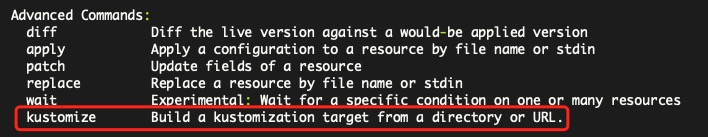

# kustomize 是什么

一句话，**自定义k8s资源配置 (Customization of kubernetes YAML configurations)**

`kustomize`有两层含义:

* `customize/kustomize: 自定义、定制`

* **k**ubernetes c**ustomize**

`kustomize`项目由k8s社区`SIG-CLI`进行开发和维护。

> Kubernetes的社区是以SIG（Special Interest Group特别兴趣小组）和工作组的形式组织起来的。
>
> 

`kustomize`可以以二进制的形式独立安装，但在2019年`Kubernetes`的首个发布版本(`Kubernetes 1.14`)中，`kustomize`已经原生集成到了`kubectl`的子命令中。

```shell
$ kubectl
```



`kustomize`子命令在`Kubernetes`所有的[kustomize](https://github.com/kubernetes-sigs/kustomize) 仓库中开发：

* 最新的特性以独立的`kustomize`二进制文件进行提供

* 并在每次`Kubernetes`发布之前在`kubectl`中更新

# Kustomize VS Helm

## kustomize

* `kustomize` 原生集成到了`kubectl`中，不需要再有额外的安装工作。

* 鼓励采用声明式应用程序管理

  **声明式：易于维护、可循迹**

  ```yaml
  apiVersion: v1
  kind: Service
  metadata:
    name: svc-access-api
    namespace: default
    labels:
      app: svc-access-api
  
  spec:
    ports:
      - port: 8009
        targetPort: 8009
    selector:
      app: deploy-access-api
  ```

  **命令式：不易于维护、不可循迹**

  ```shell
  $ kubectl create svc clusterip svc-access-api --tcp=8009:8009 -n default
  ```

  > 类似于docker和docker-compose，尽量使用docker-compose！

* 开放使用原生 `Kubernetes API`

  `kustomize`直接在k8s资源文件的基础上，通过`kustomization.yaml`文件进行组织与自定义。

  ```shell
  base
  ├── deployment.yaml     # 原生 Kubernetes API
  ├── hpa.yaml            # 原生 Kubernetes API
  ├── kustomization.yaml  # 自定义
  └── svc.yaml            # 原生 Kubernetes API
  ```

## helm

[https://helm.sh/zh/]()

对于`helm`，`kustomize`的[设计提案](https://github.com/kubernetes/design-proposals-archive)中是这么说的:

> 尽管Helm是一个很有用且最全面的工具，但它并不适合所有用例，例如插件管理。
> 最大的障碍是它不兼容`Kubernetes API`和`DSL(domain-specific language)`语法将它从`Kubernetes`本身推向了`Kubernetes`生态系统中。
> 而且，尽管`helm`只针对`Kubernetes`，但它几乎没有利用这一点。

* 不兼容`Kubernetes API`: `Helm`有一套自己的资源文件生成规则

* `DSL`: 包含了`Go Template`语法

查看一个`nginx chart`的例子:

```shell
$ helm search repo nginx
# helm search hub nginx
$ helm pull bitnami/nginx --untar
```

## 总结

* `kustomize`: 原生集成、简单易用。

  > 名副其实的亲儿子!

* `helm`: 灵活强大，但也复杂。

  > 白嫖使我快乐，自己维护就下次一定！

# Kustomize具体使用

假如存在两个完全相同的k8s资源文件:

* deployment.yaml

  ```yaml
  # deployment.yaml
  apiVersion: apps/v1
  kind: Deployment
  metadata:
    name: deploy-mynginx
  spec:
    selector:
      matchLabels:
        app: mynginx
    replicas: 1
    template:
      metadata:
        labels:
          app: mynginx
      spec:
        containers:
          - name: mynginx
            image: nginx:latest
  ```

* svc.yaml

  ```yaml
  # svc.yaml
  kind: Service
  apiVersion: v1
  metadata:
    name: svc-nginx
  spec:
    selector:
      app: mynginx
    ports:
      - name: http-port
        port: 80
        targetPort: 80
  ```

## 1\. namespace

自定义名称空间

```shell
1-namespace
├── deployment.yaml
└── kustomization.yaml
```

```yaml
# kustomization.yaml

# 这两行可省略
# apiVersion: kustomize.config.k8s.io/v1beta1
# kind: Kustomization

namespace: scana

resources:
  - deployment.yaml
```

```shell
$ kubectl -k 1-namespace
```

```yaml
apiVersion: apps/v1
kind: Deployment
metadata:
  name: deploy-mynginx
  namespace: scana
spec:
  replicas: 1
  selector:
    matchLabels:
      app: mynginx
  template:
    metadata:
      labels:
        app: mynginx
    spec:
      containers:
      - image: nginx:latest
        name: mynginx
```

## 2\. commonAnnotations

通用标注

```shell
2-commonAnnotations
├── deployment.yaml
├── kustomization.yaml
└── svc.yaml
```

```yaml
# kustomization.yaml
# 这两行可省略
# apiVersion: kustomize.config.k8s.io/v1beta1
# kind: Kustomization

namespace: scana

resources:
  - deployment.yaml
  - svc.yaml

commonAnnotations:
  usage: demo
```

```shell
$ kubectl kustomize 2-commonAnnotations
```

```yaml
apiVersion: v1
kind: Service
metadata:
  annotations:
    usage: demo
  name: svc-nginx
  namespace: scana
spec:
  ports:
  - name: http-port
    port: 80
    targetPort: 80
  selector:
    app: mynginx
---
apiVersion: apps/v1
kind: Deployment
metadata:
  annotations:
    usage: demo
  name: deploy-mynginx
  namespace: scana
spec:
  replicas: 1
  selector:
    matchLabels:
      app: mynginx
  template:
    metadata:
      annotations:
        usage: demo
      labels:
        app: mynginx
    spec:
      containers:
      - image: nginx:latest
        name: mynginx
```

## 3\. commonLabels

通用标签

```shell
3-commonLabels
├── deployment.yaml
├── kustomization.yaml
└── svc.yaml
```

```yaml
# kustomization.yaml
# 这两行可省略
# apiVersion: kustomize.config.k8s.io/v1beta1
# kind: Kustomization

namespace: scana

resources:
  - deployment.yaml
  - svc.yaml

commonLabels:
  tier: backend
```

```shell
$ kubectl kustomize 3-commonLabels
```

```yaml
apiVersion: v1
kind: Service
metadata:
  labels:
    tier: backend
  name: svc-nginx
  namespace: scana
spec:
  ports:
  - name: http-port
    port: 80
    targetPort: 80
  selector:
    app: mynginx
    tier: backend
---
apiVersion: apps/v1
kind: Deployment
metadata:
  labels:
    tier: backend
  name: deploy-mynginx
  namespace: scana
spec:
  replicas: 1
  selector:
    matchLabels:
      app: mynginx
      tier: backend
  template:
    metadata:
      labels:
        app: mynginx
        tier: backend
    spec:
      containers:
      - image: nginx:latest
        name: mynginx
```

## 4\. namePrefixSuffix

统一生成名称前后缀

```shell
4-namePrefixSuffix
├── deployment.yaml
├── kustomization.yaml
└── svc.yaml
```

```yaml
# kustomization.yaml
# 这两行可省略
# apiVersion: kustomize.config.k8s.io/v1beta1
# kind: Kustomization

namespace: scana

resources:
  - deployment.yaml
  - svc.yaml

namePrefix: scana-
nameSuffix: -✈✈
```

```shell
$ kubectl kustomize 4-namePrefixSuffix
```

```yaml
apiVersion: v1
kind: Service
metadata:
  name: scana-svc-nginx-✈✈
  namespace: scana
spec:
  ports:
  - name: http-port
    port: 80
    targetPort: 80
  selector:
    app: mynginx
---
apiVersion: apps/v1
kind: Deployment
metadata:
  name: scana-deploy-mynginx-✈✈
  namespace: scana
spec:
  replicas: 1
  selector:
    matchLabels:
      app: mynginx
  template:
    metadata:
      labels:
        app: mynginx
    spec:
      containers:
      - image: nginx:latest
        name: mynginx
```

## 5\. images

改变镜像

```shell
5-images
├── deployment.yaml
├── kustomization.yaml
└── svc.yaml
```

```yaml
# kustomization.yaml
# 这两行可省略
# apiVersion: kustomize.config.k8s.io/v1beta1
# kind: Kustomization

namespace: scana

resources:
  - deployment.yaml
  - svc.yaml

images:
  - name: nginx
    newName: hub.qixincha.com/nginx
    newTag: 3.5.5
    digest: sha256:24a0c4b4a4c0eb97
```

```shell
$ kubectl kustomize 5-images
```

```yaml
apiVersion: v1
kind: Service
metadata:
  name: svc-nginx
  namespace: scana
spec:
  ports:
  - name: http-port
    port: 80
    targetPort: 80
  selector:
    app: mynginx
---
apiVersion: apps/v1
kind: Deployment
metadata:
  name: deploy-mynginx
  namespace: scana
spec:
  replicas: 1
  selector:
    matchLabels:
      app: mynginx
  template:
    metadata:
      labels:
        app: mynginx
    spec:
      containers:
      - image: hub.qixincha.com/nginx:3.5.5@sha256:24a0c4b4a4c0eb97
        name: mynginx
```

## 6\. replicas

改变副本数

```shell
6-replicas
├── deployment.yaml
├── kustomization.yaml
└── svc.yaml
```

```yaml
# kustomization.yaml
# 这两行可省略
# apiVersion: kustomize.config.k8s.io/v1beta1
# kind: Kustomization

namespace: scana

resources:
  - deployment.yaml
  - svc.yaml

replicas:
  - name: deploy-mynginx
    count: 3
```

```shell
$ kubectl kustomize 6-replicas
```

```yaml
apiVersion: v1
kind: Service
metadata:
  name: svc-nginx
  namespace: scana
spec:
  ports:
  - name: http-port
    port: 80
    targetPort: 80
  selector:
    app: mynginx
---
apiVersion: apps/v1
kind: Deployment
metadata:
  name: deploy-mynginx
  namespace: scana
spec:
  replicas: 3
  selector:
    matchLabels:
      app: mynginx
  template:
    metadata:
      labels:
        app: mynginx
    spec:
      containers:
      - image: nginx:latest
        name: mynginx
```

## 7\. configMapGenerator

配置生成器

```shell
7-configMapGenerator
├── access-api.yaml
├── deployment.yaml
├── kustomization.yaml
└── svc.yaml
```

```yaml
# kustomization.yaml
# 这两行可省略
# apiVersion: kustomize.config.k8s.io/v1beta1
# kind: Kustomization

namespace: scana

resources:
  - deployment.yaml
  - svc.yaml

configMapGenerator:
  # 从字面值生成
  - name: cm-auth
    literals:
      - AccessSecret=bW9uZ28gMTAuMjUyLjIuOToyNzAxNy9hZG1pbi
      - AccessExpire=28800
    options:
      disableNameSuffixHash: true
      annotations:
        usage: demo
      labels:
        tier: backend

  # 从env文件生成
  - name: cm-env
    envs:
      - .env

  # 从文件生成
  - name: cm-access-api
    behavior: create
    files:
      - access-api.yaml
      - env=.env
```

```shell
$ kubectl kustomize 7-configMapGenerator
```

```yaml
apiVersion: v1
data:
  access-api.yaml: |
    Name: access-api
    Host: 0.0.0.0
    Port: 8009
    Mode: dev
    Timeout: 120000
    MaxBytes: 104857600

    AccessRpc:
      Etcd:
        Hosts:
          - svc-etcd-cluster:2379
        Key: access.rpc
      Timeout: 120000

    UsersRpc:
      Etcd:
        Hosts:
          - svc-etcd-cluster:2379
        Key: users.rpc
      Timeout: 120000
  env: |-
    NODE_ENV=production
    VUE_APP_BUILD=production
kind: ConfigMap
metadata:
  name: cm-access-api-tbm6cc4b4d
  namespace: scana
---
apiVersion: v1
data:
  AccessExpire: "28800"
  AccessSecret: bW9uZ28gMTAuMjUyLjIuOToyNzAxNy9hZG1pbi
kind: ConfigMap
metadata:
  annotations:
    usage: demo
  labels:
    tier: backend
  name: cm-auth
  namespace: scana
---
apiVersion: v1
data:
  NODE_ENV: production
  VUE_APP_BUILD: production
kind: ConfigMap
metadata:
  name: cm-env-f7ddtkmdtk
  namespace: scana
---
apiVersion: v1
kind: Service
metadata:
  name: svc-nginx
  namespace: scana
spec:
  ports:
  - name: http-port
    port: 80
    targetPort: 80
  selector:
    app: mynginx
---
apiVersion: apps/v1
kind: Deployment
metadata:
  name: deploy-mynginx
  namespace: scana
spec:
  replicas: 1
  selector:
    matchLabels:
      app: mynginx
  template:
    metadata:
      labels:
        app: mynginx
    spec:
      containers:
      - image: nginx:latest
        name: mynginx
```

## 8\. generatorOptions

全局生成器选项--对configmap、secret生效

```shell
8-generatorOptions
├── access-api.yaml
├── deployment.yaml
├── kustomization.yaml
└── svc.yaml
```

```yaml
# kustomization.yaml
# 这两行可省略
# apiVersion: kustomize.config.k8s.io/v1beta1
# kind: Kustomization

namespace: scana

resources:
  - deployment.yaml
  - svc.yaml

generatorOptions:
  disableNameSuffixHash: true
  annotations:
    usage: demo
  labels:
    tier: backend

configMapGenerator:
  # 从字面值生成
  - name: cm-auth
    literals:
      - AccessSecret=bW9uZ28gMTAuMjUyLjIuOToyNzAxNy9hZG1pbi
      - AccessExpire=28800

  # 从env文件生成
  - name: cm-env
    envs:
      - .env

  # 从文件生成
  - name: cm-access-api
    behavior: create
    files:
      - access-api.yaml
      - env=.env
```

```shell
$ kubectl kustomize 8-generatorOptions
```

```yaml
apiVersion: v1
data:
  access-api.yaml: |
    Name: access-api
    Host: 0.0.0.0
    Port: 8009
    Mode: dev
    Timeout: 120000
    MaxBytes: 104857600

    AccessRpc:
      Etcd:
        Hosts:
          - svc-etcd-cluster:2379
        Key: access.rpc
      Timeout: 120000

    UsersRpc:
      Etcd:
        Hosts:
          - svc-etcd-cluster:2379
        Key: users.rpc
      Timeout: 120000
  env: |-
    NODE_ENV=production
    VUE_APP_BUILD=production
kind: ConfigMap
metadata:
  annotations:
    usage: demo
  labels:
    tier: backend
  name: cm-access-api
  namespace: scana
---
apiVersion: v1
data:
  AccessExpire: "28800"
  AccessSecret: bW9uZ28gMTAuMjUyLjIuOToyNzAxNy9hZG1pbi
kind: ConfigMap
metadata:
  annotations:
    usage: demo
  labels:
    tier: backend
  name: cm-auth
  namespace: scana
---
apiVersion: v1
data:
  NODE_ENV: production
  VUE_APP_BUILD: production
kind: ConfigMap
metadata:
  annotations:
    usage: demo
  labels:
    tier: backend
  name: cm-env
  namespace: scana
---
apiVersion: v1
kind: Service
metadata:
  name: svc-nginx
  namespace: scana
spec:
  ports:
  - name: http-port
    port: 80
    targetPort: 80
  selector:
    app: mynginx
---
apiVersion: apps/v1
kind: Deployment
metadata:
  name: deploy-mynginx
  namespace: scana
spec:
  replicas: 1
  selector:
    matchLabels:
      app: mynginx
  template:
    metadata:
      labels:
        app: mynginx
    spec:
      containers:
      - image: nginx:latest
        name: mynginx
```

## 9\. secretGenerator

密钥生成器

```shell
9-secretGenerator
├── access-api.yaml
├── deployment.yaml
├── kustomization.yaml
└── svc.yaml
```

```yaml
# kustomization.yaml
# 这两行可省略
# apiVersion: kustomize.config.k8s.io/v1beta1
# kind: Kustomization

namespace: scana

resources:
  - deployment.yaml
  - svc.yaml

generatorOptions:
  disableNameSuffixHash: true
  annotations:
    usage: demo
  labels:
    tier: backend

secretGenerator:
  # 从字面值生成
  - name: secret-auth
    literals:
      - AccessSecret=bW9uZ28gMTAuMjUyLjIuOToyNzAxNy9hZG1pbi
      - AccessExpire=28800

  # 从env文件生成
  - name: secret-env
    envs:
      - .env

  # 从文件生成
  - name: secret-access-api
    behavior: create
    files:
      - access-api.yaml
      - env=.env
```

```shell
$ kubectl kustomize 9-secretGenerator
```

```yaml
apiVersion: v1
data:
  access-api.yaml: |
    TmFtZTogYWNjZXNzLWFwaQpIb3N0OiAwLjAuMC4wClBvcnQ6IDgwMDkKTW9kZTogZGV2Cl
    RpbWVvdXQ6IDEyMDAwMApNYXhCeXRlczogMTA0ODU3NjAwCgpBY2Nlc3NScGM6CiAgRXRj
    ZDoKICAgIEhvc3RzOgogICAgICAtIHN2Yy1ldGNkLWNsdXN0ZXI6MjM3OQogICAgS2V5Oi
    BhY2Nlc3MucnBjCiAgVGltZW91dDogMTIwMDAwCgpVc2Vyc1JwYzoKICBFdGNkOgogICAg
    SG9zdHM6CiAgICAgIC0gc3ZjLWV0Y2QtY2x1c3RlcjoyMzc5CiAgICBLZXk6IHVzZXJzLn
    JwYwogIFRpbWVvdXQ6IDEyMDAwMAo=
  env: Tk9ERV9FTlY9cHJvZHVjdGlvbgpWVUVfQVBQX0JVSUxEPXByb2R1Y3Rpb24=
kind: Secret
metadata:
  annotations:
    usage: demo
  labels:
    tier: backend
  name: secret-access-api
  namespace: scana
type: Opaque
---
apiVersion: v1
data:
  AccessExpire: Mjg4MDA=
  AccessSecret: Ylc5dVoyOGdNVEF1TWpVeUxqSXVPVG95TnpBeE55OWhaRzFwYmk=
kind: Secret
metadata:
  annotations:
    usage: demo
  labels:
    tier: backend
  name: secret-auth
  namespace: scana
type: Opaque
---
apiVersion: v1
data:
  NODE_ENV: cHJvZHVjdGlvbg==
  VUE_APP_BUILD: cHJvZHVjdGlvbg==
kind: Secret
metadata:
  annotations:
    usage: demo
  labels:
    tier: backend
  name: secret-env
  namespace: scana
type: Opaque
---
apiVersion: v1
kind: Service
metadata:
  name: svc-nginx
  namespace: scana
spec:
  ports:
  - name: http-port
    port: 80
    targetPort: 80
  selector:
    app: mynginx
---
apiVersion: apps/v1
kind: Deployment
metadata:
  name: deploy-mynginx
  namespace: scana
spec:
  replicas: 1
  selector:
    matchLabels:
      app: mynginx
  template:
    metadata:
      labels:
        app: mynginx
    spec:
      containers:
      - image: nginx:latest
        name: mynginx
```

## 10\. vars

变量引用

```shell
10-vars
├── deployment.yaml
├── kustomization.yaml
└── svc.yaml
```

```yaml
# kustomization.yaml
# 这两行可省略
# apiVersion: kustomize.config.k8s.io/v1beta1
# kind: Kustomization

namespace: scana

resources:
  - deployment.yaml
  - svc.yaml

replicas:
  - name: deploy-mynginx
    count: 3

vars:
  - name: DEPLOY_REPLICAS
    objref:
      kind: Deployment
      name: deploy-mynginx
      apiVersion: apps/v1
    # 字段默认引用 metadata.name，可以省略
    fieldref:
      fieldpath: spec.replicas
```

```yaml
# deployment.yaml
apiVersion: apps/v1
kind: Deployment
metadata:
  name: deploy-mynginx
spec:
  selector:
    matchLabels:
      app: mynginx
  replicas: 1
  template:
    metadata:
      labels:
        app: mynginx
    spec:
      containers:
        - name: mynginx
          image: nginx:latest
          env:
          - name: REPLICAS
            value: $(DEPLOY_REPLICAS)
```

```shell
$ kubectl kustomize 10-vars
```

```yaml
apiVersion: v1
kind: Service
metadata:
  name: svc-nginx
  namespace: scana
spec:
  ports:
  - name: http-port
    port: 80
    targetPort: 80
  selector:
    app: mynginx
---
apiVersion: apps/v1
kind: Deployment
metadata:
  name: deploy-mynginx
  namespace: scana
spec:
  replicas: 3
  selector:
    matchLabels:
      app: mynginx
  template:
    metadata:
      labels:
        app: mynginx
    spec:
      containers:
      - env:
        - name: REPLICAS
          value: 3
        image: nginx:latest
        name: mynginx
```

## 11\. patches

补丁策略

```shell
11-patches
├── inlineString
│   ├── deployment.yaml
│   ├── kustomization.yaml
│   └── svc.yaml
├── json6902
│   ├── deployment.yaml
│   ├── kustomization.yaml
│   ├── patch.json
│   ├── patch.yaml
│   └── svc.yaml
└── strategicMerge
    ├── deployment.yaml
    ├── kustomization.yaml
    ├── patch.yaml
    └── svc.yaml
```

### inlineString

```yaml
# inlineString/kustomization.yaml
# 这两行可省略
# apiVersion: kustomize.config.k8s.io/v1beta1
# kind: Kustomization

namespace: scana

resources:
  - deployment.yaml
  - svc.yaml

patches:
  - target:
      group: apps
      version: v1
      kind: Deployment
      name: deploy-mynginx
      
    patch: |-
      - op: add
        path: /spec/revisionHistoryLimit
        value: 5
      - op: replace
        path: /spec/replicas
        value: 5
      - op: remove
        path: /spec/selector
```

```shell
$ kubectl kustomize 11-patches/inlineString
```

```yaml
apiVersion: v1
kind: Service
metadata:
  name: svc-nginx
  namespace: scana
spec:
  ports:
  - name: http-port
    port: 80
    targetPort: 80
  selector:
    app: mynginx
---
apiVersion: apps/v1
kind: Deployment
metadata:
  name: deploy-mynginx
  namespace: scana
spec:
  replicas: 5
  revisionHistoryLimit: 5
  template:
    metadata:
      labels:
        app: mynginx
    spec:
      containers:
      - image: nginx:latest
        name: mynginx
```

### json6902

```yaml
# json6902/kustomization.yaml

# 这两行可省略
# apiVersion: kustomize.config.k8s.io/v1beta1
# kind: Kustomization

namespace: scana

resources:
  - deployment.yaml
  - svc.yaml

patchesJson6902:
  - target:
      group: apps
      version: v1
      kind: Deployment
      name: deploy-mynginx
    patch: |-
      - op: add
        path: /spec/revisionHistoryLimit
        value: 5

  - target:
      group: apps
      version: v1
      kind: Deployment
      name: deploy-mynginx
    path: patch.json

  - target:
      group: apps
      version: v1
      kind: Deployment
      name: deploy-mynginx
    path: patch.yaml
```

```json
// patch.json
[
    {
        "op": "replace",
        "path": "/spec/replicas",
        "value": 5
    }
]
```

```yaml
# patch.yaml
- op: remove
  path: /spec/selector
```

```shell
$ kubectl kustomize 11-patches/json6902
```

```yaml
apiVersion: v1
kind: Service
metadata:
  name: svc-nginx
  namespace: scana
spec:
  ports:
  - name: http-port
    port: 80
    targetPort: 80
  selector:
    app: mynginx
---
apiVersion: apps/v1
kind: Deployment
metadata:
  name: deploy-mynginx
  namespace: scana
spec:
  replicas: 5
  revisionHistoryLimit: 5
  template:
    metadata:
      labels:
        app: mynginx
    spec:
      containers:
      - image: nginx:latest
        name: mynginx
```

### strategicMerge

```yaml
# strategicMerge/kustomization.yaml
# 这两行可省略
# apiVersion: kustomize.config.k8s.io/v1beta1
# kind: Kustomization

namespace: scana

resources:
  - deployment.yaml
  - svc.yaml

patchesStrategicMerge:
  - patch.yaml
```

```yaml
# patch.yaml
apiVersion: apps/v1
kind: Deployment
metadata:
  name: deploy-mynginx
spec:
  replicas: 5
  revisionHistoryLimit: 5
```

```shell
$ kubectl kustomize 11-patches/strategicMerge
```

```yaml
apiVersion: v1
kind: Service
metadata:
  name: svc-nginx
  namespace: scana
spec:
  ports:
  - name: http-port
    port: 80
    targetPort: 80
  selector:
    app: mynginx
---
apiVersion: apps/v1
kind: Deployment
metadata:
  name: deploy-mynginx
  namespace: scana
spec:
  replicas: 5
  revisionHistoryLimit: 5
  selector:
    matchLabels:
      app: mynginx
  template:
    metadata:
      labels:
        app: mynginx
    spec:
      containers:
      - image: nginx:latest
        name: mynginx
```

## 12\. overlay

采用base+overlay的结构管理不同环境下k8s资源文件：

```shell
12-overlay
└── access-api
    ├── base
    │   ├── deployment.yaml
    │   ├── hpa.yaml
    │   ├── kustomization.yaml
    │   └── svc.yaml
    └── overlay
        ├── dev
        │   ├── access-api.yaml
        │   ├── hpa.yaml
        │   └── kustomization.yaml
        ├── prod
        │   ├── access-api.yaml
        │   ├── kustomization.yaml
        │   └── patch.yaml
        └── test
            ├── access-api.yaml
            ├── kustomization.yaml
            └── patch.yaml
```

### base

```yaml
# base/kustomization.yaml
namespace: default

resources:
  - deployment.yaml
  - svc.yaml
  - hpa.yaml

commonLabels:
  # -------私有标签------------
  tier: backend
  # -------共享标签------------
  app.kubernetes.io/part-of: scana # 此级别的更高级别应用程序的名称
  app.kubernetes.io/managed-by: kubectl # 用于管理应用程序的工具
  app.kubernetes.io/component: api # 架构中的组件

# commonAnnotations:
#   apply-time: "2023-01-11 18:44:40"

configMapGenerator:
  - name: cm-access-api

generatorOptions:
  disableNameSuffixHash: true
  labels:
    app: cm-access-api

images:
  - name: swr.cn-north-4.myhuaweicloud.com/scana/scana-access-api
    newTag: dev-20230222154156
```

```yaml
# base/deployment.yaml
apiVersion: apps/v1
kind: Deployment
metadata:
  name: deploy-access-api
  namespace: default
  labels:
    app: deploy-access-api
spec:
  replicas: 1
  revisionHistoryLimit: 5
  selector:
    matchLabels:
      app: deploy-access-api
  template:
    metadata:
      labels:
        app: deploy-access-api
    spec:
      priorityClassName: scana-4th-prior
      containers:
        - name: scana-access-api
          image: swr.cn-north-4.myhuaweicloud.com/scana/scana-access-api:dev
          command: ["./access-api", "-f", "etc/access-api.yaml"]
          ports:
            - containerPort: 8009
          readinessProbe:
            tcpSocket:
              port: 8009
            initialDelaySeconds: 5
            periodSeconds: 10
          livenessProbe:
            tcpSocket:
              port: 8009
            initialDelaySeconds: 15
            periodSeconds: 20
          resources:
            requests:
              cpu: 50m
              memory: 128Mi
            limits:
              cpu: 1000m
              memory: 1024Mi
          volumeMounts:
            - name: timezone
              mountPath: /etc/localtime
            - name: app-config
              mountPath: /app/etc
      volumes:
        - name: timezone
          hostPath:
            path: /usr/share/zoneinfo/Asia/Shanghai
        - name: app-config
          configMap:
            name: cm-access-api
            items:
              - key: access-api.yaml
                path: access-api.yaml
```

```yaml
# base/svc.yaml
apiVersion: v1
kind: Service
metadata:
  name: svc-access-api
  namespace: default
  labels:
    app: svc-access-api

spec:
  ports:
    - port: 8009
      targetPort: 8009
  selector:
    app: deploy-access-api
```

```yaml
# base/hpa.yaml
apiVersion: autoscaling/v2beta1
kind: HorizontalPodAutoscaler
metadata:
  name: hpa-access-api-c
  labels:
    app: hpa-access-api-c
spec:
  scaleTargetRef:
    apiVersion: apps/v1
    kind: Deployment
    name: deploy-access-api
  minReplicas: 1
  maxReplicas: 3
  metrics:
    - type: Resource
      resource:
        name: cpu
        targetAverageUtilization: 80

---
apiVersion: autoscaling/v2beta1
kind: HorizontalPodAutoscaler
metadata:
  name: hpa-access-api-m
  labels:
    app: hpa-access-api-m
spec:
  scaleTargetRef:
    apiVersion: apps/v1
    kind: Deployment
    name: deploy-access-api
  minReplicas: 1
  maxReplicas: 3
  metrics:
    - type: Resource
      resource:
        name: memory
        targetAverageUtilization: 80
```

### overlay

#### dev

```yaml
# overlay/dev/kustomization.yaml
# bases:
resources:
  - ../../base
  - hpa.yaml

# # nameSuffix: -dev

configMapGenerator:
  - name: cm-access-api
    files:
      - access-api.yaml
    behavior: replace
```

```yaml
# overlay/dev/access-api.yaml
Name: access-api
Host: 0.0.0.0
Port: 8009
Mode: dev
Timeout: 120000
MaxBytes: 104857600

AccessRpc:
  Etcd:
    Hosts:
      - svc-etcd-cluster:2379
    Key: access.rpc
  Timeout: 120000

UsersRpc:
  Etcd:
    Hosts:
      - svc-etcd-cluster:2379
    Key: users.rpc
  Timeout: 120000

CacheRedis:
  - Host: svc-redis:6379
    Pass:
    Type: node # cluster

Auth:
  AccessSecret: bW9uZfasdfasdfjUyLjIuOToyNzAxNy9hZG1pbi
  AccessExpire: 28800

Log:
  ServiceName: access-api
  Mode: console
  Encoding: json
  Level: info

# jaeger
Telemetry:
  Name: access-api
  Endpoint: http://svc-jaeger:14268/api/traces
  Batcher: jaeger
```

```yaml
# overlay/dev/hpa.yaml
apiVersion: autoscaling/v2
kind: HorizontalPodAutoscaler
metadata:
  name: hpa-access-api-c
  labels:
    app: hpa-access-api-c
spec:
  scaleTargetRef:
    apiVersion: apps/v1
    kind: Deployment
    name: deploy-access-api
  minReplicas: 1
  maxReplicas: 3
  metrics:
    - type: Resource
      resource:
        name: cpu
        target:
          type: Utilization
          averageUtilization: 80

---
apiVersion: autoscaling/v2
kind: HorizontalPodAutoscaler
metadata:
  name: hpa-access-api-m
  labels:
    app: hpa-access-api-m
spec:
  scaleTargetRef:
    apiVersion: apps/v1
    kind: Deployment
    name: deploy-access-api
  minReplicas: 1
  maxReplicas: 3
  metrics:
    - type: Resource
      resource:
        name: memory
        target:
          type: Utilization
          averageUtilization: 80
```

#### test

```yaml
# overlay/test/kustomization.yaml
# bases:
resources:
  - ../../base

namespace: scana

# nameSuffix: -test

configMapGenerator:
  - name: cm-access-api
    files:
      - access-api.yaml
    behavior: replace

patchesStrategicMerge:
  - patch.yaml
```

```yaml
# overlay/test/access-api.yaml
Name: access-api
Host: 0.0.0.0
Port: 8009
Mode: test
Timeout: 120000
MaxBytes: 104857600

AccessRpc:
  Etcd:
    Hosts:
      - svc-etcd-cluster:2379
    Key: access.rpc
  Timeout: 120000

UsersRpc:
  Etcd:
    Hosts:
      - svc-etcd-cluster:2379
    Key: users.rpc
  Timeout: 120000

CacheRedis:
  - Host: 10.28.0.76:6379
    Pass: UpeAS7CifasdfascCXshQQ
    Type: node # cluster

Auth:
  AccessSecret: bW9uZ28gMTAafasdfasgaIuOToyNzAxNy9hZG1pbi
  AccessExpire: 28800

Log:
  ServiceName: access-api
  Mode: console
  Encoding: json
  Level: info

# otlp
Telemetry:
  Name: access-api
  Endpoint: otlp-agent.default:4317
  Batcher: grpc
```

```yaml
# overlay/test/patch.yaml
apiVersion: apps/v1
kind: Deployment
metadata:
  name: deploy-access-api
spec:
  replicas: 1
  selector:
    matchLabels:
      app: deploy-access-api
  template:
    spec:
      nodeSelector:
        "mtype": "cpu"    
      imagePullSecrets:
        - name: default-secret
      containers:
        - name: scana-access-api
          imagePullPolicy: Always
          resources:
            requests:
              cpu: 200m
              memory: 256Mi
            limits:
              cpu: 1000m
              memory: 1024Mi

---
apiVersion: autoscaling/v2beta1
kind: HorizontalPodAutoscaler
metadata:
  name: hpa-access-api-c
spec:
  scaleTargetRef:
    apiVersion: apps/v1
    kind: Deployment
    name: deploy-access-api
  minReplicas: 1
  maxReplicas: 3

---
apiVersion: autoscaling/v2beta1
kind: HorizontalPodAutoscaler
metadata:
  name: hpa-access-api-m
spec:
  scaleTargetRef:
    apiVersion: apps/v1
    kind: Deployment
    name: deploy-access-api
  minReplicas: 1
  maxReplicas: 3
```

#### prod

```yaml
# overlay/prod/kustomization.yaml
# bases:
resources:
  - ../../base

namespace: scana

# nameSuffix: -prod

configMapGenerator:
  - name: cm-access-api
    files:
      - access-api.yaml
    behavior: replace

patchesStrategicMerge:
  - patch.yaml
```

```yaml
# overlay/prod/access-api.yaml
Name: access-api
Host: 0.0.0.0
Port: 8009
Mode: pro
Timeout: 120000
MaxBytes: 104857600

AccessRpc:
  Etcd:
    Hosts:
      - svc-etcd-cluster:2379
    Key: access.rpc
  Timeout: 120000

UsersRpc:
  Etcd:
    Hosts:
      - svc-etcd-cluster:2379
    Key: users.rpc
  Timeout: 120000

CacheRedis:
  - Host: 10.28.0.79:8635
    Pass: XrNVWIfasfasfVeSr6QA==
    Type: node # cluster

Auth:
  AccessSecret: bW9uZ28gMTAuMjUyLjIufasfasNzAxNy9hZG1pbi
  AccessExpire: 28800

Log:
  ServiceName: access-api
  Mode: console
  Encoding: json
  Level: info

# otlp
Telemetry:
  Name: access-api
  Endpoint: otlp-agent.default:4317
  Batcher: grpc
```

```yaml
# overlay/prod/patch.yaml
apiVersion: apps/v1
kind: Deployment
metadata:
  name: deploy-access-api
spec:
  replicas: 1
  selector:
    matchLabels:
      app: deploy-access-api
  template:
    spec:
      imagePullSecrets:
        - name: default-secret
      containers:
        - name: scana-access-api
          imagePullPolicy: Always
          resources:
            requests:
              cpu: 500m
              memory: 512Mi
            limits:
              cpu: 1000m
              memory: 1024Mi

---
apiVersion: autoscaling/v2beta1
kind: HorizontalPodAutoscaler
metadata:
  name: hpa-access-api-c
spec:
  scaleTargetRef:
    apiVersion: apps/v1
    kind: Deployment
    name: deploy-access-api
  minReplicas: 1
  maxReplicas: 3

---
apiVersion: autoscaling/v2beta1
kind: HorizontalPodAutoscaler
metadata:
  name: hpa-access-api-m
spec:
  scaleTargetRef:
    apiVersion: apps/v1
    kind: Deployment
    name: deploy-access-api
  minReplicas: 1
  maxReplicas: 3
```

## 应用到`kubernetes`中

```shell
# 应用资源
$ kubectl apply -k access-api/overlay/dev
# 删除资源
$ kubectl delete -k access-api/overlay/dev
# 回滚资源
$ kubectl rollout undo -k access-api/overlay/dev [--to-revision=1]
```

# 结合Helm使用

可以借助helm来生成基本的资源文件:

## 方式一

安装chart后获取资源清单:

```shell
$ helm install mynginx bitnami/nginx
$ helm get manifest mynginx
```

## 方式二

获取chart后输出模板：

```shell
$ helm pull bitnami/nginx --untar
$ helm template mynginx ./nginx --debug/--dry-run
$ helm template mynginx ./nginx --debug --output-dir my-template
```

# 参考资料

1. <https://kustomize.io/>

2. <https://kubectl.docs.kubernetes.io/zh/>

3. <https://kubernetes.io/zh-cn/docs/tasks/manage-kubernetes-objects/kustomization/>

4. <https://github.com/kubernetes-sigs/kustomize>